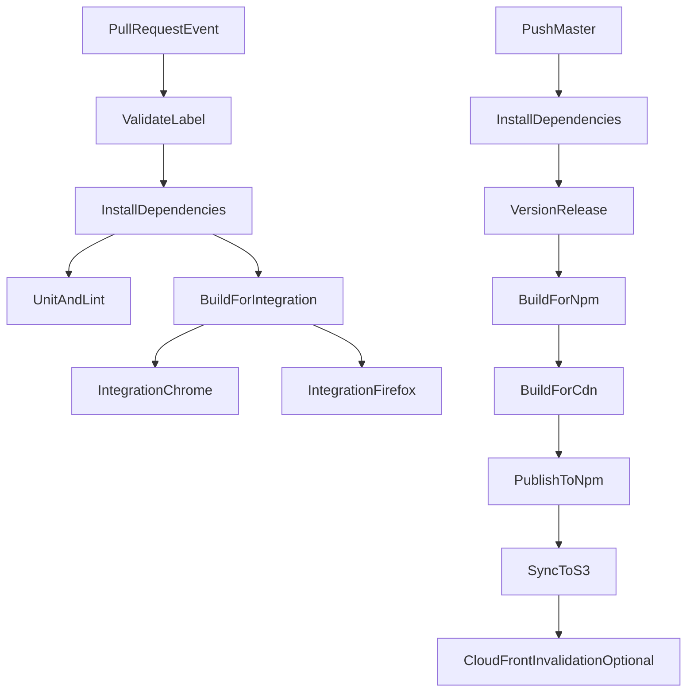

# GitHub Actions Pipeline Guide

This repository now runs CI/CD in GitHub Actions and keeps CircleCI only as historical reference until final decommissioning.

## Source Of Truth Files

- [`.github/workflows/pull-request.yml`](.github/workflows/pull-request.yml)
- [`.github/workflows/deploy.yml`](.github/workflows/deploy.yml)
- [`.circleci/config.yml`](.circleci/config.yml) (reference for legacy parity)

## CI/CD Flow At A Glance

## Trigger Model

### Pull Request CI (`pull-request.yml`)

- Event: `pull_request` on `opened`, `reopened`, `synchronize`, `labeled`, `unlabeled`.
- Manual support: `workflow_dispatch`.
- Concurrency: `${{ github.workflow }}-${{ github.event.pull_request.number || github.ref }}` with cancel-in-progress.
- Critical gate: `validated` label is required for PR checks to proceed.

### Deploy CD (`deploy.yml`)

- Event: `push` to `master`.
- Manual support: `workflow_dispatch`.
- Concurrency: one deploy per ref; queue rather than cancel.

## Pull Request Pipeline Breakdown

### Job Order

1. `validate` - fails if `validated` label is absent.
2. `install` - `npm ci`.
3. `unit_tests_and_linting` - eslint + jest.
4. `build_for_tests` - builds `dist-test`.
5. `journey_tests_chrome` - integration suite in Chrome.
6. `journey_tests_firefox` - integration suite in Firefox.

### Secrets Used In PR Workflow

- `WEBEX_APPID_ORGID`
- `WEBEX_APPID_SECRET`
- `WEBEX_CLIENT_ID`
- `WEBEX_CLIENT_SECRET`
- `SKIP_FLAKY_TESTS`

All secrets are read from GitHub Actions `secrets.*` and are never hardcoded.

## Deploy Pipeline Breakdown

### Job Order

1. Checkout and `npm ci`.
2. `npm run release -- --release-as minor --no-verify`.
3. Build for npm (`build:packagejson`, `build:transpile all`).
4. Build CDN bundles for:
   - `@webex/widget-space`
   - `@webex/widget-recents`
   - `@webex/widget-demo`
5. Push release commit and tags.
6. Publish npm packages (`npm run publish:components`).
7. Sync built artifacts to S3 for `alpha`, `latest`, and versioned `archives/<version>`.
8. Optionally run CloudFront invalidation when distribution ID is configured.

### Secrets Used In Deploy Workflow

- `NPM_TOKEN`
- `AWS_ACCESS_KEY_ID`
- `AWS_SECRET_ACCESS_KEY`
- `AWS_DISTRIBUTION_ID` (optional)

## Migration Notes From CircleCI

Migrated from CircleCI:

- `install`
- `unit_tests_and_linting`
- `build_for_tests`
- `journey_tests_chrome`
- `journey_tests_firefox`
- `version_and_publish`
- `deploy_to_cdn`

Not migrated in this phase:

- `promotions` scheduled workflow
- `tap` scheduled workflow
- production tag promotion flow

## Security And Compliance Notes

- Never hardcode credentials in workflow files; use GitHub repository secrets.
- Keep least privilege: PR workflow is read-only; deploy workflow has write permissions only where needed.
- Avoid shell commands that print secrets (for example `echo $NPM_TOKEN`).
- Prefer `pull_request` over `pull_request_target` unless trusted-code execution requirements force otherwise.

## Verification Checklist

1. YAML syntax:
   - `yamllint .github/workflows/*.yml` (if available)
2. PR checks:
   - open PR without `validated` label and confirm `validate` fails
   - add `validated` label and confirm all test jobs run
3. Deploy checks on `master`:
   - npm publish step authenticates successfully
   - S3 sync uploads to expected `alpha`, `latest`, and `archives/<version>` paths
   - CloudFront invalidates only when distribution ID secret is set
