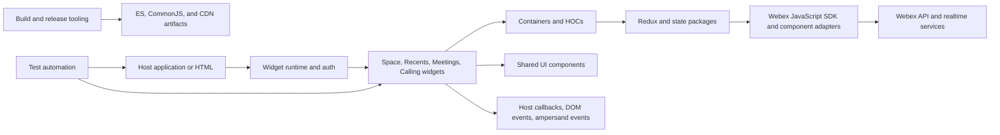
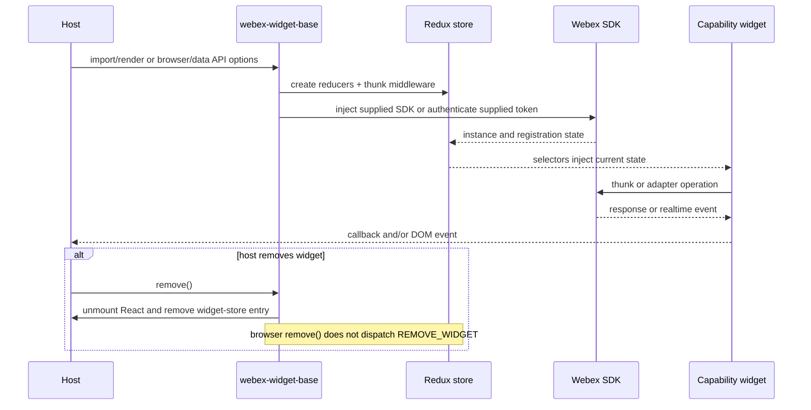
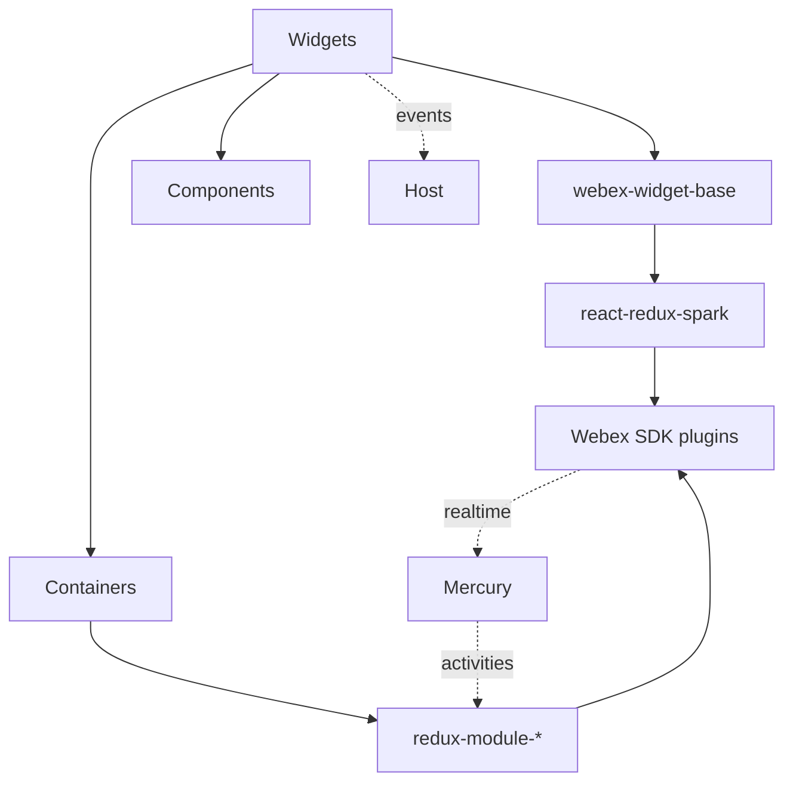

<!-- ───────────────────────────────
  Template:     ARCHITECTURE
  Template-ID:  architecture
  Generates:    ai-docs/ARCHITECTURE.md
  Description:  Repo/component architecture — components, responsibilities, interactions, cross-cutting posture.
  Library ver:  0.2.2
  Last updated: 2026-06-30
─────────────────────────────── -->

<!-- sdd-generated-metadata
doc_kind: standing-doc
generated_from: architecture
generator_plugin: sdd-bootstrap@0.4.3
generated_by: cursor-agent
approved_by: pending PR approval
updated_at: 2026-09-08
validation_status: not-run
-->

# ARCHITECTURE — react-widgets

> Start with root [`AGENTS.md`](../AGENTS.md), then route through [`SPEC_INDEX.md`](SPEC_INDEX.md). Module detail lives under `ai-docs/modules/`.

## Design Overview

The repository is one build and release unit containing a package forest. Small presentational packages remain independently importable, while widgets compose them with connected containers, Redux modules, Webex SDK adapters, and a common browser runtime. This separation lets consumers use either a complete widget or lower-level pieces without duplicating Webex-specific state and integration behavior.

`webex-widget-base` is the host boundary for legacy JavaScript widgets. Its enhancer chain registers the data API and browser globals, creates a Redux provider, injects Webex SDK state/authentication, loads the current user, exposes version metadata, and supports teardown. Newer TypeScript calling widgets instead receive component adapters through React contexts and expose typed React entrypoints. Evidence: `packages/node_modules/@webex/webex-widget-base/src/index.js`, `packages/node_modules/@webex/widget-call-history/src/contexts/AdapterContext.tsx`.

## Component Inventory & Responsibilities

| Component | Responsibility | Docs |
|---|---|---|
| Space and messaging packages | Compose space activities, messaging, files, roster, destinations, and host events. | `modules/space-messaging-spec.md` |
| Recents package | Load/filter spaces, react to realtime activities and membership changes, and emit host selection/call/profile events. | `modules/recents-spec.md` |
| Meetings packages | Resolve destinations and manage create/join/media/leave state and UI. | `modules/meetings-spec.md` |
| Calling packages | Render call history, dial pad, speed dials, voicemail, and adapter-driven call actions. | `modules/calling-spec.md` |
| Shared UI components | Provide presentational building blocks and UI utilities. | `modules/shared-ui-components-spec.md` |
| Redux/state packages | Own immutable client state, SDK thunks, event reducers, and metrics queues. View selectors live in widget/container packages. | `modules/state-management-spec.md` |
| Containers/HOCs | Bind UI to Redux, SDK operations, file retrieval, notifications, presence, scrolling, and Mercury. | `modules/containers-hooks-spec.md` |
| Widget runtime/auth/demos | Mount widgets, establish auth/SDK context, expose browser/data APIs, and provide demos/samples. | `modules/widget-runtime-auth-spec.md` |
| Build/release tooling | Discover packages and build, transpile, sign, publish, deploy, and serve artifacts. | `modules/build-release-tooling-spec.md` |
| Test automation | Run Jest and browser journeys, accessibility checks, test-user setup, and CI reporting. | `modules/test-automation-spec.md` |

## Component Interaction

Hosts enter through imported React exports, `window.webex.widget(element)`, or `[data-toggle^="webex-"]`. Legacy widgets compose shared enhancers and reducers; Redux thunks call SDK plugins, and realtime listeners feed normalized state and host events. Calling widgets use typed adapter contexts rather than the legacy shared Redux runtime.

## Widget Initialization & Interaction Flow

Evidence: `packages/node_modules/@webex/webex-widget-base/src/enhancers/withBrowserGlobals.js`, `packages/node_modules/@webex/webex-widget-base/src/enhancers/withInitialState.js`, `packages/node_modules/@webex/widget-recents/src/enhancers/listeners.js`.

## Dependencies

| Dependency | Type | How used | Failure / version handling |
|---|---|---|---|
| React / ReactDOM | peer/runtime | Render components and mount browser widgets. | Root dependency range is `^16.8.4`; public component behavior is semver-sensitive. |
| Redux / React-Redux / Immutable.js | internal runtime | Widget stores, actions, reducers, selectors, and connected containers. | Reducers retain initial state on unknown actions; failed SDK operations enter error state or reject thunks. |
| Webex JavaScript SDK plugins | external packages/services | Authentication, devices, conversations, rooms, people, meetings, Mercury, search, teams, flags, and metrics. | Versions are pinned to the compatible `^2.60.4` family; callers surface errors/loading state. |
| Momentum UI and Webex Components | external package | Visual primitives, collaboration controls, and calling adapters. | Root versions are pinned; CSS and host-theme compatibility must be checked on upgrades. |
| Browser APIs | host platform | DOM mount, CustomEvent, media streams, notifications, localStorage, and audio/video. | Browser support and test configuration are explicit; unavailable permissions surface errors or disable behavior. |
| Babel/Rollup/Webpack | build | Transpile packages and bundle widgets. | Build fails on compile/config errors; generated `es/`, `cjs/`, and `dist/` are not source. |

### State Model

- Each legacy widget creates a combined Redux store with widget reducers plus `spark` and `users`. The reducer resets if `REMOVE_WIDGET` is dispatched, but the browser `remove()` implementation does not dispatch it. Evidence: `packages/node_modules/@webex/webex-widget-base/src/enhancers/withInitialState.js`, `packages/node_modules/@webex/webex-widget-base/src/enhancers/withBrowserGlobals.js`.
- State packages use Immutable.js maps/records for activities, conversations, spaces, users, media, meetings, errors, features, flags, presence, search, teams, and metrics. Evidence: `packages/node_modules/@webex/redux-module-meetings/src/reducer.js`.
- Setup enhancers advance from SDK authentication/registration to Mercury connection, initial fetch, avatar/team/feature loading, ready/error display, and teardown. Evidence: `packages/node_modules/@webex/widget-recents/src/enhancers/setup.js`.

## Cross-Cutting Concerns

- **Security:** credentials enter as host props or environment variables; SDK/API calls cross the trust boundary. Never persist or log tokens. Browser globals and data attributes are public inputs and must be validated against component prop contracts.
- **Observability:** development Redux logging, SDK logger calls, CI JUnit/browser artifacts, and the metrics HOC expose state/action timing and failures. Call payloads are deliberately omitted from Recents event logs to avoid range/serialization problems.

## Performance, Compatibility & Accessibility

The repository targets the browser matrix in `babel.config.js`, including legacy ES5 output. Rollup externalizes core peer UI libraries and hashes CSS-module class names; Webpack produces self-contained widget bundles. Recents loads a bounded initial set (default 25), then avatars/teams/features, and accessibility journeys run axe checks. Public package exports, widget names, data attributes, event strings, keyboard behavior, and SRI manifests are compatibility surfaces.

## Dependency / Interaction Topology

| From | To | Kind | Purpose |
|---|---|---|---|
| Widget entrypoints | `webex-widget-base` | in-process composition | Install common host, Redux, auth, version, and teardown behavior. |
| Containers/HOCs | Redux modules | in-process calls | Dispatch state transitions and select display props. |
| Redux thunks/runtime | Webex SDK | promise/event calls | Fetch or mutate Webex resources and connect realtime services. |
| Widgets | Host | callbacks/DOM events | Report message, room, call, membership, profile, and activity behavior. |

## Object / Data Ownership

| Domain object | Client-state owner | Read by |
|---|---|---|
| SDK authentication/registration state | `react-redux-spark` | all legacy widgets and setup enhancers |
| Space/conversation/activity/user/team state | matching `redux-module-*` packages | Space, Recents, Message, Roster, and connected components |
| Call/media state | `redux-module-media` and widget reducers | Meet/Space/Recents call UI |
| Meeting IDs and media readiness | `redux-module-meetings` | Meetings widget selectors/components |
| Widget-local status/config | each widget reducer or React hook state | owning widget only |

Remote Webex services remain systems of record; this repository owns only client representations and transitions.

## Caching Catalog

| Cache | Backend | What it holds | Lifetime | Invalidation trigger |
|---|---|---|---|---|
| widget store | `window.webex.widgetStore` | mounted `BrowserWidget` objects by UUID | widget lifetime | `remove()` deletes the UUID entry |
| Redux resource maps | in-memory Immutable.js store | spaces, users, activities, files, meetings, and related status | widget/Provider lifetime | actions replace/remove records; an explicit `REMOVE_WIDGET` action resets state, but browser `remove()` does not dispatch it |
| downloaded share reuse | Redux share state | decrypted/downloadable file blob | widget/Provider lifetime | new fetch/reducer update; browser removal relies on React unmount and reference release |
| number-pad focus flags | browser `localStorage` | focus handoff flags | interaction-scoped | blur/unmount handlers remove keys |

## Observability Patterns

- **Logging:** SDK logger calls record setup, events, warnings, and adaptive-card failures; development stores add `redux-logger`. Do not log tokens or raw call objects.
- **Metrics:** `react-redux-spark-metrics` queues named start/end metrics and sends them through the SDK metrics plugin when available.
- **Audit:** CI stores JUnit and browser artifacts; no product audit trail is owned by this client library.

## Infrastructure Matrix

| Category | In use | Notes |
|---|---|---|
| Datastores | none owned | Browser/Redux state only; Webex services own remote data. |
| Messaging / streaming | Webex Mercury | SDK-managed realtime conversation/activity channel. |
| Cloud / platform services | CircleCI, Sauce Labs, AWS S3/CloudFront, npm registry, Netlify tooling | Build, browser test, publish, and CDN deployment integrations. |

## Shared / Base Libraries

| Library | Shared responsibility | Version floor/source |
|---|---|---|
| `@webex/webex-widget-base` | Legacy widget mount, Redux, SDK/auth, current user, browser/data APIs, teardown, intl composition. | `packages/node_modules/@webex/webex-widget-base/src/index.js` |
| `@webex/react-component-utils` | Hydra IDs, activity/file/card/string/mention helpers and constants. | `packages/node_modules/@webex/react-component-utils/src/index.js` |
| `@webex/react-redux-spark` | SDK instance/authentication/device state injection. | `packages/node_modules/@webex/react-redux-spark/src/index.js` |
| Momentum UI / Webex Components | Shared visual controls and adapter interfaces. | pinned in `package.json` |

## Package Map & Inter-Package Dependencies

- Workspace convention: tracked packages live under `packages/node_modules/@webex/*`; a root discovery utility enumerates package paths rather than npm workspaces.
- Visibility: packages with `private: true` are build/demo/internal-only; other package entrypoints are publishable npm surfaces.
- Dependency direction: widgets depend on base/runtime, containers, Redux modules, and components; containers depend on Redux/SDK helpers; components should remain reusable and primarily presentational.
- Release rule: root versioning and publish tooling build non-private packages together; breaking exported changes require a compatible release and migration note.

## Release & Versioning

- `standard-version` generates root versions/changelog entries using Conventional Commits. Non-private packages are built and published publicly through root tooling.
- CI builds Space, Recents, and Demo CDN archives, creates SRI manifests/signatures, syncs alpha/latest/archive prefixes to S3, and invalidates CloudFront.
- Consumers can read bundle version metadata from headers, `window.webex.widgetFn.{name}.version`, or a mounted widget object.

## Host Integration & Theming

- Imported React components use package entrypoints and package CSS/Sass as documented by the owning module.
- Browser-global hosts call `window.webex.widget(element).{name}Widget(options)`; data-API hosts use `data-toggle="webex-{name}"` plus data attributes.
- Hosts provide tokens or a pre-authenticated SDK instance and must load compatible Webex SDK/plugin versions. The legacy alias `window.ciscospark` points at `window.webex`.
- Momentum UI/Webex Components styles and generated CSS-module class names are host-facing visual dependencies.

## Cross-Repo Dependency Graph

- **Internal packages consumed:** Webex JS SDK plugins, Webex Components, adapter interfaces, Webex style guide, and test-helper packages.
- **Consumers:** npm applications and sites embedding CDN bundles or importing individual `@webex/*` packages.
- **External services:** Webex identity/API/realtime services, npm, Sauce Labs, AWS S3/CloudFront, CircleCI, and optional Netlify deployment.

## Security Architecture

The browser host is outside the library trust boundary and supplies credentials, DOM elements, data attributes, callback functions, destination IDs, and optional SDK adapters. `react-redux-spark` establishes authenticated SDK state, after which setup enhancers register devices/connect Mercury and dispatch SDK operations. Network transport and remote authorization are owned by the Webex SDK/services; this repository must avoid broadening token exposure through logs, browser storage, examples, or generated artifacts.

---

Per-module orientation and design: [`SPEC_INDEX.md`](SPEC_INDEX.md).

## Architecture Reference Links

| Reference | Location | When to read |
|---|---|---|
| Architecture decisions | `adr/` | Before changing module boundaries, central doc layout, or compatibility policy. |
| Repo patterns | `patterns/` | Before adding components, Redux behavior, or package exports. |
| Enforceable rules | `RULES.md` and `rules/` | Before any implementation or release change. |

## WS6 References

No WS6/platform architecture document is tracked in this repository. External architecture claims are unsupported until an authoritative source is supplied; current local implications derive only from `package.json`, source, tests, and CI configuration.

---

Provenance: generated_by `codex-desktop`; approved_by `pending PR approval`; updated_at `2026-08-07`.
