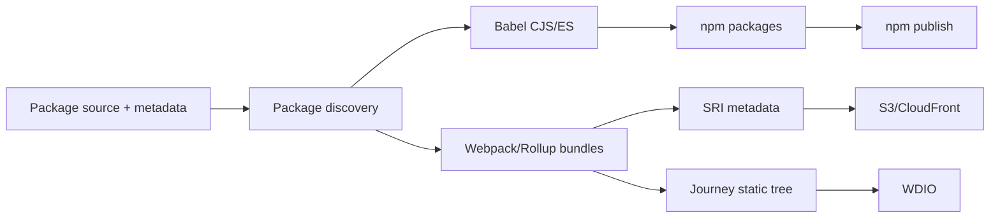
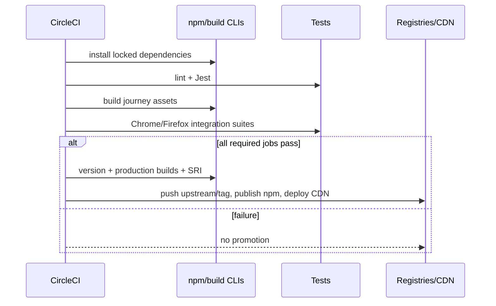
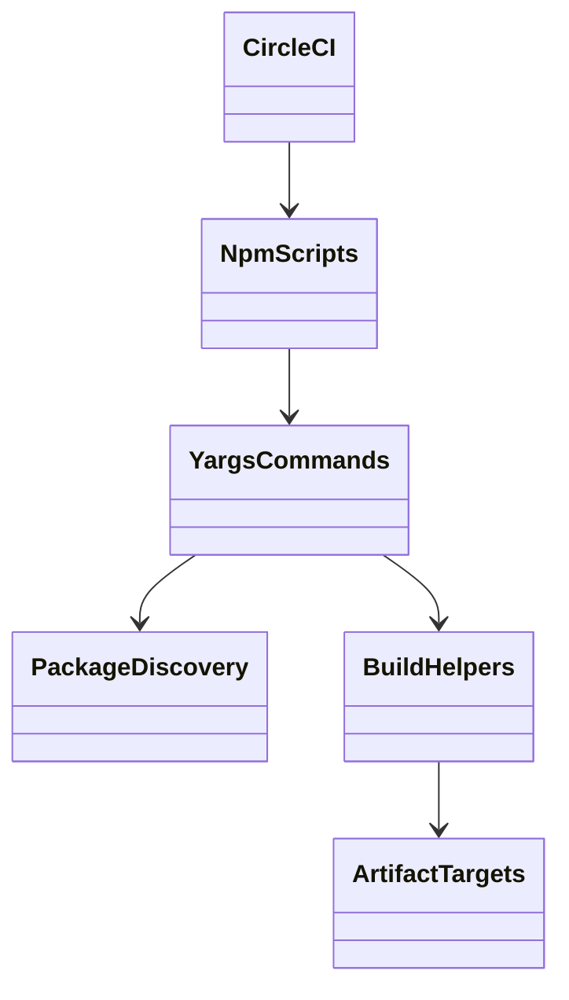

<!-- ───────────────────────────────
  Template:     Module Spec
  Template-ID:  module-spec
  Generates:    ai-docs/modules/build-release-tooling-spec.md
  Description:  Per-module canonical spec — orientation plus requirements, design, invariants, flows, pitfalls, and tests.
  Library ver:  0.2.1
  Last updated: 2026-07-11
─────────────────────────────── -->

# Build and Release Tooling — SPEC

> Start with root [`AGENTS.md`](../../AGENTS.md), router [`SPEC_INDEX.md`](../SPEC_INDEX.md), and system [`ARCHITECTURE.md`](../ARCHITECTURE.md).

## Metadata

| Field | Value |
|---|---|
| Module id | `build-release-tooling` |
| Source path(s) | `scripts/`, root build configs, `.circleci/config.yml`, package metadata |
| Doc kind | Module spec |
| Coverage score | 95% assessed 2026-07-22; commands, selection rules, outputs, CI promotion, and failure gates covered |
| Generated from | `module-spec` @ SDLC template library `0.2.1` |
| generated_by / approved_by / updated_at | `codex-desktop` / pending PR approval / 2026-08-07 |
| Validation status | not-run; independent validation pending at the repaired PR commit |

## Evidence Rules

Root scripts, yargs command handlers, package metadata, bundler/transpiler configuration, lockfile, and CircleCI are authoritative. `scripts/release.sh` explicitly says it is not currently used and is historical, not the current delivery contract.

## Source Material Register

| Source material | Scope | Decision | Detail location or disposition |
|---|---|---|---|
| Repository usage guide development commands | local build/test | verified | Public Surface and Use Cases. |
| `package.json` scripts | command API | authoritative | Public Surface and Requirements. |
| build/publish scripts and CI | artifacts/release | authoritative | Design, rules, and failure handling. |
| Historical release helper | historical release approach | reference-only | Pitfalls; do not execute as the current workflow. |

## Overview

Root yargs CLIs discover packages beneath `packages/node_modules`, transpile package sources, build widget bundles, generate journey distributions and SRI metadata, start local demos/samples, and publish eligible packages. CircleCI installs with Node 22.22, runs lint/Jest and browser journeys, versions the repository, publishes packages, and deploys selected widget assets.

## Purpose / Responsibility

Turn the single Git repository into consistent per-package artifacts and enforce quality/promotion rules without changing package source semantics.

## Stack

Node.js 22.22 in CI, npm 10, Babel, Webpack 4, Rollup 2, Sass/PostCSS, yargs, SRI signing, standard-version, npm publishing, CircleCI, AWS S3/CloudFront, Netlify tooling, Jest, and WebdriverIO.

## Folder / Package Structure

```text
package.json, package-lock.json
babel.config.js, webpack.config.babel.js, rollup*.js
scripts/
├── build/commands/      # all, components, dist, esm, journey, package.json, sri, transpile, widgets
├── start/commands/      # demo, package, samples
├── publish/commands/    # components, package
├── deploy/commands/
├── tooling/commands/
└── utils/               # build, package discovery, dependencies, publish, SRI, process helpers
.circleci/config.yml
```

## Key Files (source of truth)

| File | Holds |
|---|---|
| `package.json` | supported npm command surface |
| `scripts/build/index.js` and `commands/*.js` | build targets and selection |
| `scripts/utils/build.js` | Babel/Webpack/Rollup execution |
| `scripts/utils/package.js` | package discovery/classification |
| `scripts/publish/commands/*.js` | publish eligibility and dispatch |
| `.circleci/config.yml` | install, test, build, version, publish, CDN deployment |
| `rollup.config.js`, `rollup.calling-config.js`, `scripts/webpack/*` | artifact configuration |

## Public Surface

Repository command contracts:

| Contract ID | Type | Surface | Purpose | Compatibility / deprecation | Schema / detail link | Root index |
|---|---|---|---|---|---|---|
| `rw.cmd.install` | CLI | `npm install --legacy-peer-deps` | CI dependency installation | lockfile/CI contract | `.circleci/config.yml` | `../CONTRACTS.md` |
| `rw.cmd.build` | CLI | `npm run build {target}` plus root build aliases | package/widget artifacts and integrity | preserve yargs target names/arguments | `package.json`, `scripts/build/index.js`, `scripts/build/commands/` | `../CONTRACTS.md` |
| `rw.cmd.build-journey` | CLI | `npm run build journey {path}` | static browser-test assets | target path is destructive/generated | `scripts/build/commands/journey.js` | `../CONTRACTS.md` |
| `rw.cmd.serve` | CLI | `npm run serve {target}` / `npm start` | local development hosts | development only | `package.json`, `scripts/start/` | `../CONTRACTS.md` |
| `rw.cmd.publish` | CLI | `npm run publish:components` | publish eligible non-private packages | credentialed; never a casual verification command | `scripts/publish/commands/components.js`, `package.json` | `../CONTRACTS.md` |
| `rw.cmd.release` | CLI | `npm run release` | update version/changelog through standard-version | credentialed/release-only | `package.json` | `../CONTRACTS.md` |

Compatibility notes:

Command names and required arguments are automation interfaces. Build output is generated and excluded from source-of-truth documentation.

## Requires (dependencies)

Locked npm dependencies, a supported Node/npm runtime, package `name`/`private` metadata, filesystem/process access, CI credentials for npm/AWS/upstream Git, and a private key plus `widget-key.pub` for SRI.

## Requirements

| ID | WHAT | WHY | Source Evidence | Test / Example Evidence | Assumptions / Gaps | Confidence |
|---|---|---|---|---|---|---|
| `BUILD-R-001` | Package discovery and classification use package metadata; private packages are omitted from public ES/component publishing and demos are excluded from component publication. | Prevent accidental release of internal/example code. | `scripts/utils/package.js`, `scripts/build/commands/components.js`, `scripts/publish/commands/components.js` | `scripts/tooling/commands/check-testable.js`, `.circleci/config.yml` | No dedicated publish dry-run suite found. | PRESENT |
| `BUILD-R-002` | Public widgets receive distributable bundles while packages receive transpiled/module outputs appropriate to the selected command. | Consumers use both embeddable bundles and package imports. | `scripts/build/commands/all.js`, `scripts/build/commands/widgets.js`, `scripts/utils/build.js` | `.circleci/config.yml` | Artifact snapshots are limited. | PRESENT |
| `BUILD-R-003` | Journey builds copy static servers/axe and build Space, Recents, Demo, and current calling distributions into the requested target. | Browser tests require a self-contained served tree. | `scripts/build/commands/journey.js` | `.circleci/config.yml` | Some calling output paths share `dist-call-history`; validate before altering. | PRESENT |
| `BUILD-R-004` | SRI generation fails safely when `PRIVATE_KEY` is absent and signs package distributions with the repository public key when present. | CDN consumers need verifiable assets without exposing signing material. | `scripts/build/commands/sri.js`, `scripts/utils/sri.js` | `.circleci/config.yml` | Secret provisioning is external. | PRESENT |
| `BUILD-R-005` | CI gates release on dependency install, lint, Jest, built journey assets, and configured Chrome/Firefox journeys before version/publish/deploy. | Published packages and CDN assets must derive from a verified commit. | `.circleci/config.yml` | CI workflow itself | External services/credentials can block. | PRESENT |
| `BUILD-R-006` | Version/publish changes preserve package dependency/version consistency and publish only non-private eligible packages. | The repository releases many interdependent packages from one versioned source. | `scripts/utils/deps.js`, `scripts/publish/commands/components.js`, `.circleci/config.yml` | `package.json` | Rollback is operational/manual. | PRESENT |

## Design Overview

Root npm aliases dispatch to small yargs command handlers. Package utilities enumerate the nonstandard `packages/node_modules` tree; build helpers centralize Babel, Rollup, and Webpack invocation. CI persists dependencies and built journey assets between jobs, then versions/publishes/deploys from the tested repository state.

## Data Flow



## Sequence Diagram(s)

Sequence coverage:

| Operation group | Diagram | Failure / recovery coverage |
|---|---|---|
| package artifact build | Artifact build | invalid target/build failure stops artifact production |
| CI verify, version, publish, deploy | Verified promotion | failed required gate prevents promotion; partial external failure requires operator review |

```mermaid
sequenceDiagram
  participant D as Developer/CI
  participant Y as Build yargs command
  participant P as Package discovery
  participant B as Babel/Webpack/Rollup
  D->>Y: target + package/path
  Y->>P: enumerate and filter metadata
  P-->>Y: eligible package paths
  loop each selected package
    Y->>B: transpile/bundle
    alt build succeeds
      B-->>D: generated artifact
    else invalid target or compiler failure
      B-->>D: nonzero/throw; no promotion
    end
  end
```



## Class / Component Relationships



## Use Cases

- Build every public widget and transpile every package for a release candidate.
- Build one package during focused development.
- Generate the static journey tree consumed locally or in CI.
- Publish all eligible component/module packages while skipping private/demo packages.
- Produce and deploy versioned Space/Recents/Demo CDN assets with SRI.

## Business Rules & Invariants

- `private: true` packages and demo packages are never published by the bulk component command.
- Build output is generated; source remains under package `src`.
- Release promotion uses the tested commit/version and requires credentials from CI, never committed files.
- SRI private keys come only from the environment.

## Concurrency & Reactive Flow

CI jobs share cached dependencies and persisted journey artifacts. Package loops may invoke builds sequentially but external publish/deploy operations have partial-failure risk; reruns must not silently publish a different source commit under the same version.

## Error Handling & Failure Modes

| Condition | Signal (error/code/result) | Caller recovery |
|---|---|---|
| build/transpile failure | command throws/non-zero process | fix source/config and rerun from clean output |
| command argument missing | yargs usage error or false result | supply documented target/package |
| SRI key missing | logged error and false result | provision `PRIVATE_KEY` through approved secret store |
| registry/CDN/Git failure | CI job failure or partial publish | inspect versions/artifacts before controlled retry |

## Pitfalls

- `scripts/release.sh` deletes/rebuilds large trees and declares itself unused; do not run it as the current release procedure.
- The repository layout resembles installed `node_modules` but is tracked source.
- `build journey` contains repeated calling-output destinations and asynchronous copy/build sequencing that merits characterization before refactoring.
- Bulk publish currently catches errors; review logs to detect partial publication.

## Module Do's / Don'ts

- Do preserve private/demo filters and verify artifacts from a clean checkout.
- Do keep secrets in environment/CI stores.
- Don't publish or deploy from an unvalidated local worktree.
- Don't change package discovery or artifact paths without exercising every build target.

## Key Design Trade-off

Central scripts give 100+ packages one consistent release pipeline, but the custom tracked-node_modules layout and mixed Babel/Webpack/Rollup outputs make broad tooling changes high blast radius.

## Test-Case Strategy (module)

| Requirement | Current evidence | Focused gap |
|---|---|---|
| `BUILD-R-001` filters | `scripts/build/commands/components.js`, `scripts/publish/commands/components.js` | dry-run eligibility snapshot |
| `BUILD-R-002` artifacts | `scripts/build/commands/all.js`, `.circleci/config.yml` | clean artifact manifest |
| `BUILD-R-003` journey tree | `scripts/build/commands/journey.js`, `.circleci/config.yml` | calling destination assertions |
| `BUILD-R-004` SRI | `scripts/build/commands/sri.js`, `.circleci/config.yml` | missing/malformed key tests |
| `BUILD-R-005` gates | `.circleci/config.yml` | local workflow lint/schema check |
| `BUILD-R-006` version/publish | `scripts/publish/commands/components.js`, `.circleci/config.yml` | partial publish recovery runbook |

## Traceability

- Commands and external boundaries: `../GETTING_STARTED.md`, `../CONTRACTS.md`.
- Security/review rules: `../SECURITY.md`, `../REVIEW_CHECKLIST.md`.
- Machine coverage/profile/contracts: `.sdd/manifest.json`.
