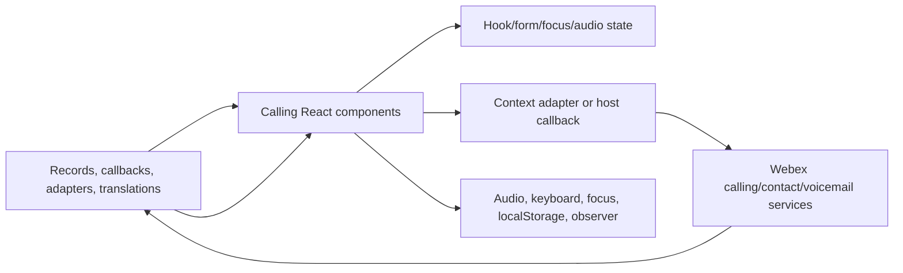
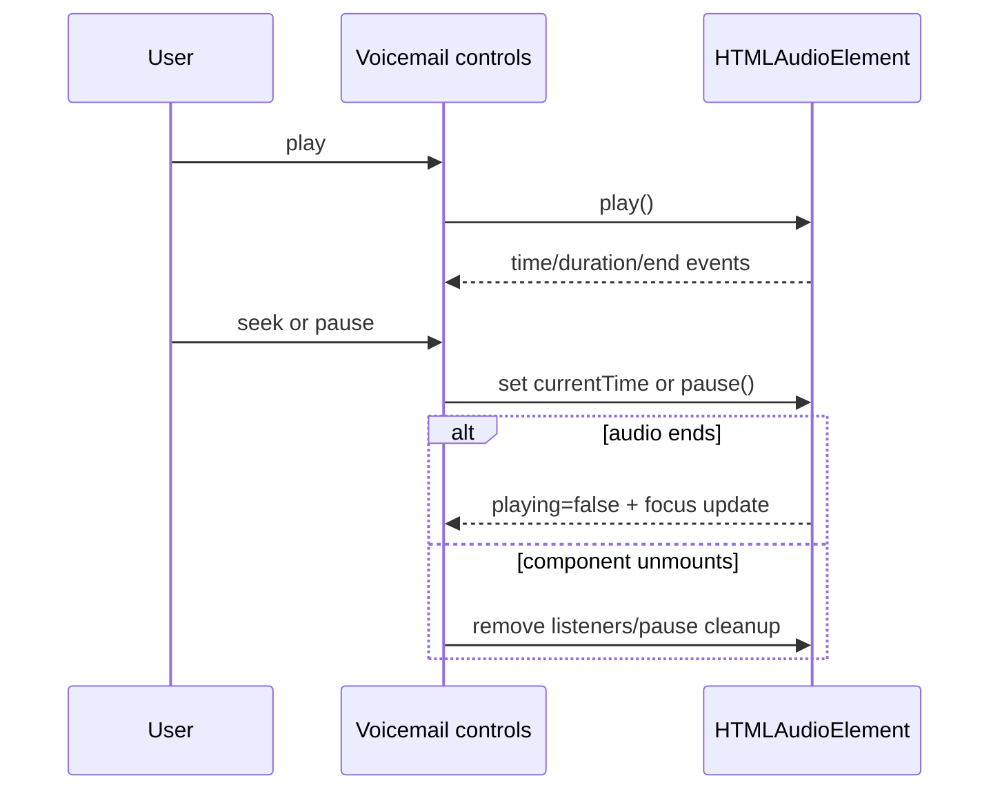
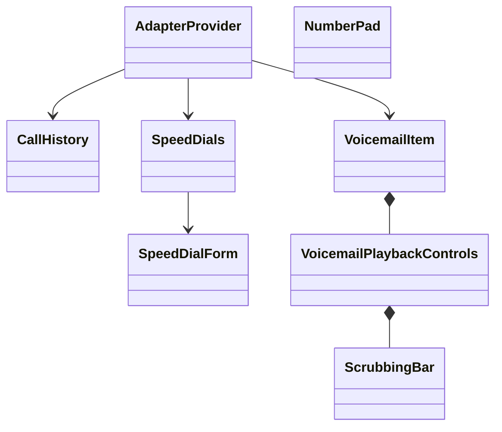
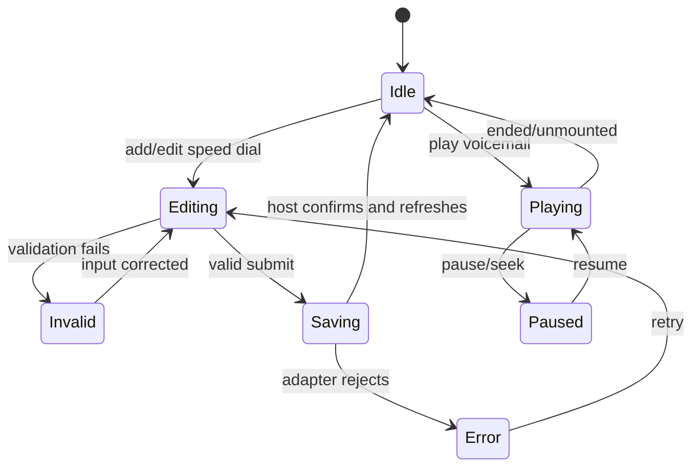

<!-- ───────────────────────────────
  Template:     Module Spec
  Template-ID:  module-spec
  Generates:    ai-docs/modules/calling-spec.md
  Description:  Per-module canonical spec — orientation plus requirements, design, invariants, flows, pitfalls, and tests.
  Library ver:  0.2.2
  Last updated: 2026-07-30
─────────────────────────────── -->

# Calling Widgets — SPEC

> Start with root [`AGENTS.md`](../../AGENTS.md), router [`SPEC_INDEX.md`](../SPEC_INDEX.md), and system [`ARCHITECTURE.md`](../ARCHITECTURE.md).

## Metadata

| Field | Value |
|---|---|
| Module id | `calling` |
| Source path(s) | `packages/node_modules/@webex/widget-call-history/`, `widget-number-pad/`, `widget-speed-dial/`, `widget-voice-mail/` |
| Parent spec | — |
| Doc kind | Module spec |
| Coverage score | 91% assessed 2026-07-22; all typed entrypoints, adapter/call/audio/form flows, UI state and risks covered; automated tests are sparse outside GenericModal |
| Generated from | `module-spec` @ SDLC template library `0.2.2` |
| generated_by / approved_by / updated_at | `codex-desktop` / pending PR approval / 2026-08-07 |
| Validation status | not-run |

## Evidence Rules

TypeScript entrypoints/interfaces, adapter contexts/hooks, component implementations, stories, and the one current Jest test are evidence. Placeholder package READMEs do not establish behavior beyond package identity/import examples.

## Source Material Register

| Source material | Scope | Decision | Detail location or disposition |
|---|---|---|---|
| Call History and Speed Dial placeholder READMEs | package identity/import | verified/unsupported | Valid package identity is in Public Surface; empty install sections and generic summaries are unsupported by code and not promoted. |
| Generic Modal README | component import | verified | The current internal modal relationship is documented in Public Surface and UI Flow. |
| Stories and TypeScript types | API/examples | used/reference-only | Exact props remain native type/story detail; stable exported concepts are summarized below. |

## Overview

Calling is a newer TypeScript/React component family separate from the legacy enhanced widgets. Call History renders call records and call-back controls; Number Pad handles digits, long-press behavior, contact/call selection, and keyboard focus; Speed Dial renders/sorts/creates/edits/removes callable records; Voice Mail renders messages and accessible audio playback/scrubbing.

Packages use Webex component-adapter interfaces and React contexts/hooks to make calls or fetch/search data without constructing the legacy Redux/Webex runtime. Consumers supply typed data, callbacks, adapters, translation providers, and styles.

## Purpose / Responsibility

Own reusable calling-oriented UI and interaction state for history, dialing, speed dials, and voicemail. It does not own calling service persistence, call signaling, contact storage, or voicemail storage.

## Stack

TypeScript 4.5, React hooks/contexts, Momentum UI collaboration components, Webex component adapter interfaces, react-i18next, react-hook-form, react-stately/React Aria utilities, Sass, Storybook, and limited Jest.

## Folder / Package Structure

```text
packages/node_modules/@webex/
├── widget-call-history/src/ # list/item types, call hook, date/voiceover helpers
├── widget-number-pad/src/   # dial pad, call buttons, contact search/popover, focus hooks
├── widget-speed-dial/src/   # list/items/forms/search/modals/photo/banner and types
└── widget-voice-mail/src/   # voicemail item, playback controls, scrubbing/audio hooks
```

## Key Files (source of truth)

| File | Holds |
|---|---|
| `packages/node_modules/@webex/widget-call-history/src/index.ts`, `packages/node_modules/@webex/widget-number-pad/src/index.ts`, `packages/node_modules/@webex/widget-speed-dial/src/index.ts`, `packages/node_modules/@webex/widget-voice-mail/src/index.ts` | public exports |
| `packages/node_modules/@webex/widget-call-history/src/CallHistoryItem.types.ts` | call-history record contract |
| `packages/node_modules/@webex/widget-speed-dial/src/SpeedDials.types.tsx` | speed-dial records/events/list props |
| `packages/node_modules/@webex/widget-speed-dial/src/SpeedDialForm.types.tsx` | create/edit form types |
| package `src/contexts/AdapterContext.tsx` | supplied adapter contracts |
| `packages/node_modules/@webex/widget-number-pad/src/utils/WebexDialPad.ts` | long-press/focus constants |
| `packages/node_modules/@webex/widget-voice-mail/src/hooks/useAudio.ts` | audio playback state/listener lifecycle |

## Public Surface

| Contract ID | Type | Surface | Purpose | Compatibility / deprecation | Schema / detail link | Root index |
|---|---|---|---|---|---|---|
| `rw.widget.call-history` | React/TypeScript | `CallHistoryItem`, `CallHistory`, `NoHistory`, item types | render/select/call back history records | public semver/type surface | `packages/node_modules/@webex/widget-call-history/src/index.ts` | `../CONTRACTS.md` |
| `rw.widget.number-pad` | React/TypeScript | `NumberPad`, `CallButtons`, contact/search/popover components | digit entry, calling controls, contact selection | public semver/type surface | `packages/node_modules/@webex/widget-number-pad/src/index.ts` | `../CONTRACTS.md` |
| `rw.widget.speed-dial` | React/TypeScript | `SpeedDials`, item/form/search/banner + form/list types | manage and activate speed-dial records | public semver/type surface | `packages/node_modules/@webex/widget-speed-dial/src/index.ts` | `../CONTRACTS.md` |
| `rw.widget.voice-mail` | React/TypeScript | `VoicemailItem`, playback controls, scrubbing bar | render/play/seek/call back voicemail | public semver/type surface | `packages/node_modules/@webex/widget-voice-mail/src/index.ts` | `../CONTRACTS.md` |

Compatibility notes:

- Callback names, record fields, optional/default behavior, focus/keyboard semantics, and exported TypeScript types are public.
- Internal hooks/contexts not re-exported at package `index.ts` are implementation surfaces unless a consumer deep-import already exists.

## Requires (dependencies)

- React host plus translation/theme/style providers expected by components.
- `@webex/component-adapter-interfaces`, `@webex/sdk-component-adapter`, Momentum UI/Webex Components.
- Host-supplied record arrays, callbacks/adapters, audio source URLs, refs, and permissions.
- Browser Audio, localStorage, MutationObserver, keyboard/focus, and file/image APIs for applicable controls.

## Requirements

| ID | WHAT | WHY | Source Evidence | Test / Example Evidence | Assumptions / Gaps | Confidence |
|---|---|---|---|---|---|---|
| `CALLING-R-001` | Call History renders supplied records in order, preserves selected state, forwards row/call actions, and can dismiss a badge on row activation. | The package is a controlled list; hosts own records and follow-up call behavior. | `packages/node_modules/@webex/widget-call-history/src/CallHistory.tsx`, `packages/node_modules/@webex/widget-call-history/src/CallHistoryItem.types.ts` | `packages/node_modules/@webex/widget-call-history/src/CallHistory.stories.tsx` | No Jest test found. | PRESENT |
| `CALLING-R-002` | Number Pad reports button values, supports configured long-press alternatives, keyboard grid focus, and contact/call selection callbacks. | Dial input and keyboard accessibility must be deterministic. | `packages/node_modules/@webex/widget-number-pad/src/NumberPad.tsx`, `packages/node_modules/@webex/widget-number-pad/src/hooks/useGridFocus.ts`, `packages/node_modules/@webex/widget-number-pad/src/utils/WebexDialPad.ts` | `packages/node_modules/@webex/widget-number-pad/src/NumberPad.stories.tsx` | No Jest test found. | PRESENT |
| `CALLING-R-003` | Speed Dial renders records and forwards press/audio/video/edit/remove/add/sort callbacks with typed record shapes. | Hosts/adapters own persistence and calls; UI must not invent side effects. | `packages/node_modules/@webex/widget-speed-dial/src/SpeedDials.tsx`, `packages/node_modules/@webex/widget-speed-dial/src/SpeedDials.types.tsx` | `packages/node_modules/@webex/widget-speed-dial/src/SpeedDialModal.stories.tsx` | Core list/form tests sparse. | PRESENT |
| `CALLING-R-004` | Speed Dial forms validate/create/edit inputs and keep modal/search/photo/error UI state consistent on cancel/submit/failure. | Invalid or stuck form state creates bad callable records and inaccessible modal flow. | `packages/node_modules/@webex/widget-speed-dial/src/SpeedDialForm.tsx`, `packages/node_modules/@webex/widget-speed-dial/src/SpeedDialForm.types.tsx`, `packages/node_modules/@webex/widget-speed-dial/src/GenericModal/GenericModal.tsx` | `packages/node_modules/@webex/widget-speed-dial/src/GenericModal/GenericModal.test.tsx` | Full validation matrix not covered. | WEAK |
| `CALLING-R-005` | Voicemail playback loads audio, reports play state/time/duration, supports seek and focus transitions, and removes audio listeners on cleanup. | Audio controls must remain synchronized and accessible across repeated items/mounts. | `packages/node_modules/@webex/widget-voice-mail/src/VoicemailPlaybackControls.tsx`, `packages/node_modules/@webex/widget-voice-mail/src/hooks/useAudio.ts` | `packages/node_modules/@webex/widget-voice-mail/src/ScrubbingBar.stories.tsx` | No Jest test found. | PRESENT |
| `CALLING-R-006` | Adapter-backed call/search operations handle missing adapters and rejected promises without committing service state locally. | These packages are UI adapters, not service owners; failures must remain recoverable by the host. | `packages/node_modules/@webex/widget-call-history/src/contexts/AdapterContext.tsx`, `packages/node_modules/@webex/widget-call-history/src/hooks/useMakeCall.ts`, `packages/node_modules/@webex/widget-speed-dial/src/hooks/useContactSearch.ts` | `packages/node_modules/@webex/widget-call-history/src/CallHistory.stories.tsx` | Error contract needs stronger tests. | WEAK |

## Design Overview

The packages are controlled component layers. Record arrays and callbacks are supplied by consumers, while small hooks provide local focus, debounce, form, audio, or adapter-call state. Adapter contexts decouple UI from a specific SDK instance and allow a host to inject the component-adapter implementation.

The shared `useWebexClasses` pattern creates predictable BEM-like classes, and Storybook stories serve as executable usage examples. TypeScript entrypoints intentionally export selected components/types rather than every internal modal/hook.

## Data Flow



Remote operations use host callbacks or adapter promises; component composition is in-process React; audio/focus interactions use browser APIs.

## Sequence Diagram(s)

Sequence coverage:

| Operation group | Diagram | Failure / recovery coverage |
|---|---|---|
| select/call record or speed dial | Controlled action | missing callback/adapter and rejection |
| create/edit speed dial | Form/modal flow | validation/cancel/service failure |
| play/seek voicemail | Audio flow | load/end/unmount recovery |

```mermaid
sequenceDiagram
  participant U as User
  participant C as History/Dial/SpeedDial UI
  participant H as Host callback or adapter
  participant S as Calling service
  U->>C: select or press audio/video call
  alt callback/adapter available
    C->>H: record/address + call mode/label
    H->>S: make call
    alt rejected
      S-->>H: error
      H-->>C: recoverable error state
    else accepted
      S-->>H: call result
    end
  else unavailable
    C-->>U: no service side effect; host must configure adapter
  end
```

```mermaid
sequenceDiagram
  participant U as User
  participant M as SpeedDial modal
  participant F as Form
  participant H as Host/adapter
  U->>M: add or edit
  M->>F: initialize values
  alt invalid
    F-->>U: validation errors; submit disabled
  else valid submit
    F->>H: create/update record
    alt failure
      H-->>M: error modal/banner; form retained
    else success
      H-->>M: close and host refreshes items
    end
  end
  opt cancel
    U->>M: cancel; discard local edits
  end
```



## Class / Component Relationships



## Use Cases

- **UC-1 Review and return a call:** host supplies history → user selects/calls an item → callback/adapter initiates call → host updates records/selection.
- **UC-2 Dial a number/contact:** user enters digits or searches contacts → keyboard/long-press rules update input → call selection invokes supplied action.
- **UC-3 Manage speed dials:** user adds/edits/removes/reorders records → validated callback/adapter request → host refreshes controlled list.
- **UC-4 Play/call back voicemail:** user plays/seeks/pauses an audio source or presses call-back → audio state/focus updates and supplied call action runs.
- **UI flow:** list/empty/error → selected item/action controls; Speed Dial additionally uses add/edit/search/photo/modal/error screens; Voice Mail uses play/pause/scrub/focus states.
- **Cross-service flow:** adapters/callbacks cross to Webex component services; all persisted results return from the host rather than being owned in component state.

## State Model

- Controlled data: call history items, selected record, speed-dial records, voicemail metadata, and host callbacks/adapters.
- Local state: focus/keyboard indices, digit press timing, search/debounce, form validity/dirty state, modal selection/error, image preview, audio object/current time/duration/playing.
- Browser focus flags are temporary and removed on blur/unmount; they are not domain persistence.

## Business Rules & Invariants

- Stable item IDs drive React keys/selection/reordering; do not use array position as durable identity.
- Speed Dial submit remains disabled when invalid and, for edits, when not dirty.
- Long-press behavior applies only to configured dial-pad values and must not also emit the short value after the threshold.
- Audio play/pause/time and focus state must reflect the same `HTMLAudioElement` lifecycle.

## Concurrency & Reactive Flow

- Debounced search and adapter calls can resolve out of order; callers/hooks must avoid applying stale results.
- Audio time/end events update React state asynchronously and must remove listeners on cleanup.
- Timers implement dial-pad long press; cleanup must prevent delayed callbacks after unmount/release.
- MutationObserver/focus listeners in call-selection UI require symmetric removal.

## State Machine



## UI Flow

- Call History: list/empty → row selected → audio/video/callback action.
- Number Pad: focus grid → digit/long press → optional contact results → call-mode selection.
- Speed Dial: list/error/empty → add/edit modal → validated form/search/photo → save/cancel/error → reordered list.
- Voice Mail: item → playback controls → scrub/focus/ended states, with call-back action when provided.
- Preserve labels, focus visibility, arrow-key transitions, list position announcements, and German/locale-specific formatting flags.

## Error Handling & Failure Modes

| Condition | Signal (error/code/result) | Caller recovery |
|---|---|---|
| no callback/adapter function | optional call is not performed | provide the required callback/AdapterProvider |
| adapter/search/save rejects | hook/form error or host rejection | retain input, show error/banner/modal, retry/cancel |
| invalid speed-dial input | form errors/disabled submit | correct required fields/type/addresses |
| audio fails to load/play | missing duration/play rejection | show non-playing state and provide valid source/browser permission |
| empty record list | empty/list UI | host supplies records or user adds when supported |
| component unmount with active timer/listener/audio | leak/stale callback risk | cleanup timer/listener/observer/audio in effect return |

## Pitfalls

- Package READMEs are placeholder-level and contain empty install commands; use entrypoints/types/stories, not those blanks.
- Several packages deep-import adapter interface distribution paths (`dist/cjs` or `dist/esm`); dependency upgrades can break type/runtime resolution.
- `dismissBagdeonClickRow` is misspelled in the public Call History type/implementation; correcting spelling alone would be breaking.
- Number Pad uses localStorage for focus coordination, not persisted dialing data; always remove temporary keys.
- Calling packages have far less Jest coverage than legacy component packages; characterize before behavior changes.

## Module Do's / Don'ts

- DO keep components controlled and forward service operations through typed callbacks/adapters.
- DO preserve focus cleanup and accessible announcements when changing markup.
- DON'T introduce hidden persistence, silently rename misspelled public props, or export internal hooks without a contract review.

## Export Stability

All symbols in the four `src/index.ts` files and their exported TypeScript interfaces are public semver surfaces. Additive optional props/types are preferred; removals/required-field changes need a major migration. The placeholder READMEs do not narrow these actual exports.

## Host Integration & Theming

Consumers mount React components, supply Momentum/Webex styling and i18n context, and inject data/callbacks or adapter providers. Components assume browser focus/audio/observer APIs where used but do not assume the legacy `window.webex.widget` runtime.

## Key Design Trade-off

- Controlled components and adapter contexts maximize host portability and keep service state outside the UI packages, at the cost of requiring consumers to wire records, persistence, translations, and failure handling explicitly.

## Test-Case Strategy (module)

Storybook stories cover visual/use-case examples; `GenericModal.test.tsx` covers the only discovered Jest target. Before modifying behavior, add React tests for each exported component/hook boundary with positive action and negative missing/rejected/cleanup cases, plus keyboard/focus/audio assertions. Adapter integration belongs in a host/component-adapter test layer.

| Behavior / Requirement | Existing test evidence | Gap |
|---|---|---|
| `CALLING-R-001` Call History | `packages/node_modules/@webex/widget-call-history/src/CallHistory.stories.tsx` | no Jest coverage |
| `CALLING-R-002` Number Pad | `packages/node_modules/@webex/widget-number-pad/src/NumberPad.stories.tsx` | long-press/grid/contact Jest coverage |
| `CALLING-R-003` Speed Dial callbacks/sort | `packages/node_modules/@webex/widget-speed-dial/src/SpeedDialModal.stories.tsx` | core list tests |
| `CALLING-R-004` form/modal | `packages/node_modules/@webex/widget-speed-dial/src/GenericModal/GenericModal.test.tsx` | validation/save/error matrix |
| `CALLING-R-005` voicemail audio | `packages/node_modules/@webex/widget-voice-mail/src/ScrubbingBar.stories.tsx` | audio event/cleanup/focus tests |
| `CALLING-R-006` adapters/errors | `packages/node_modules/@webex/widget-call-history/src/hooks/useMakeCall.ts` | missing/rejected adapter tests |

## Traceability

- Architecture: `../ARCHITECTURE.md`; registry: `../SPEC_INDEX.md`; contracts: `../CONTRACTS.md`.
- Machine coverage/profile/contracts: `.sdd/manifest.json`.
