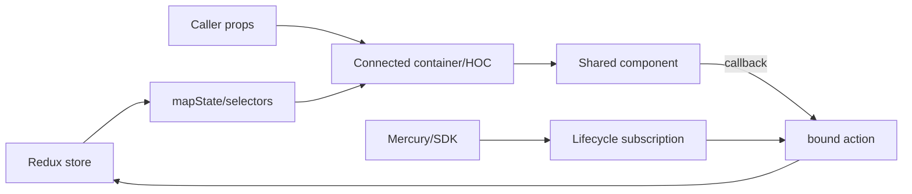
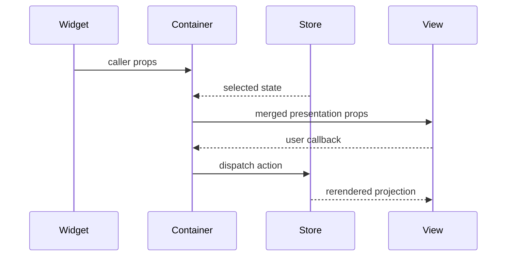
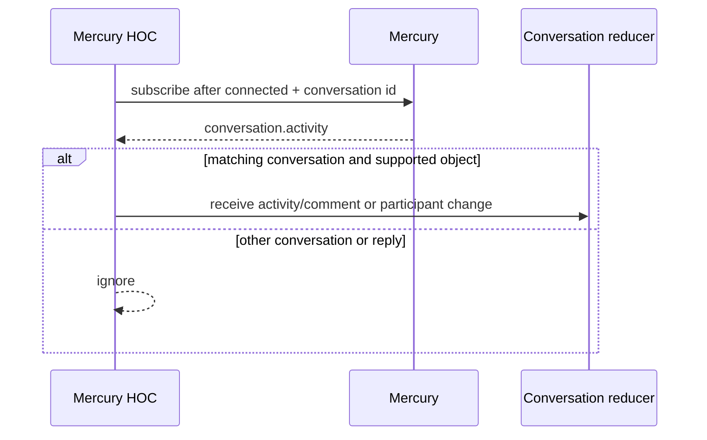
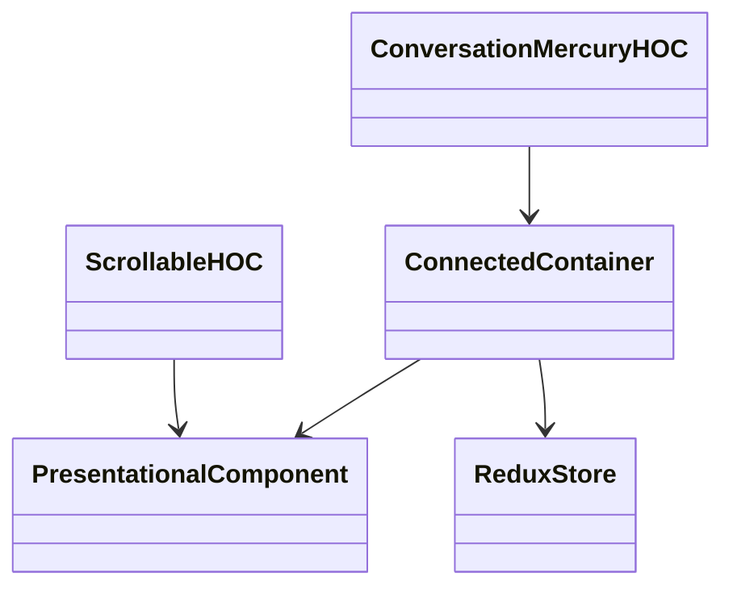
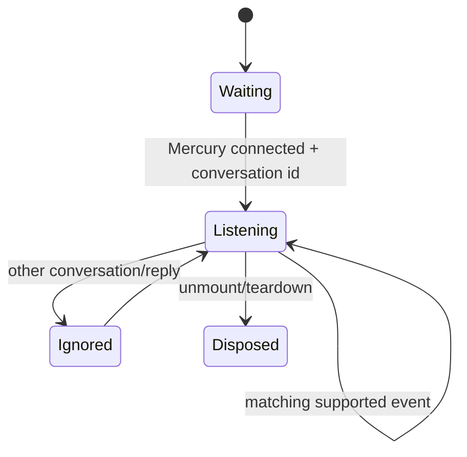

<!-- ───────────────────────────────
  Template:     Module Spec
  Template-ID:  module-spec
  Generates:    ai-docs/modules/containers-hooks-spec.md
  Description:  Per-module canonical spec — orientation plus requirements, design, invariants, flows, pitfalls, and tests.
  Library ver:  0.2.2
  Last updated: 2026-07-30
─────────────────────────────── -->

# Containers and HOCs — SPEC

> Start with root [`AGENTS.md`](../../AGENTS.md), router [`SPEC_INDEX.md`](../SPEC_INDEX.md), and system [`ARCHITECTURE.md`](../ARCHITECTURE.md).

## Metadata

| Field | Value |
|---|---|
| Module id | `containers-hooks` |
| Source path(s) | `packages/node_modules/@webex/react-container-*/`, `react-hoc-*/` |
| Parent spec | — |
| Doc kind | Module spec |
| Coverage score | 92% assessed 2026-07-22; every package and lifecycle boundary covered, with gaps around repeated subscription cleanup |
| Generated from | `module-spec` @ SDLC template library `0.2.2` |
| generated_by / approved_by / updated_at | `codex-desktop` / pending PR approval / 2026-08-07 |
| Validation status | not-run |

## Evidence Rules

Connected-container exports, selectors, actions/reducers, lifecycle methods, tests, and consuming widgets determine behavior. Despite the capability name, the repository currently implements class/connect HOCs rather than a general React Hooks layer.

## Source Material Register

| Source material | Scope | Decision | Detail location or disposition |
|---|---|---|---|
| Legacy container/HOC rename READMEs | namespace migration | verified | Export Stability records the suffix-preserving `@webex` mapping. |
| Container/HOC source | injection and lifecycle | authoritative | Public Surface through Concurrency. |
| Adjacent Jest tests | projections/interactions | verified | Test-Case Strategy. |

## Overview

Seven container packages connect shared UI to Redux/SDK-aware behavior: activity list, file downloader, message composer, notifications, presence avatar, read receipts, and scrolling activity. Two HOCs add conversation Mercury handling and imperative scroll behavior.

## Purpose / Responsibility

Translate application state and actions into presentational props, and own only the subscriptions or DOM capabilities necessary for that translation. Containers must preserve wrapped-component contracts and clean up resources they create.

## Stack

React 16, react-redux `connect`, Redux actions/reducers, Immutable.js, reselect, recompose conventions, PropTypes, Webex SDK/Mercury, CSS modules, and Jest.

## Folder / Package Structure

```text
packages/node_modules/@webex/
├── react-container-activity-list/src/
├── react-container-file-downloader/src/
├── react-container-message-composer/src/
├── react-container-notifications/src/
├── react-container-presence-avatar/src/
├── react-container-read-receipts/src/
├── react-container-scrolling-activity/src/
├── react-hoc-conversation-mercury/src/
└── react-hoc-scrollable/src/
```

## Key Files (source of truth)

| File | Holds |
|---|---|
| `packages/node_modules/@webex/react-container-activity-list/src/index.js` and the exact container paths indexed in `../CONTRACTS.md` | public default/named exports |
| `packages/node_modules/@webex/react-container-activity-list/src/selectors.js` | activity projection |
| `packages/node_modules/@webex/react-container-message-composer/src/container.js` | composer state/actions |
| `packages/node_modules/@webex/react-container-notifications/src/container.js` | notification integration |
| `packages/node_modules/@webex/react-hoc-conversation-mercury/src/index.js` | conversation subscription/filtering |
| `packages/node_modules/@webex/react-hoc-scrollable/src/index.js` | imperative scrolling API |

## Public Surface

| Contract ID | Type | Surface | Purpose | Compatibility / deprecation | Schema / detail link | Root index |
|---|---|---|---|---|---|---|
| `rw.containers` | SDK/React | seven `react-container-*` default entrypoints | connect presentation to selected state/actions | public semver; injected/caller props remain compatible | exact `rw.container.*` catalog paths; representative: `packages/node_modules/@webex/react-container-activity-list/src/index.js`, `packages/node_modules/@webex/react-container-message-composer/src/index.js` | `../CONTRACTS.md` |
| `rw.hoc.conversation-mercury` | SDK/React | `wrapConversationMercury(Component)` | filter/dispatch live conversation activity | public semver; `WrappedComponent` and display name are observable | `packages/node_modules/@webex/react-hoc-conversation-mercury/src/index.js` | `../CONTRACTS.md` |
| `rw.hoc.scrollable` | SDK/React | `injectScrollable(Component)` plus imperative scroll methods | reusable activity scrolling | public semver; methods and thresholds are observable | `packages/node_modules/@webex/react-hoc-scrollable/src/index.js` | `../CONTRACTS.md` |

Compatibility notes:

Message composer and notifications also expose actions and a reducer. Injected props are implementation-owned; caller-facing props remain declared alongside each wrapper.

## Requires (dependencies)

Redux slices/actions/selectors, shared components, React/DOM lifecycle, Webex SDK/Mercury for live conversation behavior, and owning widgets to compose any exported reducers.

## Requirements

| ID | WHAT | WHY | Source Evidence | Test / Example Evidence | Assumptions / Gaps | Confidence |
|---|---|---|---|---|---|---|
| `CONT-R-001` | Containers derive presentational props without changing caller-supplied props except for documented injections. | Wrapped components must remain reusable and predictable. | `packages/node_modules/@webex/react-container-activity-list/src/index.js`, `packages/node_modules/@webex/react-container-activity-list/src/selectors.js` | `packages/node_modules/@webex/react-container-activity-list/src/index.test.js`, `packages/node_modules/@webex/react-container-activity-list/src/selectors.test.js` | Prop collision behavior is not uniformly tested. | PRESENT |
| `CONT-R-002` | Containers that export reducers/actions expose them through the package barrel for widget composition. | State behavior must be installable with the connected component. | `packages/node_modules/@webex/react-container-message-composer/src/index.js`, `packages/node_modules/@webex/react-container-notifications/src/index.js` | `packages/node_modules/@webex/react-container-message-composer/src/index.test.js`, `packages/node_modules/@webex/react-container-notifications/src/container.test.js` | None known. | PRESENT |
| `CONT-R-003` | Conversation Mercury handling subscribes only after connection and conversation identity exist and ignores other conversations/replies. | Prevent duplicate or cross-conversation activity updates. | `packages/node_modules/@webex/react-hoc-conversation-mercury/src/index.js` | adjacent HOC tests | Listener removal is not explicit in this HOC. | WEAK |
| `CONT-R-004` | Scrollable exposes stable threshold-based top/bottom methods around the wrapped content node. | Activity views need reusable infinite-scroll and jump-to-bottom behavior. | `packages/node_modules/@webex/react-hoc-scrollable/src/index.js` | adjacent HOC tests | Thresholds 100/150 pixels are current behavior. | PRESENT |
| `CONT-R-005` | File, composer, notification, presence, receipt, and activity projections surface SDK/action failures through owning state/callback paths. | Containers should not swallow failures between data and UI layers. | `packages/node_modules/@webex/react-container-file-downloader/src/index.js`, `packages/node_modules/@webex/react-container-message-composer/src/container.js`, `packages/node_modules/@webex/react-container-notifications/src/container.js` | `packages/node_modules/@webex/react-container-file-downloader/src/index.test.js`, `packages/node_modules/@webex/react-container-message-composer/src/index.test.js` | Error rendering may be owned by parent UI. | PRESENT |

## Design Overview

Containers are intentionally thin adapters. Selectors/projectors turn Immutable state into component-friendly data, dispatch bindings supply operations, and the wrapped component remains responsible for presentation. HOCs own cross-cutting lifecycle behavior that cannot be expressed as a simple projection.

## Data Flow



## Sequence Diagram(s)

Sequence coverage:

| Operation group | Diagram | Failure / recovery coverage |
|---|---|---|
| project and dispatch | Container interaction | initial projection and action-result rerender |
| subscribe and filter realtime activity | Mercury conversation flow | other-conversation/reply ignore branch; teardown gap is recorded in Pitfalls |





## Class / Component Relationships



## Use Cases

- Project normalized activities into an activity-list component.
- Submit composer text/files through bound operations and local reducer state.
- Receive a matching Mercury conversation event and dispatch the appropriate update.
- Download a file through SDK-backed state while reporting failure.
- Allow an activity surface to measure, set, and classify its scroll position.

## State Model

Most containers are projections with no independent state. Message composer, notifications, and presence-related packages may own reducer slices. HOCs keep only lifecycle/DOM references; the conversation HOC records `isListeningToMercury` in the conversation state to guard registration.

## Business Rules & Invariants

- Do not dispatch conversation activity for a different conversation.
- Reply activities are currently ignored by the Mercury HOC.
- Person-object add/leave verbs map to participant actions before the comment is recorded.
- Scroll top/bottom calculations use the wrapped node and current 100/150-pixel thresholds.

## Concurrency & Reactive Flow

Redux updates, prop changes, DOM scroll events, and Mercury events are independent. Subscription guards must be idempotent; unmount or conversation changes must not leave callbacks that target stale stores/components.

## State Machine



## Error Handling & Failure Modes

| Condition | Signal (error/code/result) | Caller recovery |
|---|---|---|
| selected state not loaded | initial/empty projection | render bounded empty/loading state |
| bound SDK/action rejects | owning reducer error or callback result | parent renders error/retry |
| scroll node absent | imperative method cannot complete | call only after mount; guard new call sites |
| duplicate/unremoved Mercury listener | duplicate dispatched activity | dispose listener and characterize reconnect behavior |

## Pitfalls

- `react-hoc-conversation-mercury` registers a listener but does not visibly remove it; characterize behavior before changing it.
- `shouldComponentUpdate(nextProps) { return nextProps !== this.props; }` relies on reference changes.
- “containers-hooks” is a capability label, not evidence that these packages export Hooks.

## Module Do's / Don'ts

- Do keep selectors deterministic and injected props explicit.
- Do add teardown for newly introduced listeners/timers.
- Don't move presentation decisions into a state connector.
- Don't change imperative scrolling methods without checking activity consumers.

## Export Stability

Container and HOC package entrypoints are public semver surfaces. Protected `@ciscospark` notices document the same package suffix under `@webex`; wrapper display names and `WrappedComponent` are observable in tests/tooling.

## Host Integration & Theming

Containers pass through host/widget props and render shared components, inheriting their CSS/intl/accessibility behavior. Browser-specific behavior is limited to DOM scrolling, downloads, notifications, and realtime SDK events.

## Key Design Trade-off

Thin packages keep concerns reusable, but lifecycle behavior spread across HOCs and widgets makes listener ownership harder to audit. New cross-cutting behavior should state exactly who registers and disposes it.

## Test-Case Strategy (module)

| Requirement | Current evidence | Focused gap |
|---|---|---|
| `CONT-R-001` projection | `packages/node_modules/@webex/react-container-activity-list/src/index.test.js`, `packages/node_modules/@webex/react-container-activity-list/src/selectors.test.js` | prop collision matrix |
| `CONT-R-002` exports | `packages/node_modules/@webex/react-container-message-composer/src/index.test.js` | public export snapshot |
| `CONT-R-003` Mercury filters | None found adjacent to `packages/node_modules/@webex/react-hoc-conversation-mercury/src/index.js` | teardown/reconnect characterization |
| `CONT-R-004` scrolling | None found adjacent to `packages/node_modules/@webex/react-hoc-scrollable/src/index.js` | absent-node/resize behavior |
| `CONT-R-005` failures | `packages/node_modules/@webex/react-container-file-downloader/src/index.test.js`, `test/journeys/specs/space/index.js` | integrated error display |

## Traceability

- Architecture/contracts: `../ARCHITECTURE.md`, `../CONTRACTS.md`.
- Listener rule: `../rules/clean-up-runtime-listeners.md`.
- Machine coverage/profile/contracts: `.sdd/manifest.json`.
