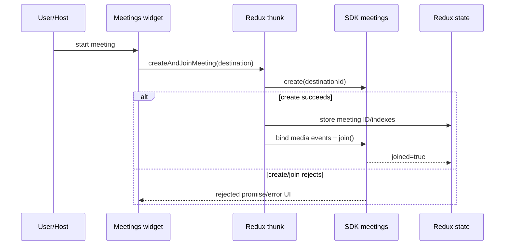
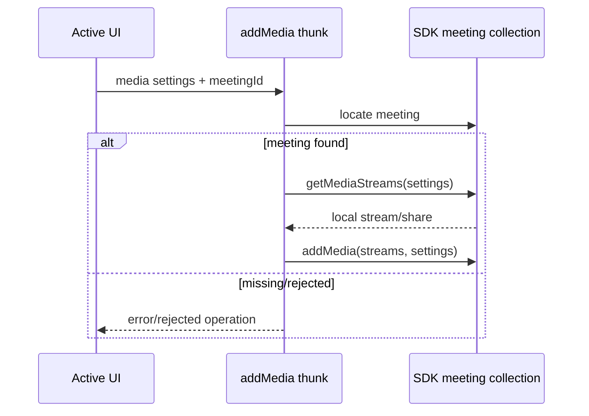
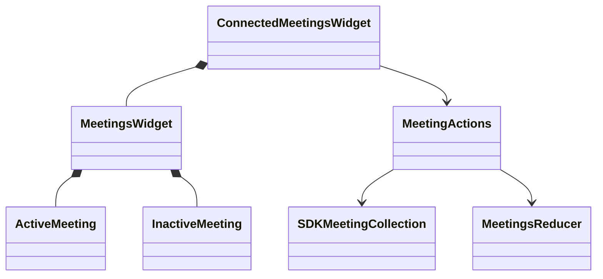
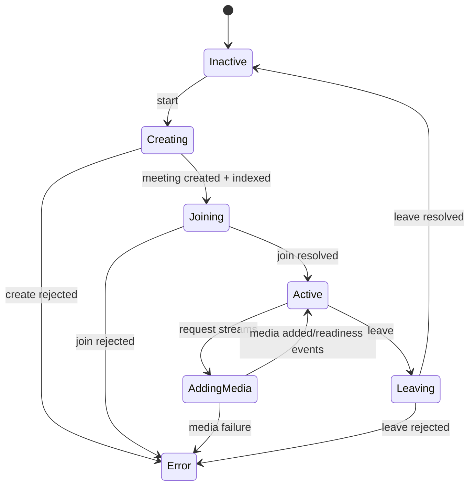

<!-- ───────────────────────────────
  Template:     Module Spec
  Template-ID:  module-spec
  Generates:    ai-docs/modules/meetings-spec.md
  Description:  Per-module canonical spec — orientation plus requirements, design, invariants, flows, pitfalls, and tests.
  Library ver:  0.2.2
  Last updated: 2026-07-30
─────────────────────────────── -->

<!-- sdd-generated-metadata
doc_kind: module-spec
generated_from: module-spec
generator_plugin: sdd-bootstrap@0.4.3
generated_by: cursor-agent
approved_by: pending PR approval
updated_at: 2026-09-08
validation_status: not-run
-->


# Meetings — SPEC

> Start with root [`AGENTS.md`](../../AGENTS.md), router [`SPEC_INDEX.md`](../SPEC_INDEX.md), and system [`ARCHITECTURE.md`](../ARCHITECTURE.md).

## Metadata

| Field | Value |
|---|---|
| Module id | `meetings` |
| Source path(s) | `packages/node_modules/@webex/widget-meet/`, `widget-meetings/`, `redux-module-meetings/` |
| Parent spec | — |
| Doc kind | Module spec |
| Coverage score | 92% assessed 2026-07-22; entrypoints, destinations, legacy events, create/join/media/leave flow, state, UI, and current tests covered; lifecycle TODOs remain gaps |
| Generated from | `module-spec` @ SDLC template library `0.2.2` |
| generated_by / approved_by / updated_at | `codex-desktop` / pending PR approval / 2026-08-07 |
| Validation status | not-run |

## Evidence Rules

Claims come from package entrypoints, containers/enhancers/handlers, meeting actions/reducer, UI tests, and Space journey meeting intent. The legacy namespace notice supplies compatibility history only.

## Source Material Register

| Source material | Scope | Decision | Detail location or disposition |
|---|---|---|---|
| Protected `@ciscospark/widget-meet` README and rename notice | compatibility | verified | Export Stability records the current namespace; legal material remains protected. |
| Space/Recents call and meeting guidance | host flow/tests | verified | Use Cases and Test Strategy connect incoming/start/join/hang-up behavior to current code. |
| Current implementation comments/TODOs | design gaps | used | Missing media-stopped and meeting stopped/destroyed handling is explicit in Pitfalls and tests. |

## Overview

This capability contains two related legacy widgets. `widget-meet` integrates the older media/Mercury call stack and emits call lifecycle host events. Its membership event names are exported constants but have no publisher in current source. `widget-meetings` uses the SDK meetings plugin plus `redux-module-meetings` to create, join, add media, and leave meetings while rendering inactive/active states.

Both accept typed destination identifiers and compose through the shared widget base. The newer reducer intentionally stores meeting IDs and readiness state rather than SDK meeting objects; the SDK meeting collection remains the object source of truth.

## Purpose / Responsibility

Own embeddable meeting/call presentation and the client lifecycle from destination lookup through create/join/media/leave. Remote meeting membership, media transport, and service truth remain owned by the Webex SDK/services.

## Stack

JavaScript, React/PropTypes, Redux/Immutable.js, recompose, react-intl, Webex JS SDK meeting/media/Mercury plugins, shared media components, Jest, and Space browser journeys.

## Folder / Package Structure

```text
packages/node_modules/@webex/
├── widget-meet/src/             # legacy call widget, media/Mercury enhancers, host events
├── widget-meetings/src/         # create/join/leave UI, selectors, handlers, setup
└── redux-module-meetings/src/   # meeting thunks, ID indexes, media-ready state
```

## Key Files (source of truth)

| File | Holds |
|---|---|
| `packages/node_modules/@webex/widget-meet/src/index.js` | legacy widget export, destination types, enhancer composition |
| `packages/node_modules/@webex/widget-meet/src/events.js` | legacy call/membership event strings and payload builder |
| `packages/node_modules/@webex/widget-meetings/src/index.js` | meetings widget export, reducers, destination types |
| `packages/node_modules/@webex/widget-meetings/src/container.js` | public destination props and active/inactive UI wiring |
| `packages/node_modules/@webex/redux-module-meetings/src/actions.js` | create/join/add-media/leave thunks and SDK event binding |
| `packages/node_modules/@webex/redux-module-meetings/src/reducer.js` | destination/locus/ID indexes and meeting readiness state |

## Public Surface

| Contract ID | Type | Surface | Purpose | Compatibility / deprecation | Schema / detail link | Root index |
|---|---|---|---|---|---|---|
| `rw.widget.meet` | SDK/React/event | default Meet widget + reducers/destination types | legacy call experience and host call events | public semver | `packages/node_modules/@webex/widget-meet/src/index.js` | `../CONTRACTS.md` |
| `rw.widget.meetings` | SDK/React | default Meetings widget + reducers/destination types | meetings-plugin create/join/media/leave UI | public semver | `packages/node_modules/@webex/widget-meetings/src/index.js` | `../CONTRACTS.md` |
| `rw.state.meetings` | SDK/Redux | action thunks, reducer, `initialState`, `buildDestinationLookup` | shared meeting state and operations | public semver | `packages/node_modules/@webex/redux-module-meetings/src/index.js` | `../CONTRACTS.md` |
| `rw.meet.events` | event | emitted `calls:created/connected/disconnected`; defined-only `memberships:notified/connected/declined/disconnected` constants | legacy host lifecycle notifications and definition-only compatibility names | exact emitted strings stable; membership constants are not active events without a publisher | `packages/node_modules/@webex/widget-meet/src/events.js`, `packages/node_modules/@webex/widget-meet/src/enhancers/withEventHandler.js` | `../CONTRACTS.md` |

Compatibility notes:

- Destination values remain `sip`, `email`, `userId`, `spaceId`, and `pstn`.
- `widget-meet` and `widget-meetings` are distinct public packages; do not silently replace one with the other.

## Requires (dependencies)

- Shared widget runtime/auth/intl and Webex SDK meetings/media/Mercury plugins.
- Legacy media Redux package for `widget-meet`; meetings Redux package for `widget-meetings`.
- Browser audio/video/media-stream capability and host permissions.
- Destination context from the host/Space/Recents flow.

## Requirements

| ID | WHAT | WHY | Source Evidence | Test / Example Evidence | Assumptions / Gaps | Confidence |
|---|---|---|---|---|---|---|
| `MEET-R-001` | Widgets accept only supported destination types/IDs and expose the same destination string set. | Hosts need one predictable target contract across Space/Meet/Meetings. | `packages/node_modules/@webex/widget-meet/src/index.js`, `packages/node_modules/@webex/widget-meetings/src/index.js`, `packages/node_modules/@webex/widget-meetings/src/container.js` | `test/journeys/specs/space/startup-settings.js`, `test/journeys/specs/space/index.js` | Invalid destination tests are sparse in Meetings. | PRESENT |
| `MEET-R-002` | `createAndJoinMeeting` creates through the SDK, stores ID lookup state, binds media events, joins, and resolves the meeting. | Ordered state creation prevents selectors from referencing an unindexed SDK object. | `packages/node_modules/@webex/redux-module-meetings/src/actions.js` | None found for the action path. | Major unit-test gap. | WEAK |
| `MEET-R-003` | Meeting Redux stores IDs and readiness flags by destination/locus/ID; SDK collection remains object source of truth. | Avoids placing mutable SDK meeting objects into immutable Redux state. | `packages/node_modules/@webex/redux-module-meetings/src/reducer.js` | `packages/node_modules/@webex/widget-meetings/src/components/MeetingsWidget.test.js` | Reducer lacks direct tests. | PRESENT |
| `MEET-R-004` | Adding media obtains streams with explicit send/receive settings and adds them to the located meeting. | Media direction must match host/user intent and SDK lifecycle. | `packages/node_modules/@webex/redux-module-meetings/src/actions.js` | ActiveMeeting/MeetingsWidget tests | Promise rejection path lacks dedicated tests. | PRESENT |
| `MEET-R-005` | Leave locates the meeting, invokes SDK `leave()`, then records `joined=false`; errors reject to the caller/error enhancer. | UI/state must not claim leave before the SDK operation succeeds. | `packages/node_modules/@webex/redux-module-meetings/src/actions.js`, `packages/node_modules/@webex/redux-module-meetings/src/reducer.js`, `packages/node_modules/@webex/widget-meetings/src/handlers/index.js` | `packages/node_modules/@webex/widget-meetings/src/components/ActiveMeeting.test.js`, `test/journeys/specs/space/index.js` | stopped/destroyed cleanup handling remains unimplemented. | PRESENT |
| `MEET-R-006` | Active/inactive/error/loading UI and legacy call events reflect current meeting/media state and remain keyboard/accessibility compatible. | The visible lifecycle and host callbacks are the consumer contract. | `packages/node_modules/@webex/widget-meetings/src/components/MeetingsWidget.js`, `packages/node_modules/@webex/widget-meet/src/container.js`, `packages/node_modules/@webex/widget-meet/src/events.js` | `packages/node_modules/@webex/widget-meetings/src/components/MeetingsWidget.test.js`, `test/journeys/specs/smoke/widget-space/index.js`, `test/journeys/specs/space/guest.js` | direct axe coverage is through Space composition. | PRESENT |

## Design Overview

The newer flow separates SDK object ownership from Redux indexing. A thunk asks `sdkInstance.meetings` to create or locate a meeting, the reducer maps destination/locus identifiers to the SDK meeting ID, and selectors retrieve the object/readiness needed by the connected UI. Media-ready events update boolean state; handlers map start/leave controls to thunks.

The legacy Meet widget instead composes media and Mercury enhancers around its connected view and formats call events for hosts. Membership strings remain exported but are not emitted by `withEventHandler`. Keeping both packages preserves consumers while allowing the newer meetings-plugin model to coexist.

## Data Flow

```mermaid
flowchart LR
  Host[Destination + credentials] --> Widget[Meet or Meetings widget]
  Widget --> Runtime[Shared widget runtime]
  Runtime --> SDK[Webex SDK meetings/media/Mercury]
  SDK --> Thunks[Meeting/media thunks and event handlers]
  Thunks --> Redux[ID indexes + readiness/call state]
  Redux --> Selector[Meeting selector]
  Selector --> UI[Inactive/Active meeting UI]
  UI --> HostEvents[Legacy call events/callbacks]
```



Transport is in-process Redux/React plus promise/event-based Webex SDK calls and browser media streams.

## Sequence Diagram(s)

Sequence coverage:

| Operation group | Diagram | Failure / recovery coverage |
|---|---|---|
| create/join | Create and join | create/join rejection |
| add media | Media acquisition | missing meeting/media failure |
| leave | Leave lifecycle | lookup/leave rejection |





```mermaid
sequenceDiagram
  participant U as User
  participant W as Meeting UI
  participant A as leave thunk
  participant S as SDK meeting
  participant R as Redux state
  U->>W: leave
  W->>A: destination
  A->>S: locate + leave()
  alt success
    A->>R: joined=false
    R-->>W: inactive UI
  else lookup/leave failure
    A-->>W: error; joined state not falsely cleared
  end
```

## Class / Component Relationships



## Use Cases

- **UC-1 Start a destination meeting:** host supplies destination → user starts → SDK creates/joins → UI becomes active and media can attach.
- **UC-2 Join/add media:** active meeting requests configured send/receive streams → SDK returns media → UI renders local/remote media readiness.
- **UC-3 Leave/decline/hang up:** user action invokes SDK lifecycle → state/event/UI transitions to inactive or declined.
- **UC-4 Answer incoming call from Recents:** host receives a call object/room context → mounts Space/Meet flow with that call → lifecycle events report progress.
- **UI flow:** loading/error → inactive call control → active meeting media/leave controls → inactive after leave.
- **Cross-service flow:** Webex meeting/media/Mercury plugins own remote meeting and streams; Redux holds indexes/readiness only.

## State Model

- New meetings state: `byDestination`, `byLocusUrl`, and `byId`; each ID maps to `joined`, `hasLocalMedia`, `hasRemoteVideo`, and `hasRemoteAudio`.
- Legacy Meet state combines media/call and widget-specific error/destination details.
- Transitions come from create/store, join, media-ready, leave, incoming call/membership events, and SDK errors.

## Business Rules & Invariants

- `buildDestinationLookup` requires both destination ID and type and creates the stable `${type}-${id}` key.
- Never store the SDK meeting object in immutable Redux state; locate it in `meetingCollection.meetings` by ID.
- Record `joined=true/false` only after corresponding SDK promise success.
- Ignore falsey `media:ready` events; set only the readiness flag matching `local`, `remoteVideo`, or `remoteAudio`.

## Concurrency & Reactive Flow

- Create/join, media acquisition/addition, and leave are promise chains; consumers must handle rejection.
- Media-ready events can arrive independently and merge into existing state.
- Legacy Mercury/media enhancers listen for call changes; listener teardown and duplicate prevention are mandatory. Exported membership constants do not establish a listener or publisher.

## State Machine



## Error Handling & Failure Modes

| Condition | Signal (error/code/result) | Caller recovery |
|---|---|---|
| missing destination/meeting lookup input | thrown lookup error | supply valid destination type/id or meeting ID |
| SDK collection lacks meeting | thrown lookup error | recreate/refresh meeting state; do not fabricate object |
| create/join/media/leave rejection | rejected promise / widget error enhancer | show error and allow retry/leave/remount as appropriate |
| browser media permission/capability absent | media promise failure/no ready event | request permission or run audio-only/compatible browser path |
| meeting destroyed/stopped externally | current implementation gap leaves possible stale state | do not claim full recovery; add handlers/tests before relying on it |

## Pitfalls

- `bindMeetingEvents` explicitly lacks media-stopped and meeting stopped/destroyed handlers; stale readiness/index state is a known gap.
- The call object belongs to the SDK and is mutable/non-serializable; keep it outside immutable meeting state and avoid logging/JSON conversion.
- Legacy `widget-meet` membership constants omit the `calls:` prefix used by Space's defined-only call-membership constants. Preserve the exported names, but do not describe either set as emitted until a publisher exists.
- Destination compatibility is shared but implementation paths differ between legacy Meet and newer Meetings.

## Module Do's / Don'ts

- DO locate meeting objects through the SDK collection and keep Redux to IDs/readiness.
- DO update UI/status only after SDK lifecycle success and handle promise rejection.
- DON'T merge the two public widget packages or normalize their event strings without a migration plan.

## Export Stability

`@ciscospark/widget-meet` was renamed to `@webex/widget-meet`; install/import the current package. Both current widget entrypoints, destination constants, named reducers/actions, and legacy event strings are semver-sensitive.

## Host Integration & Theming

Legacy widgets mount through the shared React/browser/data runtime and require host credentials/SDK plus media permissions. Space can embed Meet as an activity; Recents can pass incoming call context. Styles and video/audio elements depend on browser and Momentum UI behavior.

## Key Design Trade-off

- Storing only meeting IDs/readiness in Redux favors serializable, immutable state and SDK ownership over easy standalone state inspection; selectors/actions must coordinate with the live SDK collection.

## Test-Case Strategy (module)

Existing Jest tests cover active/inactive/aggregate Meetings UI. Space journeys cover pre-call, hang-up before answer, decline, in-call hang-up, event data, guest calling, startup `startCall`, and data API calling. Add direct action/reducer tests for create/join/media/leave, rejection, lookup, media-stopped, destroyed meetings, and listener cleanup.

| Behavior / Requirement | Existing test evidence | Gap |
|---|---|---|
| `MEET-R-001` destination/UI | `packages/node_modules/@webex/widget-meetings/src/components/MeetingsWidget.test.js`, `test/journeys/specs/space/startup-settings.js` | invalid destination unit cases |
| `MEET-R-002` create/join | None found for meeting thunk | blocking test gap before behavioral change |
| `MEET-R-003` ID/readiness model | `packages/node_modules/@webex/redux-module-meetings/src/reducer.js`, `packages/node_modules/@webex/widget-meetings/src/components/MeetingsWidget.test.js` | direct reducer tests |
| `MEET-R-004` add media | `packages/node_modules/@webex/widget-meetings/src/components/ActiveMeeting.test.js` | SDK promise/event unit tests |
| `MEET-R-005` leave | `test/journeys/specs/space/index.js`, `test/journeys/specs/space/guest.js`, `test/journeys/specs/space/data-api.js` | rejected leave and destroyed meeting |
| `MEET-R-006` call UI/events | `test/journeys/specs/smoke/widget-space/index.js`, `test/journeys/specs/space/index.js` | direct accessibility/payload tests |

## Traceability

- Architecture: `../ARCHITECTURE.md`; registry: `../SPEC_INDEX.md`; contracts/state: `../CONTRACTS.md`, `../SERVICE_STATE.md`.
- Machine coverage/profile/contracts: `.sdd/manifest.json`.
