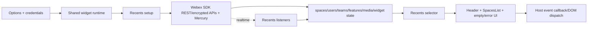
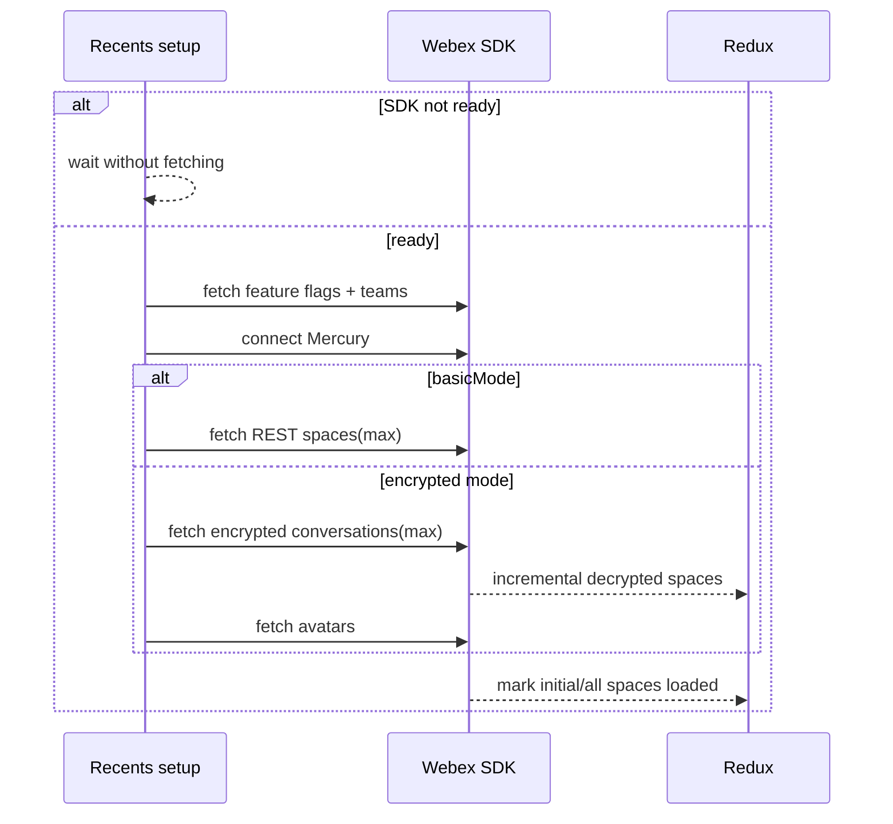
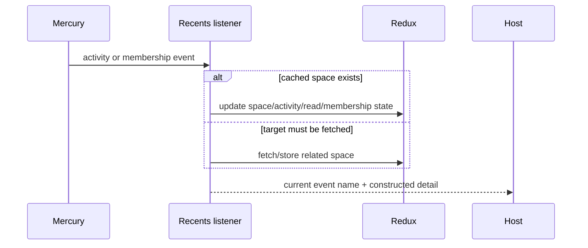
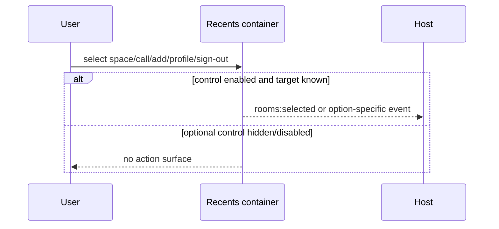
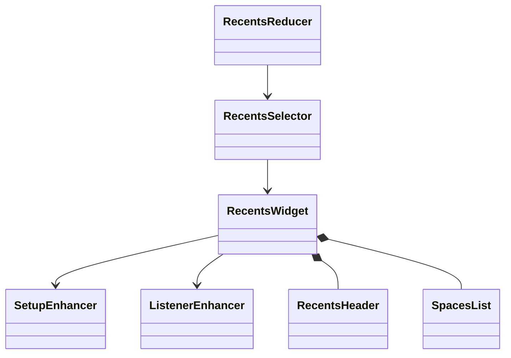
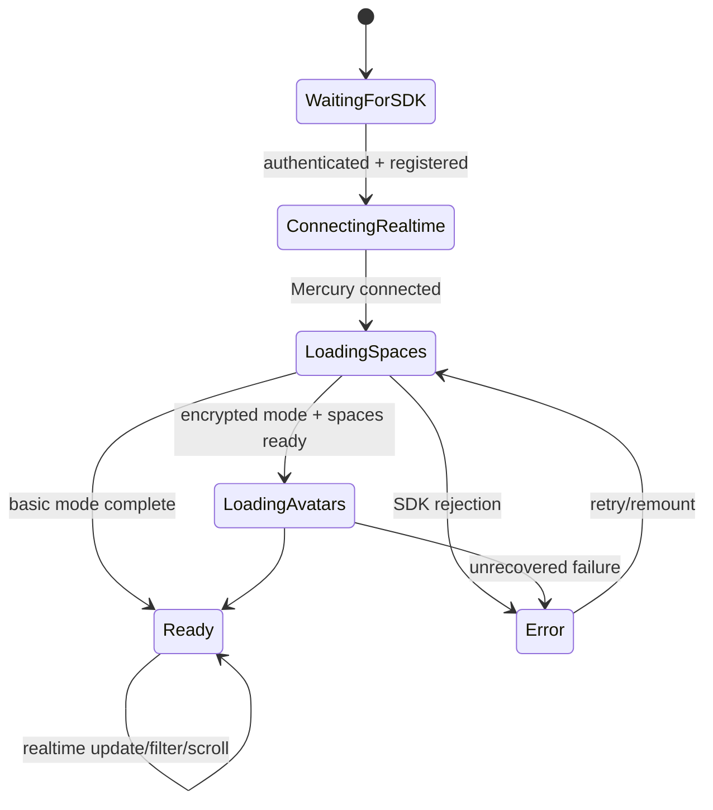

# Recents — SPEC

> Start with root [`AGENTS.md`](../../AGENTS.md), router [`SPEC_INDEX.md`](../SPEC_INDEX.md), and system [`ARCHITECTURE.md`](../ARCHITECTURE.md).

## Metadata

| Field | Value |
|---|---|
| Module id | `recents` |
| Source path(s) | `packages/node_modules/@webex/widget-recents/` |
| Doc kind | Module spec |
| Coverage score | 95% assessed 2026-07-22; entrypoint, options, current events, setup/listener flows, state, failure modes, and journey intent covered |
| Generated from | `module-spec` @ SDLC template library `0.2.1` |
| generated_by / approved_by / updated_at | `codex-desktop` / repository owner / 2026-07-23 |
| Validation status | independent Cursor validation passed on 2026-07-23 with zero Blocking findings |

## Evidence Rules

Current `src/index.js`, public PropTypes/defaults, `src/events.js`, setup/listeners, reducers/selectors, Jest tests, and journey specs are authoritative. Protected guides contribute intent but cannot add an event absent from current constants/listeners.

## Source Material Register

| Source material | Scope | Decision | Detail location or disposition |
|---|---|---|---|
| Existing Recents overview/install/configuration | overview/API/UI | verified/corrected | Supported options, modes, host APIs, teardown, and browser support are placed below. |
| Existing event guide and examples | events | verified/reference-only/stale | Current event set and semantics are in Public Surface/Requirements; payload examples remain native detail; notification examples are stale for this package. |
| Legacy namespace notice | compatibility | verified | Export Stability records the replacement package. |
| Journey test plan | tests | verified | Smoke, data API, global object, events, filters, calls, and accessibility are mapped in Test-Case Strategy. |

## Overview

Recents renders the authenticated user's Webex space list and reacts to realtime messages, read state, memberships, and incoming calls. It loads features/teams/spaces/avatars in state-driven stages, supports optional filtering/header controls, and emits selected/add/profile/sign-out/call events to the host.

The module is a legacy enhanced widget: the package entrypoint composes the shared runtime and intl around a connected container. Setup and listeners translate SDK/Mercury work into shared Redux resource state; UI components render the header, empty state, and spaces list.

## Purpose / Responsibility

Own the embeddable recent-spaces list, its initial/realtime loading state, user selection/filter/header interactions, and Recents-specific host events. It does not own remote Webex space data.

## Stack

JavaScript, React 16, Redux/React-Redux, Immutable.js, recompose/decorators, react-intl, Webex JS SDK/Mercury, shared components/state modules, Jest, WebdriverIO, and axe-core.

## Folder / Package Structure

```text
widget-recents/src/
├── index.js                 # public enhanced widget
├── container.js             # props, rendering, user/host interactions
├── enhancers/setup.js       # initial feature/team/space/avatar loading
├── enhancers/listeners.js   # realtime activity/membership handling
├── events.js                # current event names and payload builders
├── reducer.js / selector.js # widget-local state and view projection
└── components/              # header, profile, and empty-state UI
```

## Key Files (source of truth)

| File | Holds |
|---|---|
| `packages/node_modules/@webex/widget-recents/src/index.js` | public export and shared enhancer composition |
| `packages/node_modules/@webex/widget-recents/src/container.js` | public configuration defaults, rendering, selection/call/profile handlers |
| `packages/node_modules/@webex/widget-recents/src/events.js` | current event strings and payload construction |
| `packages/node_modules/@webex/widget-recents/src/enhancers/setup.js` | authenticated initial-loading workflow and default count |
| `packages/node_modules/@webex/widget-recents/src/enhancers/listeners.js` | realtime message/read/membership processing |
| `packages/node_modules/@webex/widget-recents/src/helpers.js` | space/user/avatar view helpers |

## Public Surface

| Contract ID | Type | Surface | Purpose | Compatibility / deprecation | Schema / detail link | Root index |
|---|---|---|---|---|---|---|
| `rw.widget.recents` | SDK/React | default enhanced Recents widget; named reducers | render/load recent spaces | public semver | `packages/node_modules/@webex/widget-recents/src/index.js` | `../CONTRACTS.md` |
| `rw.recents.options` | prop/data API | `basicMode`, header/filter/profile toggles, `spaceLoadCount`; accepted-only `muteNotifications` | host configuration | defaults and data names are public; `muteNotifications` is declared but has no read/use in current Recents source | `packages/node_modules/@webex/widget-recents/src/container.js` | `../CONTRACTS.md` |
| `rw.recents.events` | event | messages, room read/unread/selected, call, membership, add/profile/sign-out | host integration | exact strings stable | `packages/node_modules/@webex/widget-recents/src/events.js` | `../CONTRACTS.md` |

Compatibility notes:

- Browser global name is `recentsWidget`; data API toggle is `webex-recents`; teardown uses shared `remove()`.
- Current options default to `basicMode=false`, Add off, filter/profile on, profile menu off, and `spaceLoadCount=25`.
- `muteNotifications` remains an accepted PropTypes compatibility name but is currently unused and has no documented runtime effect.

## Requires (dependencies)

- Shared widget runtime/auth/Redux setup and current-user state.
- Spaces, activities, users, teams, media/calls, errors, features, Mercury, avatar, and shared list/loading/error components.
- Webex SDK service and realtime plugins; host credentials/SDK instance; browser DOM/event support.

## Requirements

| ID | WHAT | WHY | Source Evidence | Test / Example Evidence | Assumptions / Gaps | Confidence |
|---|---|---|---|---|---|---|
| `RECENTS-R-001` | After SDK auth/registration, Recents obtains feature values, connects Mercury, loads an initial bounded space list, then enriches avatars/teams without duplicate requests. | Staged loading provides responsive encrypted lists and prevents lifecycle re-entry from duplicating work. | `packages/node_modules/@webex/widget-recents/src/enhancers/setup.js` | `packages/node_modules/@webex/widget-recents/src/enhancers/setup.test.js` | Network failure recovery coverage is incomplete. | PRESENT |
| `RECENTS-R-002` | `basicMode=false` uses encrypted conversation loading; `true` uses Webex REST/Hydra and marks the one-stage list complete. | Encryption behavior is security-significant and explicitly controlled by the host. | `packages/node_modules/@webex/widget-recents/src/enhancers/setup.js` | `test/journeys/specs/recents/global/startup-settings.js` | Basic mode removes end-to-end encryption by design. | PRESENT |
| `RECENTS-R-003` | Realtime message/read/membership changes normalize state and emit current host events, excluding own-message unread behavior where implemented. | Host and UI must observe consistent state/event transitions. | `packages/node_modules/@webex/widget-recents/src/enhancers/listeners.js`, `packages/node_modules/@webex/widget-recents/src/events.js` | `test/journeys/specs/recents/global/basic.js` | Full payload snapshots are absent. | PRESENT |
| `RECENTS-R-004` | Selecting a space or call control emits `rooms:selected`, with `action: call` only for call selection; incoming calls emit `calls:created`. | Hosts use these distinctions to open Space/call experiences. | `packages/node_modules/@webex/widget-recents/src/container.js` | `test/journeys/specs/recents/global/basic.js` | Call object serialization is intentionally avoided in logs. | PRESENT |
| `RECENTS-R-005` | Header/filter/profile controls follow their option defaults and emit Add/Profile/Sign-out events only through current handlers. | Optional host UI must be predictable and backward-compatible. | `packages/node_modules/@webex/widget-recents/src/container.js` | `packages/node_modules/@webex/widget-recents/src/components/RecentsHeader.test.js`, `test/journeys/specs/recents/global/space-list-filter.js` | Sign-out side effect is host-owned; widget emits intent. | PRESENT |
| `RECENTS-R-006` | Ready/loading/empty/error rendering derives from fetch/filter/status state and remains accessible. | Users need deterministic feedback and the test plan requires axe-clean behavior. | `packages/node_modules/@webex/widget-recents/src/container.js` | Recents smoke/data/global journeys | Some error variants lack journey coverage. | PRESENT |

## Design Overview

Setup is a guarded state machine keyed by SDK and widget-status flags. It fetches feature settings, connects the realtime channel, loads encrypted or basic-mode spaces, enriches direct-space users/avatars, and fetches teams. Realtime listeners then update cached space/activity/membership state and invoke the container's event callback.

The connected container deliberately rerenders only for relevant list/error/widget/call references. It keeps host interaction logic—selection, call selection, Add/Profile/Sign-out, filter, and scrolling—close to the rendered list, while SDK work remains in thunks/enhancers.

## Data Flow



Remote transport is Webex SDK promises and Mercury events; internal transport is Redux actions/selectors and React props; outward transport is callback/CustomEvent/ampersand events.

## Sequence Diagram(s)

Sequence coverage:

| Operation group | Diagram | Failure / recovery coverage |
|---|---|---|
| initial load | Authenticated list setup | waits, encrypted/basic alternatives, failure status |
| realtime update | Message/read/membership processing | missing cached space/fetch alternative |
| user selection/header action | Host intent event | option/unknown target branches |







## Class / Component Relationships



## Use Cases

- **UC-1 Browse recents:** authenticated user opens widget → initial spaces load → avatars/teams/features enrich → list/empty state appears. Evidence: setup code and Recents journeys.
- **UC-2 React to incoming activity:** Webex emits message/read/membership change → listeners normalize space/activity → list/unread state changes → host receives supported event.
- **UC-3 Select/open/call a space:** user selects row or call control → `rooms:selected` payload identifies target/action → host opens its chosen experience.
- **UC-4 Filter/manage header:** user filters list or clicks configured Add/Profile/Sign-out control → local view/event updates without inventing service-side behavior.
- **UI flow:** loading → list or empty/error; optional header contains filter/Add/profile/menu; list supports unread and call indicators.
- **Cross-service flow:** Webex REST/encrypted conversation APIs provide the list; Mercury drives updates; people/team/feature/avatar SDK operations enrich display data.

## State Model

- Widget-local state tracks initial/all-space, avatar/team/feature fetch flags, scroll position, and keyword filter.
- Shared state tracks spaces by ID/list, users, teams, activities, media/incoming calls, errors, SDK/Mercury status, and features.
- Status flags are guards: a fetch/connect starts only when its `is*`/`has*` state permits.

## Business Rules & Invariants

- `spaceLoadCount <= 0` falls back to 25. Enforced in setup.
- Direct-space titles/avatars need the participant other than the current user; store/fetch that user before final display.
- Basic mode is an explicit opt-in and cannot be presented as encrypted.
- `rooms:selected` call payload includes `action: call`; ordinary selection does not.

## Concurrency & Reactive Flow

- Initial load, decryption, avatar fetches, team/feature fetches, and Mercury events run asynchronously; status flags prevent duplicate starts.
- Encrypted spaces may resolve incrementally; `Promise.all` tracks avatar enrichment without blocking initial state semantics beyond implemented stages.
- Realtime activity can precede cached space availability; listeners fetch/construct the missing context before normal processing where supported.

## State Machine



## Error Handling & Failure Modes

| Condition | Signal (error/code/result) | Caller recovery |
|---|---|---|
| auth/registration missing | not-ready/loading | provide valid token/SDK and await registration |
| space/feature/team/avatar request fails | rejected thunk/status/error store | retry/remount; inspect SDK logs; keep already loaded state where implemented |
| no spaces or filter has no matches | intentional empty state | change filter or use Add control if enabled |
| incoming call lacks conversation URL | fallback call ID used as space identity | host handles limited context in `calls:created` |
| event payload contains call object | call omitted from logger but still delivered to callback | do not stringify/log the raw call object |

## Pitfalls

- Protected event docs list `notifications:created/clicked`, but current Recents constants do not; they are not current contracts.
- A source comment says pagination is to come; current encrypted/basic loading marks all spaces fetched after its one implemented stage.
- `handleProfileClick` emits `currentUserWithAvatar`, not every injected user-shaped prop.
- Event docs may show older payload fields/examples; current constructors are authoritative.
- `basicMode` changes the security properties of loading and must never be enabled as a neutral performance tweak.

## Module Do's / Don'ts

- DO guard async setup with widget-status flags and route host events through `handleEvent`/current constructors.
- DON'T fetch lists directly from the view, duplicate Mercury listeners, or document legacy notification events as current.

## Export Stability

`@ciscospark/widget-recents` was renamed to `@webex/widget-recents`; install/import the current namespace. Preserve the default package entrypoint, `recentsWidget`, `webex-recents`, option defaults, and current event strings through normal semver/deprecation rules.

## Host Integration & Theming

Hosts import the React package or mount through `window.webex.widget(element).recentsWidget(options)` / `data-toggle="webex-recents"`. CDN/imported styles are required. Hosts own follow-up behavior for selected/add/profile/sign-out events and must supply compatible credentials/SDK.

## Key Design Trade-off

- Encrypted mode favors security and incremental decryption/avatars over the simpler REST list; `basicMode` preserves a simpler integration at the explicit cost of end-to-end encryption.

## Test-Case Strategy (module)

Jest covers helpers, setup, header/profile/empty components. WebdriverIO covers data API and global instantiation, group/direct updates, unread/read, selection/call buttons, memberships, incoming calls, filter/startup settings, multiple widgets, demo auth forms, and axe accessibility. Add negative cases for rejected SDK operations and listener duplication.

| Behavior / Requirement | Existing test evidence | Gap |
|---|---|---|
| `RECENTS-R-001` staged setup | `packages/node_modules/@webex/widget-recents/src/enhancers/setup.test.js` | failure/retry permutations |
| `RECENTS-R-002` basic/encrypted mode | `test/journeys/specs/recents/global/startup-settings.js` | explicit encryption assertion |
| `RECENTS-R-003` realtime/events | `test/journeys/specs/recents/global/basic.js` | full payload snapshots and stale-event negative test |
| `RECENTS-R-004` selection/call | `test/journeys/specs/recents/global/basic.js`, `test/journeys/specs/recents/dataApi/basic.js` | unknown/missing target negative case |
| `RECENTS-R-005` header/filter | `packages/node_modules/@webex/widget-recents/src/components/RecentsHeader.test.js`, `test/journeys/specs/recents/global/space-list-filter.js` | sign-out host effect remains external |
| `RECENTS-R-006` ready/error/a11y | `test/journeys/specs/smoke/widget-recents/index.js`, `test/journeys/specs/recents/global/basic.js` | more error variants |

## Traceability

- Repo architecture: `../ARCHITECTURE.md`; registry: `../SPEC_INDEX.md`; contracts/state: `../CONTRACTS.md`, `../SERVICE_STATE.md`.
- Coverage state, source routing, profile, and contract baseline: `.sdd/manifest.json`.
