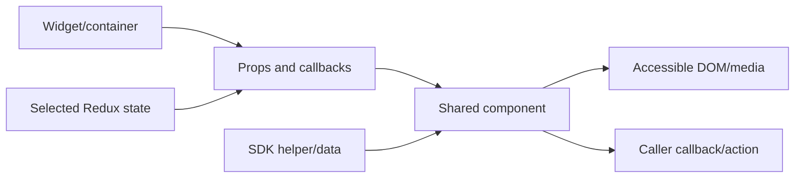
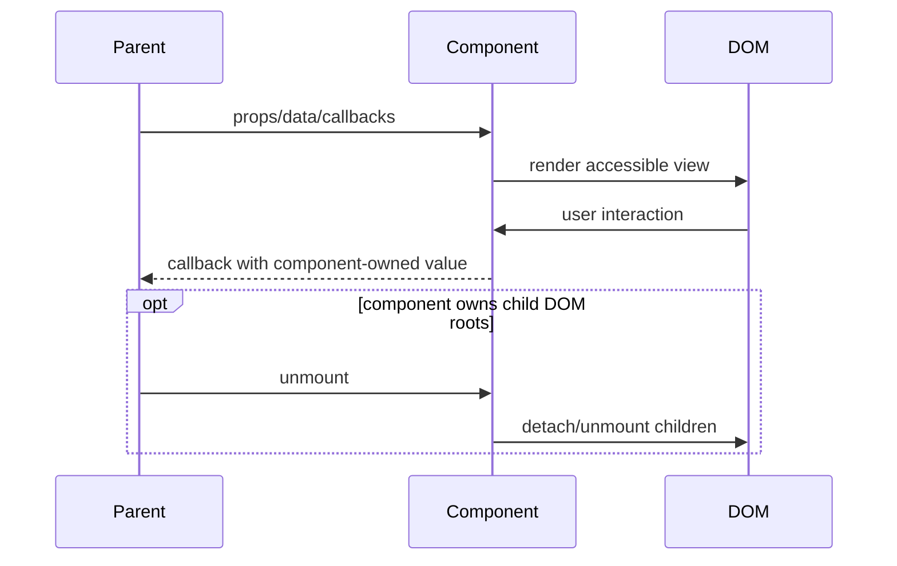
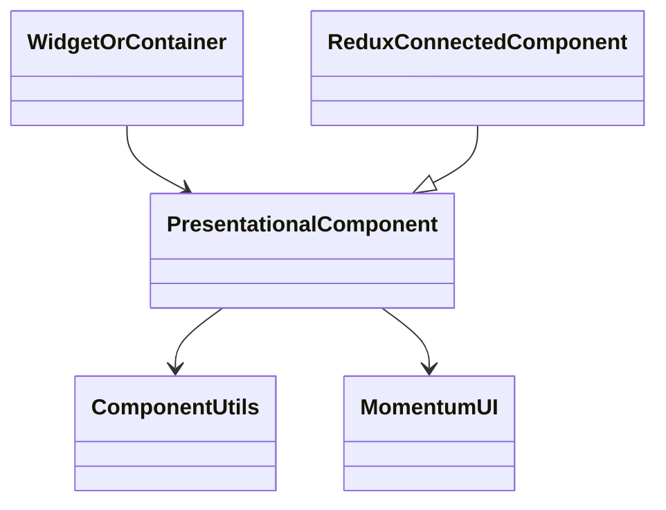
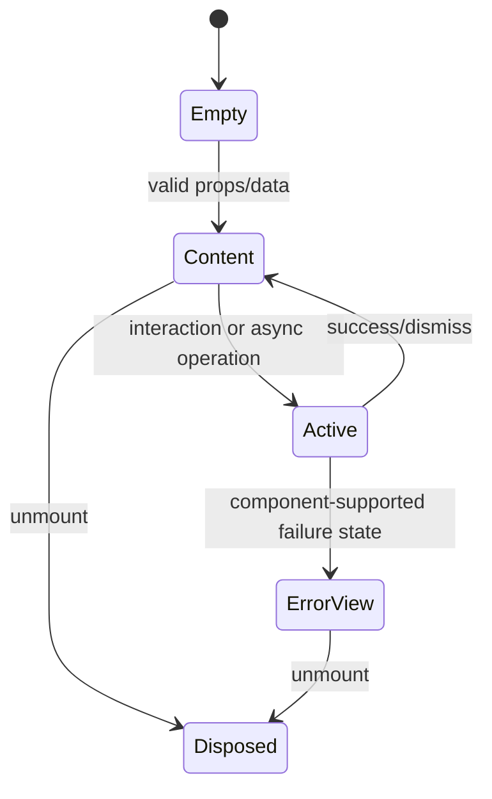

# Shared UI Components — SPEC

> Start with root [`AGENTS.md`](../../AGENTS.md), router [`SPEC_INDEX.md`](../SPEC_INDEX.md), and system [`ARCHITECTURE.md`](../ARCHITECTURE.md).

## Metadata

| Field | Value |
|---|---|
| Module id | `shared-ui-components` |
| Source path(s) | `packages/node_modules/@webex/react-component-*/`, `private-react-component-*/` |
| Doc kind | Module spec |
| Coverage score | 93% assessed 2026-07-22; all entrypoints and component families covered, with direct behavior detail concentrated on high-coupling components |
| Generated from | `module-spec` @ SDLC template library `0.2.1` |
| generated_by / approved_by / updated_at | `codex-desktop` / repository owner / 2026-07-23 |
| Validation status | independent Cursor validation passed on 2026-07-23 with zero Blocking findings |

## Evidence Rules

Package entrypoints, PropTypes/TypeScript types, styles, stories, and adjacent tests define behavior. A story demonstrates a supported rendering state but is not proof of error handling. Protected legacy rename notices establish namespace history only.

## Source Material Register

| Source material | Scope | Decision | Detail location or disposition |
|---|---|---|---|
| Legacy `@ciscospark/react-component-*` READMEs | namespace migration | verified | Current `@webex` entrypoints and compatibility policy are in Export Stability. |
| Component source and package metadata | exports, props, rendering | authoritative | Public Surface, Requirements, Design Overview. |
| Adjacent Jest tests and Storybook stories | behavior examples | verified | Test-Case Strategy. |

## Overview

This capability is the visual vocabulary used by widgets and containers: activity renderers, buttons, media elements, avatars, file affordances, adaptive-card inputs, separators, loading/error views, and utility functions. Most packages export one presentational React component; a few deliberately connect to Redux or browser APIs.

## Purpose / Responsibility

Provide reusable, composable UI primitives with stable package entrypoints and explicit props. Components must not silently take ownership of widget-level authentication, routing, or remote-resource lifecycle.

## Stack

JavaScript/TypeScript, React 16, PropTypes, CSS modules/SCSS, Momentum UI, react-intl, Immutable.js where supplied by callers, Jest, react-test-renderer, and Storybook.

## Folder / Package Structure

```text
packages/node_modules/@webex/
├── react-component-*/src/          # public components and utilities
└── private-react-component-*/src/  # repository-internal examples/helpers
```

## Key Files (source of truth)

| File | Holds |
|---|---|
| `packages/node_modules/@webex/react-component-activity-item/src/index.js` and the exact package paths indexed in `../CONTRACTS.md` | package public entrypoints and primary components |
| `packages/node_modules/@webex/react-component-utils/src/index.js` | public utility barrel |
| `packages/node_modules/@webex/react-component-adaptive-card/src/index.js` | adaptive-card DOM/Redux integration and cleanup |
| `packages/node_modules/@webex/react-component-activity-item/src/index.js` | post/share/system-message dispatch |
| `packages/node_modules/@webex/react-component-audio/src/index.js` and `packages/node_modules/@webex/react-component-video/src/index.js` | MediaStream-to-element binding |

## Public Surface

| Contract ID | Type | Surface | Purpose | Compatibility / deprecation | Schema / detail link | Root index |
|---|---|---|---|---|---|---|
| `rw.ui.components` | SDK/React | 54 `@webex/react-component-*` package entrypoints | independently reusable widget presentation | public semver; default/named exports and required props are stable | exact paths in the 54 `rw.ui.*` catalog rows; representative: `packages/node_modules/@webex/react-component-activity-item/src/index.js`, `packages/node_modules/@webex/react-component-video/src/index.js` | `../CONTRACTS.md` |
| `rw.ui.utils` | SDK | `@webex/react-component-utils` named barrel | shared files/components/date/activity/UUID/validation/adaptive-card helpers | public semver; removal/rename is breaking | `packages/node_modules/@webex/react-component-utils/src/index.js` | `../CONTRACTS.md` |

Compatibility notes:

The 54 non-private packages are public entrypoints. Most default-export a component named by the package; exact props and named exports remain source-defined at each `src/index.*`.

High-coupling contracts include:

- `ActivityItem` selects post, share, ECM-link, or system-message presentation from activity verb/content.
- `AdaptiveCard` renders SDK-backed card content, submits actions, replaces decrypted image URLs, and unmounts child React roots.
- `Audio` and `Video` assign a supplied `MediaStream` to `srcObject`; `Video` supports local-audio muting.
- `ButtonControls` chooses Momentum `CallControl` versus `ActivityButton` from each descriptor.

## Requires (dependencies)

- React/ReactDOM and host DOM/media support.
- Momentum UI, react-intl, CSS-module processing, and package-specific utilities.
- Selected components require Redux state/actions, the Webex SDK, or container packages; these dependencies must remain visible in their entrypoints.

## Requirements

| ID | WHAT | WHY | Source Evidence | Test / Example Evidence | Assumptions / Gaps | Confidence |
|---|---|---|---|---|---|---|
| `UI-R-001` | Each public component package preserves its default/named entrypoint and declared prop contract. | Widgets and external consumers import packages independently. | `packages/node_modules/@webex/react-component-activity-item/src/index.js`, `packages/node_modules/@webex/react-component-utils/src/index.js`, `ai-docs/CONTRACTS.md` | `packages/node_modules/@webex/react-component-activity-item/src/index.test.js` | Not every prop combination has a test. | PRESENT |
| `UI-R-002` | Activity rendering selects the component appropriate to verb/content and leaves unknown verbs empty. | Conversation feeds must not misrepresent activity types. | `packages/node_modules/@webex/react-component-activity-item/src/index.js` | `packages/node_modules/@webex/react-component-activity-item/src/index.test.js` | ECM/adaptive-card remote payloads depend on SDK shape. | PRESENT |
| `UI-R-003` | Stream components return no element without a stream and bind valid streams through element refs. | Avoid invalid playback nodes and keep media ownership with the caller. | `packages/node_modules/@webex/react-component-audio/src/index.js`, `packages/node_modules/@webex/react-component-video/src/index.js` | `packages/node_modules/@webex/react-component-audio/src/index.test.js` | Video has no adjacent Jest test; browser autoplay policy is external. | PRESENT |
| `UI-R-004` | Adaptive-card child roots are unmounted and transient submission status is dismissed. | Prevent leaked subtrees and stale status UI. | `packages/node_modules/@webex/react-component-adaptive-card/src/index.js` | `packages/node_modules/@webex/react-component-adaptive-card/src/index.test.js` | A two-second timer remains implementation-defined. | PRESENT |
| `UI-R-005` | Interactive controls expose labels/ARIA data and invoke supplied callbacks without owning business operations. | Accessibility and composability depend on caller-controlled actions. | `packages/node_modules/@webex/react-component-button-controls/src/index.js`, `packages/node_modules/@webex/react-component-incoming-call/src/index.js` | `packages/node_modules/@webex/react-component-button-controls/src/index.test.js`, `test/journeys/specs/smoke/widget-space/index.js` | Repository-wide journey coverage is uneven. | PRESENT |

## Design Overview

Components receive normalized data and callbacks from containers/widgets. Pure functions and small functional components dominate; class components are used where DOM refs or lifecycle cleanup are required. CSS modules isolate styles while stable `webex-*` class names support host inspection and existing tests.

## Data Flow



## Sequence Diagram(s)

Sequence coverage:

| Operation group | Diagram | Failure / recovery coverage |
|---|---|---|
| render, interact, update, dispose | Component lifecycle | absent data, callback ownership, and child-root cleanup share this actor/order group |



## Class / Component Relationships



## Use Cases

- Render conversation activities using the activity verb, content, files, actors, and timestamps.
- Bind remote/local media streams to browser media elements.
- Compose labeled call or activity controls from descriptors.
- Render and submit adaptive cards while displaying sending/success/failure state.
- Reuse loading, error, avatar, badge, list, input, and separator primitives across widget packages.

## State Model

Most functional components are stateless projections. Stateful class components such as AdaptiveCard own only transient UI/DOM state: child roots, decrypted-image replacement readiness, and submission status. Parent widgets/containers continue to own domain and remote-resource state.

## Business Rules & Invariants

- Required props remain required at the component boundary; defaults cover only optional presentation.
- A component that receives a callback invokes it but does not duplicate the owning Redux/SDK operation.
- DOM-root, timer, listener, and object-URL resources created by a component require lifecycle cleanup.
- CSS and accessibility attributes are part of observable UI behavior even when they are not JavaScript exports.

## Concurrency & Reactive Flow

React prop/state updates may race SDK or image decryption results. Adaptive cards wait until all decrypted URLs are available before replacing rendered card content; asynchronous status changes must not update an unmounted subtree.

## State Machine



## Pitfalls

- Some “component” packages connect Redux and are not pure.
- Stories are examples, not exhaustive specifications.
- Do not remove stable CSS classes merely because CSS modules generate local names.
- Adaptive-card failures use the SDK logger; callers must own broader recovery.
- Media autoplay, codec, and permission behavior remains browser-owned.

## Module Do's / Don'ts

- Do keep public entrypoints narrow and test behavior close to the component.
- Do clean resources created in lifecycle methods.
- Don't import widget orchestration into shared presentation.
- Don't change a named/default export or required prop without semver review.

## Export Stability

Public `@webex/react-component-*` entrypoints are semver contracts. The protected `@ciscospark/react-component-*` READMEs document that each legacy package moved to the identically suffixed `@webex` namespace; they are migration evidence, not additional runtime exports. Private-prefixed packages remain internal.

## Host Integration & Theming

Components inherit host font/style setup through the widget bundle, Momentum UI, CSS modules, and stable class hooks. Callers provide locale/intl, callbacks, SDK-backed values, and media streams. Avoid global styling beyond the existing font/theme entrypoints.

## Key Design Trade-off

The many small packages improve independent reuse and tree selection, but multiply public entrypoints and upgrade obligations. Preserve package boundaries unless a migration plan accounts for every consumer.

## Test-Case Strategy (module)

| Requirement | Current evidence | Focused gap |
|---|---|---|
| `UI-R-001` entrypoints/props | `packages/node_modules/@webex/react-component-activity-item/src/index.test.js`, `ai-docs/CONTRACTS.md` | automated export inventory |
| `UI-R-002` activity selection | `packages/node_modules/@webex/react-component-activity-item/src/index.test.js` | malformed/unknown activity matrix |
| `UI-R-003` stream binding | `packages/node_modules/@webex/react-component-audio/src/index.test.js`; no Video test found | browser autoplay rejection |
| `UI-R-004` cleanup/status | `packages/node_modules/@webex/react-component-adaptive-card/src/index.test.js` | fake-timer/unmount race |
| `UI-R-005` accessibility/callbacks | `packages/node_modules/@webex/react-component-button-controls/src/index.test.js`, `test/journeys/specs/smoke/widget-space/index.js` | keyboard matrix per composite |

## Traceability

- Architecture and package inventory: `../ARCHITECTURE.md`, `../CONTRACTS.md`.
- Coding conventions: `../patterns/react-component-entrypoint.md`, `../rules/preserve-public-entrypoints.md`.
- Machine coverage/profile/contracts: `.sdd/manifest.json`.
