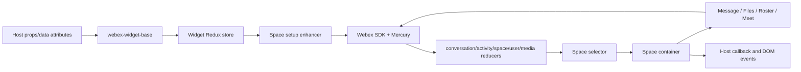
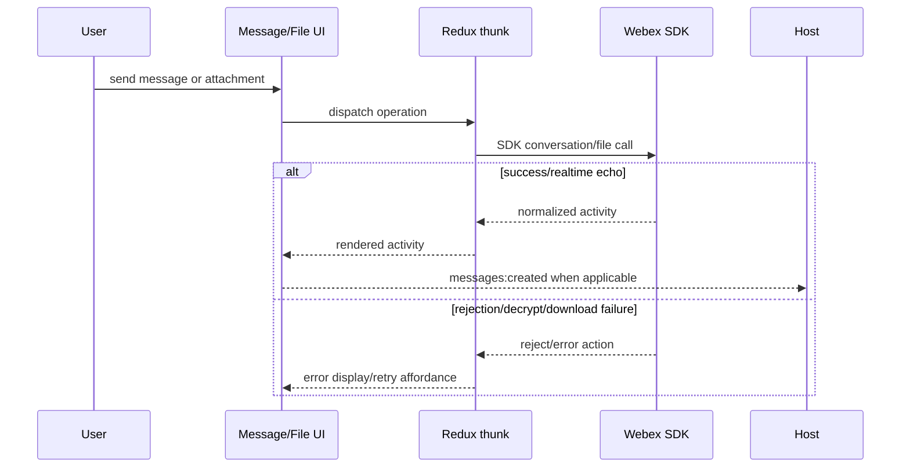
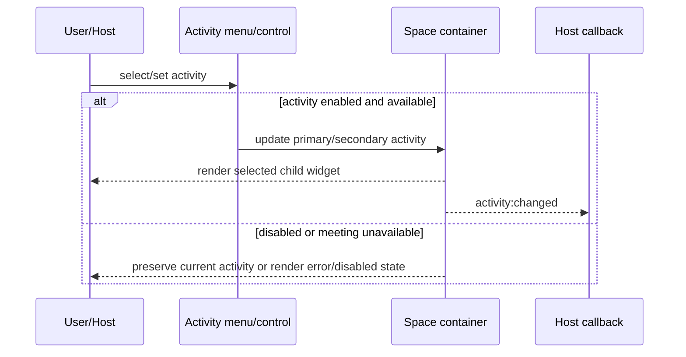
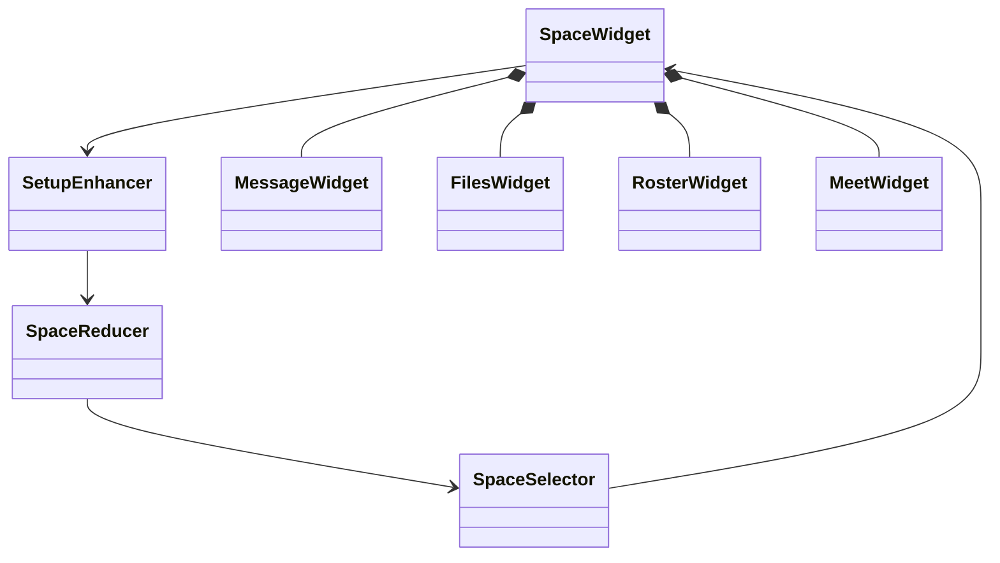
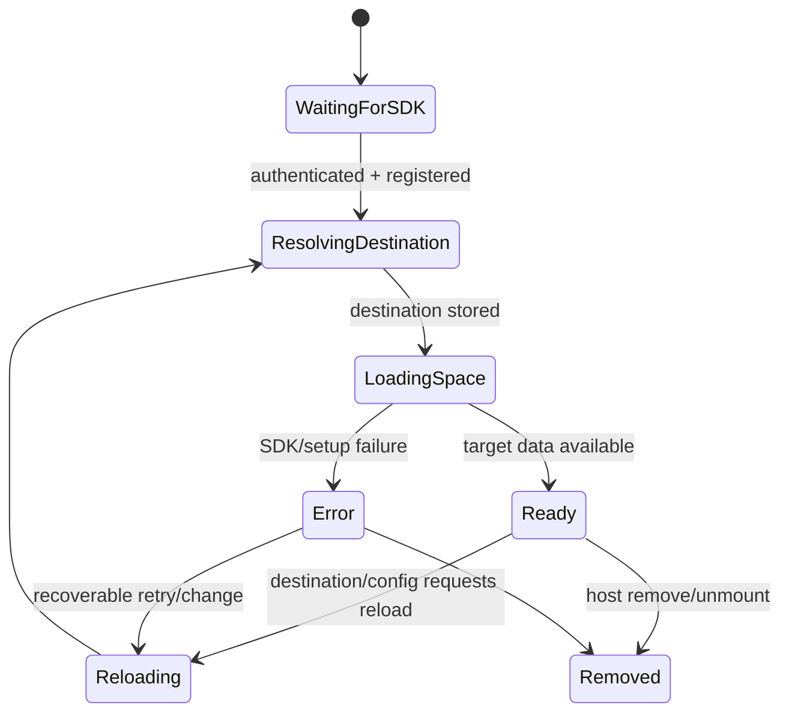

# Space and Messaging — SPEC

> Start with root [`AGENTS.md`](../../AGENTS.md), router [`SPEC_INDEX.md`](../SPEC_INDEX.md), and system [`ARCHITECTURE.md`](../ARCHITECTURE.md). This is the canonical capability spec for Space, Message, Files, and Roster packages.

## Metadata

| Field | Value |
|---|---|
| Module id | `space-messaging` |
| Source path(s) | `packages/node_modules/@webex/widget-space/`, `widget-message/`, `widget-files/`, `widget-roster/` |
| Doc kind | Module spec |
| Coverage score | 94% assessed 2026-07-22; all package entrypoints, current events, major flows, state, failures, and journey intent covered; sparse unit coverage remains for composed widget flows |
| Generated from | `module-spec` @ SDLC template library `0.2.1` |
| generated_by / approved_by / updated_at | `codex-desktop` / repository owner / 2026-07-23 |
| Validation status | independent Cursor validation passed on 2026-07-23 with zero Blocking findings |

## Evidence Rules

Requirements cite stable implementation and test paths only. Protected usage/event documents supplied reconciled intent; code constants, props, reducers, and tests decide conflicts. Missing tests are gaps, not inferred passes.

## Source Material Register

| Source material | Scope | Decision | Detail location or disposition |
|---|---|---|---|
| Existing widget usage/configuration guidance | overview, host API, UI | verified/corrected | Current options and destination behavior are in Public Surface, Requirements, UI Flow, and Host Integration. |
| Existing event guide and payload examples | events | verified/reference-only/stale | Current constant set is in Public Surface; detailed payload construction stays in code; unsupported notification/mention examples are flagged in Pitfalls. |
| Legacy package rename notices | compatibility | verified | Namespace mapping is in Export Stability; legal notices remain in their protected sources. |
| Journey test plan | tests | verified | Space smoke, primary, messaging, file, meet, guest, settings, data-API, and accessibility intent is mapped in Test-Case Strategy. |

## Overview

This capability presents a Webex space as an activity-oriented widget. `widget-space` selects a destination and composes message, meeting, file, and roster activities. The focused child widgets remain importable separately, while the full widget supplies navigation, destination setup, Redux state, SDK integration, error/loading UI, and host events.

Maintainers should start at each package `src/index.js`, then follow Space `container.js`, `enhancers/setup.js`, reducer/selector, and the child widget entrypoint. Reusable rendering/state behavior belongs in Shared UI, Containers/HOCs, or Redux modules rather than being duplicated here.

## Purpose / Responsibility

Own the embeddable space experience: resolve a typed Webex destination, expose enabled activities, coordinate messaging/files/roster/meeting presentation, and report current host events. It does not own Webex remote data or SDK transport.

## Stack

JavaScript, React 16, PropTypes, Redux/React-Redux, Immutable.js, recompose, react-intl, Momentum UI, Webex JS SDK plugins, Jest, and WebdriverIO journeys; Babel/Rollup/Webpack build the package outputs.

## Folder / Package Structure

```text
packages/node_modules/@webex/
├── widget-space/src/       # full activity shell, setup, state, selectors, events
├── widget-message/src/     # conversation message composition/display
├── widget-files/src/       # files activity composition
└── widget-roster/src/      # people/roster activity composition
```

## Key Files (source of truth)

| File | Holds |
|---|---|
| `packages/node_modules/@webex/widget-space/src/index.js` | exported widget, reducers, destination types, event names, enhancer composition |
| `packages/node_modules/@webex/widget-space/src/container.js` | public props, defaults, activity UI, keyboard behavior, unregistration |
| `packages/node_modules/@webex/widget-space/src/constants.js` | activity and destination constants |
| `packages/node_modules/@webex/widget-space/src/events.js` | current host event strings |
| `packages/node_modules/@webex/widget-space/src/enhancers/setup.js` | authenticated setup, destination normalization, reload, Mercury, data fetch |
| child widget `src/index.js` files | child package exports and enhancer composition |

## Public Surface

| Contract ID | Type | Surface | Purpose | Compatibility / deprecation | Schema / detail link | Root index |
|---|---|---|---|---|---|---|
| `rw.widget.space` | SDK/React | default `SpaceWidget`; named `eventNames`, `reducers`, `destinationTypes` | full space experience | public semver; preserve props/events/destination strings | `packages/node_modules/@webex/widget-space/src/index.js` | `../CONTRACTS.md` |
| `rw.widget.message` | SDK/React | default Message widget; named reducers/destination types | focused messaging activity | public semver | `packages/node_modules/@webex/widget-message/src/index.js` | `../CONTRACTS.md` |
| `rw.widget.files` | SDK/React | default Files widget | focused file activity | public semver | `packages/node_modules/@webex/widget-files/src/index.js` | `../CONTRACTS.md` |
| `rw.widget.roster` | SDK/React | default Roster widget; named reducers | focused people/roster activity | public semver | `packages/node_modules/@webex/widget-roster/src/index.js` | `../CONTRACTS.md` |
| `rw.space.destinations` | SDK/prop | `email`, `userId`, `spaceId`, `sip`, `pstn` where accepted | identify target conversation/call | exact strings stable | `packages/node_modules/@webex/widget-space/src/constants.js` | `../CONTRACTS.md` |
| `rw.space.events` | event | emitted `messages:created`, `rooms:read`, `rooms:unread`, `calls:created/connected/disconnected`, and `activity:changed` | notify host of current Space/child behavior | exact emitted strings stable; payload additive only | `packages/node_modules/@webex/widget-space/src/events.js`, `packages/node_modules/@webex/widget-meet/src/enhancers/withEventHandler.js` | `../CONTRACTS.md` |
| `rw.widget.space` | SDK/prop | `initialActivity` | choose the valid primary activity at startup | accepted prop/data attribute; defaults to `message` in the activity enhancer | `packages/node_modules/@webex/widget-space/src/enhancers/activity-menu.js` | `../CONTRACTS.md` |
| `rw.widget.space` | SDK/prop | `setCurrentActivity` | request a valid primary or secondary activity after mount | accepted prop; changes emit `activity:changed` | `packages/node_modules/@webex/widget-space/src/container.js`, `packages/node_modules/@webex/widget-space/src/enhancers/external-control.js` | `../CONTRACTS.md` |

Compatibility notes:

- Imported React, browser-global, and data-attribute forms remain supported through the shared runtime.
- Current `eventNames` is authoritative. Older event examples not present there are not active contracts.
- The exported `calls:memberships:*` constants have no publisher in current Space/Meet/Message source and are definition-only, not active emitted contracts.

## Requires (dependencies)

- `@webex/webex-widget-base` for Redux/SDK/auth/host integration and teardown.
- Message/files/roster/meet child widgets, shared components, containers, and Redux resource modules.
- Webex SDK authentication, device, conversation, rooms/people/meetings, Mercury, presence, search, team, feature, and flag plugins.
- Host credentials or a compatible authenticated SDK instance; browser DOM/media capabilities for UI/calling.

## Requirements

| ID | WHAT | WHY | Source Evidence | Test / Example Evidence | Assumptions / Gaps | Confidence |
|---|---|---|---|---|---|---|
| `SPACE-R-001` | The full widget accepts a supported destination type/id and resolves/stores the target only after SDK authentication and registration. | Prevents network/setup work against an unauthenticated SDK and keeps destination changes deterministic. | `packages/node_modules/@webex/widget-space/src/enhancers/setup.js` | `packages/node_modules/@webex/widget-space/src/enhancers/setup.test.js`, `test/journeys/specs/space/startup-settings.js` | PSTN/SIP behavior depends on SDK capability. | PRESENT |
| `SPACE-R-002` | Enabled `spaceActivities` determine message, meet, files, and people UI; disabling the initial activity produces an error rather than silently selecting an invalid activity. | Host configuration must predict visible navigation and startup state. | `packages/node_modules/@webex/widget-space/src/container.js`, `packages/node_modules/@webex/widget-space/src/enhancers/activity-menu.js` | `test/journeys/specs/space/startup-settings.js` | Some composition paths lack direct Jest tests. | PRESENT |
| `SPACE-R-003` | Message behavior supports sending/receiving, markdown, attachments, flags, deletion rules, mentions, and composer option controls through existing child/state packages. | These are the core promised space interactions and must remain compatible. | `packages/node_modules/@webex/widget-message/src/actions.js`, `packages/node_modules/@webex/widget-message/src/container.js`, `packages/node_modules/@webex/redux-module-activity/src/actions.js` | `test/journeys/specs/space/index.js`, `test/journeys/lib/test-helpers/space-widget/messaging.js` | Journey credentials/services required. | PRESENT |
| `SPACE-R-004` | The widget emits only event constants that have an observed publisher through host callbacks/browser event translation; defined-only `calls:memberships:*` constants are not claimed as emitted. | Constants alone do not prove a host event, and consumers need the implemented event boundary. | `packages/node_modules/@webex/widget-space/src/events.js`, `packages/node_modules/@webex/widget-space/src/enhancers/activity-menu.js`, `packages/node_modules/@webex/widget-space/src/enhancers/external-control.js`, `packages/node_modules/@webex/widget-meet/src/enhancers/withEventHandler.js`, `packages/node_modules/@webex/webex-widget-base/src/enhancers/withBrowserGlobals.js` | `test/journeys/lib/events.js`, `test/journeys/specs/space/index.js` | Payload examples in old docs may omit current fields; membership constants have no publisher. | PRESENT |
| `SPACE-R-005` | Keyboard navigation preserves tab roles, arrow/Home/End behavior, Meet-button focus handoff, and accessible labels. | The widget is customer-facing UI and journey plans require no accessibility violations. | `packages/node_modules/@webex/widget-space/src/container.js` | `test/journeys/specs/smoke/widget-space/index.js`, `test/journeys/specs/space/index.js` | Axe journeys are environment-dependent. | PRESENT |
| `SPACE-R-006` | Unmount/removal unregisters device/widget state through established teardown paths. | Prevents leaked registrations, listeners, stores, and duplicate host events. | `packages/node_modules/@webex/widget-space/src/container.js`, `packages/node_modules/@webex/webex-widget-base/src/enhancers/withRemoveWidget.js` | `packages/node_modules/@webex/widget-space/src/reducer.test.js` | End-to-end repeated mount/remove coverage is limited. | WEAK |

## Design Overview

The package exports a connected container wrapped by the shared widget enhancer and intl. `setup` is the state-driven coordinator: after SDK readiness it normalizes destinations, connects Mercury, fetches space/user/avatar data, and requests reload when destination changes. The container derives visible activity widgets, renders loading/error/content states, and forwards user/external-control activity changes.

Child widgets encapsulate focused activity composition. Redux modules normalize remote resources and async status so views remain mostly declarative. This division avoids placing SDK state machines inside presentational components and lets the same Message/Files/Roster packages be reused outside the full Space shell.

## Data Flow



Transport is in-process React/Redux for composition, promise-based Webex SDK calls for remote operations, and SDK/Mercury events for realtime updates.

## Sequence Diagram(s)

Sequence coverage:

| Operation group | Diagram | Failure / recovery coverage |
|---|---|---|
| initialize/change destination | Destination setup | waits for auth/registration; reload/error branches |
| send/receive content | Messaging/file flow | SDK rejection and error-state branch |
| switch/start activity | Activity flow | disabled/unavailable activity branch |

```mermaid
sequenceDiagram
  participant H as Host
  participant S as Space setup
  participant R as Redux modules
  participant W as Webex SDK
  H->>S: destinationType + destinationId
  alt SDK not authenticated/registered
    S-->>H: loading; no fetch
  else ready
    S->>R: store normalized destination
    S->>W: connect Mercury and fetch target data
    W-->>R: conversation/space/user/activity data
    R-->>H: selector renders activities
  end
  opt destination changes
    S->>R: reset conversation/errors and reload
  end
```





## Class / Component Relationships



The full widget owns orchestration and navigation; child widgets own activity presentation/operations; shared Redux modules own client representations and async transitions.

## Use Cases

- **UC-1 Open a space:** host supplies `spaceId`, email, or user ID → setup authenticates/resolves destination → enabled activities render. Evidence: `packages/node_modules/@webex/widget-space/src/enhancers/setup.js`, `test/journeys/specs/space/startup-settings.js`.
- **UC-2 Message and share files:** user composes text/markdown/attachment → Redux/SDK sends → realtime state renders the result and host events. Evidence: `test/journeys/lib/test-helpers/space-widget/messaging.js`.
- **UC-3 Inspect/manage participants:** user opens People → roster lists/counts/searches/adds participants → close returns to the primary activity. Evidence: `test/journeys/lib/test-helpers/space-widget/roster.js`.
- **UC-4 Start/answer a call:** user selects Meet or host passes call/start settings → call UI invokes SDK behavior → lifecycle events/status update. Evidence: `test/journeys/lib/test-helpers/space-widget/meet.js`.
- **UI flow:** loading/error → activity shell → message/files/people tabs plus Meet control → secondary activity overlays according to `secondaryActivitiesFullWidth`; keyboard navigation follows the tab/Meet rules.
- **Cross-service flow:** all remote data and call operations pass through supplied Webex SDK plugins; Mercury supplies realtime conversation/activity updates.

## State Model

- Widget state tracks destination, primary/secondary activity, reload/fetch status, and configuration-derived activity types.
- Combined reducers add conversation, activities, spaces, users, errors, media/calls, Mercury, presence, flags/features, and child-widget state.
- Triggers include host prop changes, setup lifecycle, SDK promise resolution/rejection, realtime events, user navigation, and teardown.

## Business Rules & Invariants

- An initial activity must be enabled; otherwise surface an error. Enforced in Space activity/setup logic.
- Destination strings and IDs must be normalized before fetch; email is lowercased and Hydra space IDs are decoded/cluster-aware. Enforced in `packages/node_modules/@webex/widget-space/src/enhancers/setup.js`.
- Meet is disabled for a space destination when the SDK has no preferred Webex site. Enforced in `packages/node_modules/@webex/widget-space/src/container.js`.
- Users may delete their own messages but not another person's; journey intent preserves this authorization-facing UI rule.

## Concurrency & Reactive Flow

- React lifecycle/setup runs repeatedly as SDK and destination props change; status flags prevent duplicate fetch/connect operations.
- Mercury activities and SDK call/media events asynchronously update Redux and may emit host events; listeners must not be registered twice.
- Destination changes reset existing conversation/errors before loading the replacement; do not let stale async results become the visible target.

## State Machine



## UI Flow

- Loading state precedes available target data; persistent/temporary errors render through `ErrorDisplay`.
- Message, Files, and People appear as tabs when enabled; Meet is a separate call control and can show active-call time.
- Empty/disabled initial activity, unavailable meeting site, incoming call, secondary activity, and teardown are non-happy paths that must remain visible/tested.

## Error Handling & Failure Modes

| Condition | Signal (error/code/result) | Caller recovery |
|---|---|---|
| missing/invalid destination | setup cannot resolve/fetch; error state/UI | provide a supported type/id and rerender |
| SDK unauthenticated/unregistered | widget remains loading/not ready | supply valid credentials/SDK and allow registration |
| conversation/resource operation fails | Redux error/conversation error displayed | retry/change destination; inspect SDK logger |
| disabled initial activity | explicit widget error | enable the activity or select an enabled initial value |
| meeting unavailable for space | disabled Meet/error title | configure preferred Webex site or use another activity |
| file decrypt/download fails | promise/error state from file modules | retry when SDK/network is available |

## Pitfalls

- Existing protected event guides list `notifications:*` and `mention:clicked`, but the current Space event constants do not; do not expose them without an intentional code/spec change.
- `secondaryActivitiesFullWidth` defaults to `true` in current code even though older usage text described `false`; code is authoritative.
- `spaceActivities` is the current prop; older example code may use `activities`.
- The activity-menu/Meet focus order is hand-coded; DOM/class/role changes can regress keyboard navigation without obvious render failures.
- Webex remote objects may arrive encrypted or incrementally; do not assume list/detail/avatar data is synchronously complete.

## Module Do's / Don'ts

- DO normalize destinations through the existing constants/setup path and compose child widgets through package entrypoints.
- DO keep event strings/payload construction centralized in current event/helper files.
- DON'T duplicate SDK fetch/listener logic in presentational components or treat protected examples as newer than code.

## Export Stability

Public default/named exports, props, destination strings, browser/data API names, and events are semver-sensitive. Legacy namespace mapping remains:

| Legacy package | Current package |
|---|---|
| `@ciscospark/widget-space` | `@webex/widget-space` |
| `@ciscospark/widget-message` | `@webex/widget-message` |
| `@ciscospark/widget-files` | `@webex/widget-files` |
| `@ciscospark/widget-roster` | `@webex/widget-roster` |

## Host Integration & Theming

Hosts may import React packages or mount the full widget through `window.webex.widget(element).spaceWidget(options)` / `data-toggle="webex-space"`. They provide auth/SDK and destination options, include the package Sass/CSS or CDN stylesheet, and consume callbacks/DOM events. Do not assume host React/theme versions beyond declared root/package dependencies.

## Key Design Trade-off

- The full widget favors reusable activity packages and centralized Redux/SDK orchestration over a single monolithic component. This preserves composability and host options but creates cross-package coordination and a larger compatibility surface.

## Test-Case Strategy (module)

Jest covers Space actions, reducer, selector, and setup; child/Redux/component tests cover focused behaviors. WebdriverIO supplies the end-to-end contract: activity navigation/roster, message send/receive/events, flags/deletion, files/markdown, meeting lifecycle, guest auth, startup options, data API, multiple widgets, and axe accessibility. Every change should add a positive assertion and a negative/recovery assertion at the lowest reliable tier.

| Behavior / Requirement | Existing test evidence | Gap |
|---|---|---|
| `SPACE-R-001` destination/setup | `packages/node_modules/@webex/widget-space/src/enhancers/setup.test.js`, `test/journeys/specs/space/startup-settings.js` | broader invalid SIP/PSTN cases |
| `SPACE-R-002` activity configuration | `test/journeys/specs/space/startup-settings.js` | focused Jest coverage for every option combination |
| `SPACE-R-003` messaging/files/roster | `test/journeys/specs/space/index.js`, `test/journeys/lib/test-helpers/space-widget/messaging.js`, `test/journeys/lib/test-helpers/space-widget/roster.js` | remote-service dependent |
| `SPACE-R-004` events | `test/journeys/lib/events.js`, `test/journeys/specs/space/index.js` | full payload compatibility snapshots |
| `SPACE-R-005` accessibility | `test/journeys/specs/smoke/widget-space/index.js`, `test/journeys/lib/axe.js` | unit keyboard cases for all focus branches |
| `SPACE-R-006` teardown | `packages/node_modules/@webex/widget-space/src/reducer.test.js`, `packages/node_modules/@webex/widget-space/src/enhancers/setup.test.js` | repeated browser mount/remove leak test |

## Traceability

- Repo architecture: `../ARCHITECTURE.md`; registry: `../SPEC_INDEX.md`; contracts: `../CONTRACTS.md`.
- Coverage state, source routing, profiles, and contract baseline: `.sdd/manifest.json`.
