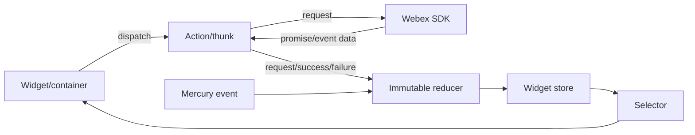
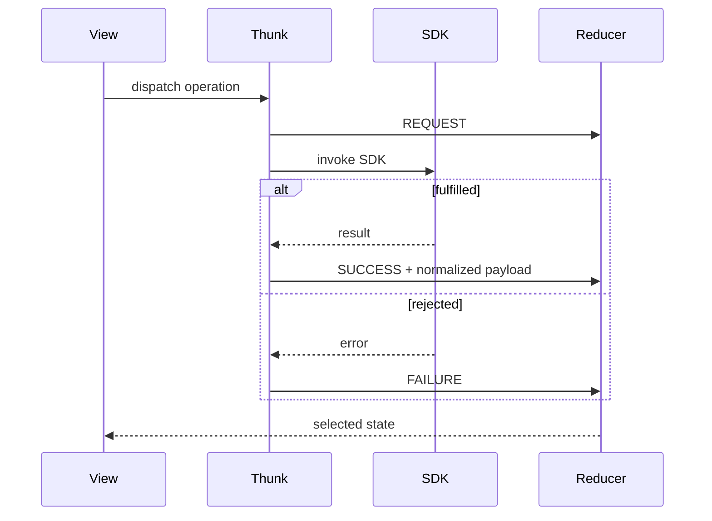
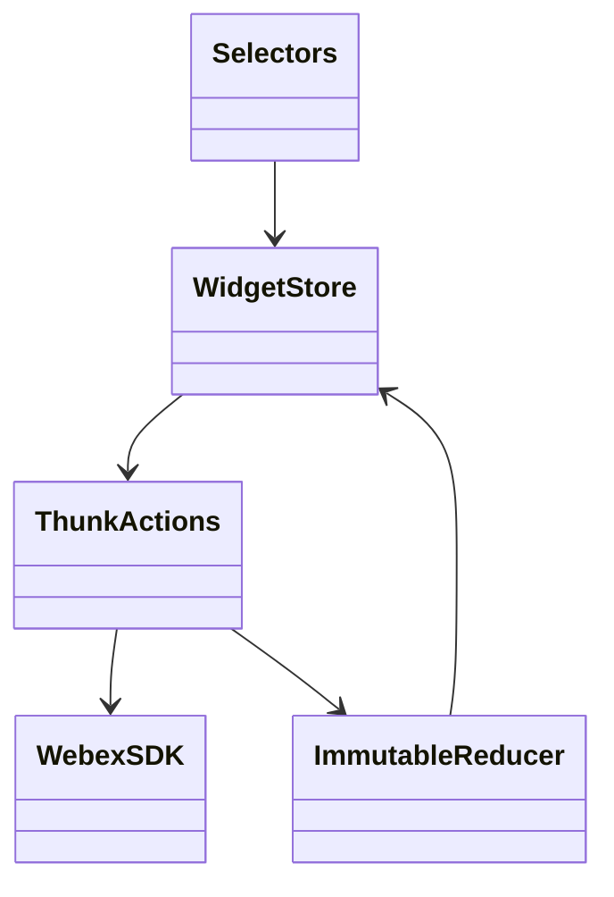
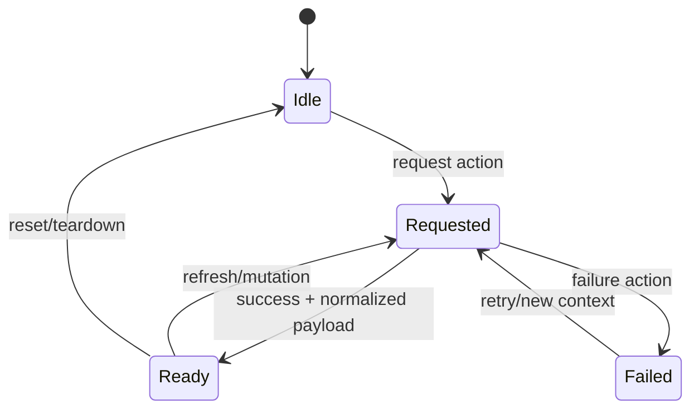

<!-- ───────────────────────────────
  Template:     Module Spec
  Template-ID:  module-spec
  Generates:    ai-docs/modules/state-management-spec.md
  Description:  Per-module canonical spec — orientation plus requirements, design, invariants, flows, pitfalls, and tests.
  Library ver:  0.2.1
  Last updated: 2026-07-11
─────────────────────────────── -->

# Redux and State Management — SPEC

> Start with root [`AGENTS.md`](../../AGENTS.md), router [`SPEC_INDEX.md`](../SPEC_INDEX.md), and [`SERVICE_STATE.md`](../SERVICE_STATE.md).

## Metadata

| Field | Value |
|---|---|
| Module id | `state-management` |
| Source path(s) | `packages/node_modules/@webex/redux-module-*/`, `react-redux-spark*/` |
| Doc kind | Module spec |
| Coverage score | 94% assessed 2026-07-22; all state packages, public barrels, async conventions, and major invariants covered |
| Generated from | `module-spec` @ SDLC template library `0.2.1` |
| generated_by / approved_by / updated_at | `codex-desktop` / pending PR approval / 2026-08-07 |
| Validation status | not-run; independent validation pending at the repaired PR commit |

## Evidence Rules

Reducer initial state, action constants/creators, selectors, thunks, tests, and widget composition define this module. Redux state is client-side representation, never evidence that the repository owns durable Webex data.

## Source Material Register

| Source material | Scope | Decision | Detail location or disposition |
|---|---|---|---|
| Legacy `@ciscospark/redux-module-*` READMEs | namespace migration | verified | Export Stability records the suffix-preserving move to `@webex`. |
| Source barrels/actions/reducers/selectors | state contract | authoritative | Public Surface through State Model. |
| Adjacent reducer/action/selector tests | transitions | verified | Test-Case Strategy. |

## Overview

Twenty capability packages normalize Webex resources and async operations into Redux/Immutable.js state. `react-redux-spark` owns the SDK instance/authentication slice; feature modules own activities, conversation, spaces, users, media, meetings, presence, Mercury, flags, errors, and related projections.

## Purpose / Responsibility

Give widgets deterministic local state transitions around SDK calls and realtime events. This layer does not persist authoritative business data and must not invent server state.

## Stack

Redux 3, react-redux 5, redux-thunk, Immutable.js, reselect, recompose/React integration, Webex JS SDK, Jest, and redux-mock-store.

## Folder / Package Structure

```text
packages/node_modules/@webex/
├── redux-module-*/src/
│   ├── actions.js
│   ├── reducer.js
│   ├── selectors.js
│   └── index.js
├── react-redux-spark/src/          # SDK/auth state and enhancer
├── react-redux-spark-metrics/src/  # metrics state/actions
└── react-redux-spark-fixtures/src/ # test-only state fixtures
```

## Key Files (source of truth)

| File | Holds |
|---|---|
| `packages/node_modules/@webex/redux-module-activity/src/index.js`, `packages/node_modules/@webex/redux-module-spaces/src/index.js`, `packages/node_modules/@webex/redux-module-users/src/index.js` | representative public action/reducer/selector barrels; every exact package path is indexed in `../CONTRACTS.md` |
| `packages/node_modules/@webex/redux-module-spaces/src/actions.js` | representative action types, creators, and async SDK work |
| `packages/node_modules/@webex/redux-module-spaces/src/reducer.js` | representative initial state and transitions |
| `packages/node_modules/@webex/react-redux-spark/src/index.js` | SDK Redux integration surface |
| `packages/node_modules/@webex/redux-module-meetings/src/actions.js` | meeting lifecycle bridge |

## Public Surface

| Contract ID | Type | Surface | Purpose | Compatibility / deprecation | Schema / detail link | Root index |
|---|---|---|---|---|---|---|
| `rw.state.modules` | SDK | `@webex/redux-module-*` barrels | capability reducers/actions/thunks/selectors | public semver; action/export changes require compatibility review | exact `rw.state.*` catalog paths; representative: `packages/node_modules/@webex/redux-module-activity/src/index.js`, `packages/node_modules/@webex/redux-module-spaces/src/index.js` | `../CONTRACTS.md` |
| `rw.state.sdk` | SDK | `@webex/react-redux-spark*` barrels | SDK/auth, metrics, and fixture integration | public semver; fixtures remain test-oriented | `packages/node_modules/@webex/react-redux-spark/src/index.js`, `packages/node_modules/@webex/react-redux-spark-metrics/src/index.js`, `packages/node_modules/@webex/react-redux-spark-fixtures/src/index.js` | `../CONTRACTS.md` |

Compatibility notes:

The public state packages include activities, activity, avatar, conversation, errors, features, flags, indicators, media, meetings, Mercury, presence, search, share, spaces, teams, and users. Reducer keys are selected when widget entrypoints compose a store, rather than through one global root reducer.

## Requires (dependencies)

- Redux store/provider and thunk middleware assembled by the widget runtime.
- Webex SDK plugins for remote operations and Mercury events.
- Immutable.js-compatible state supplied to selectors/reducers.
- Consumer widgets/containers to select and dispatch module behavior.

## Requirements

| ID | WHAT | WHY | Source Evidence | Test / Example Evidence | Assumptions / Gaps | Confidence |
|---|---|---|---|---|---|---|
| `STATE-R-001` | Each module exports a stable reducer/actions/selectors surface through its package barrel. | Widgets compose capability-specific stores and external packages import named operations. | `packages/node_modules/@webex/redux-module-activity/src/index.js`, `packages/node_modules/@webex/redux-module-spaces/src/index.js`, `packages/node_modules/@webex/redux-module-users/src/index.js` | `packages/node_modules/@webex/redux-module-activity/src/actions.test.js`, `packages/node_modules/@webex/redux-module-spaces/src/reducer.test.js` | Some modules intentionally export only selectors/constants. | PRESENT |
| `STATE-R-002` | Async operations dispatch observable request/success/failure transitions around SDK promises. | UI needs deterministic loading and error state. | `packages/node_modules/@webex/redux-module-spaces/src/actions.js`, `packages/node_modules/@webex/redux-module-spaces/src/reducer.js` | `packages/node_modules/@webex/redux-module-spaces/src/actions.test.js`, `packages/node_modules/@webex/redux-module-spaces/src/reducer.test.js` | Exact status vocabulary varies by older module. | PRESENT |
| `STATE-R-003` | Remote resources are keyed/normalized and merged without replacing unrelated entities. | Realtime and request responses arrive incrementally. | `packages/node_modules/@webex/redux-module-activities/src/reducer.js`, `packages/node_modules/@webex/redux-module-spaces/src/reducer.js`, `packages/node_modules/@webex/redux-module-users/src/reducer.js` | `packages/node_modules/@webex/redux-module-spaces/src/reducer.test.js`, `packages/node_modules/@webex/redux-module-users/src/reducer.test.js` | Server conflict resolution remains SDK-owned. | PRESENT |
| `STATE-R-004` | Meetings store identifiers and readiness projections while the SDK meeting collection remains the live object authority. | SDK meeting/media instances are mutable event emitters unsuitable as canonical Redux data. | `packages/node_modules/@webex/redux-module-meetings/src/actions.js`, `packages/node_modules/@webex/redux-module-meetings/src/reducer.js` | `packages/node_modules/@webex/widget-meetings/src/components/MeetingsWidget.test.js` | Some lifecycle branches remain unimplemented. | PRESENT |
| `STATE-R-005` | Errors are exposed to views and reset when a new destination/operation begins where owning logic requests it. | Stale failures must not contaminate a new widget context. | `packages/node_modules/@webex/redux-module-errors/src/reducer.js`, `packages/node_modules/@webex/widget-space/src/enhancers/setup.js` | `packages/node_modules/@webex/redux-module-errors/src/reducer.test.js`, `packages/node_modules/@webex/widget-space/src/enhancers/setup.test.js` | Reset ownership is distributed. | PRESENT |
| `STATE-R-006` | SDK auth and instance state are isolated in `react-redux-spark` and shared through enhancers/selectors. | Avoid parallel SDK instances and inconsistent authentication state inside one widget. | `packages/node_modules/@webex/react-redux-spark/src/index.js`, `packages/node_modules/@webex/react-redux-spark/src/reducer.js` | `packages/node_modules/@webex/react-redux-spark/src/reducer.test.js`, `packages/node_modules/@webex/react-redux-spark/src/sdk.test.js` | Separate widgets may intentionally own separate stores. | PRESENT |

## Design Overview

Packages follow a small Redux module convention: constants/action creators and thunks produce actions; an Immutable reducer owns a slice; selectors project UI-ready data; `index.js` exposes the supported boundary. Widgets explicitly merge only required reducers, which keeps independently published packages composable.

## Data Flow



## Sequence Diagram(s)

Sequence coverage:

| Operation group | Diagram | Failure / recovery coverage |
|---|---|---|
| dispatch an SDK-backed state operation | Async Redux transition | fulfilled and rejected branches |



## Class / Component Relationships



## Use Cases

- Load and incrementally update spaces, users, activities, teams, presence, flags, and features.
- Send conversation operations while reflecting request/error state.
- Project SDK authentication/current-instance state into widget setup.
- Track meeting IDs/media readiness and retrieve live meetings from the SDK collection.
- Supply repeatable fixtures and metrics actions for tests/instrumentation.

## State Model

- Each reducer owns an Immutable map/list with explicit initial state.
- Common state dimensions are `items/byId`, current entity, operation status, errors, pagination, SDK instance/auth status, and feature/flag values.
- Triggers are widget dispatches, SDK promise outcomes, Mercury events, destination changes, and teardown/reset actions.
- Authoritative remote data remains Webex; Redux is a cache/projection scoped to the widget store.

## Business Rules & Invariants

- Reducers are pure and retain unrelated state for unknown actions.
- Entity IDs, not mutable SDK objects, are preferred when referencing live meetings/resources.
- A success/failure action corresponds to its owning request and preserves enough context for the view to decide recovery.
- Selectors do not mutate state and tolerate the initial/unloaded state expected by their consumers.

## Concurrency & Reactive Flow

SDK promises and Mercury events can arrive out of order. Reducers merge by resource identity; setup/status guards prevent duplicate subscriptions/fetches. A destination change must reset scoped data or tag operations so late results cannot become the new visible destination.

## State Machine



## Error Handling & Failure Modes

| Condition | Signal (error/code/result) | Caller recovery |
|---|---|---|
| SDK promise rejects | module failure/error action | view renders error; owner retries or starts a new context |
| SDK is not authenticated/registered | auth/status slice not ready | wait for runtime readiness; do not dispatch dependent work |
| malformed/unrelated realtime payload | ignored or owning error action | retain existing state and inspect SDK/metrics logs |

## Pitfalls

- Similar modules use older, non-uniform status shapes; inspect the owning reducer before reusing a selector.
- Redux does not imply persistence or cross-widget sharing.
- Never serialize live SDK meeting/media objects into documentation or new reducer state without an explicit design change.

## Module Do's / Don'ts

- Do add action/reducer/selector tests together for a new transition.
- Do compose reducers explicitly at the consuming widget boundary.
- Don't mutate Immutable state or SDK objects in reducers.
- Don't bypass exported barrels from another package without a documented internal reason.

## Export Stability

All non-private `@webex/redux-module-*` and `react-redux-spark*` entrypoints are public package contracts. Protected `@ciscospark` rename notices record the same-suffix move to `@webex`; maintain named action/reducer/selector compatibility under semver.

## Key Design Trade-off

Capability-local stores prevent a mandatory application-wide schema and support standalone widgets, at the cost of repeated reducer composition and potential duplicated SDK-derived cache state across widget instances.

## Test-Case Strategy (module)

| Requirement | Current evidence | Focused gap |
|---|---|---|
| `STATE-R-001` exports | `packages/node_modules/@webex/redux-module-activity/src/index.js`, `packages/node_modules/@webex/redux-module-activity/src/actions.test.js` | automated public-export snapshots |
| `STATE-R-002` async lifecycle | `packages/node_modules/@webex/redux-module-spaces/src/actions.test.js`, `packages/node_modules/@webex/redux-module-spaces/src/reducer.test.js` | cancellation/late-result tests |
| `STATE-R-003` normalized merge | `packages/node_modules/@webex/redux-module-users/src/reducer.test.js` | adversarial ordering |
| `STATE-R-004` meeting references | `packages/node_modules/@webex/redux-module-meetings/src/reducer.js` | destroyed/stopped event coverage |
| `STATE-R-005` error reset | `packages/node_modules/@webex/redux-module-errors/src/reducer.test.js`, `packages/node_modules/@webex/widget-space/src/enhancers/setup.test.js` | cross-destination late failure |
| `STATE-R-006` SDK auth | `packages/node_modules/@webex/react-redux-spark/src/sdk.test.js`, `packages/node_modules/@webex/react-redux-spark/src/reducer.test.js` | multi-widget isolation |

## Traceability

- System state boundaries: `../SERVICE_STATE.md`; contracts: `../CONTRACTS.md`.
- Redux conventions: `../patterns/redux-module-barrel.md`.
- Machine coverage/profile/contracts: `.sdd/manifest.json`.
