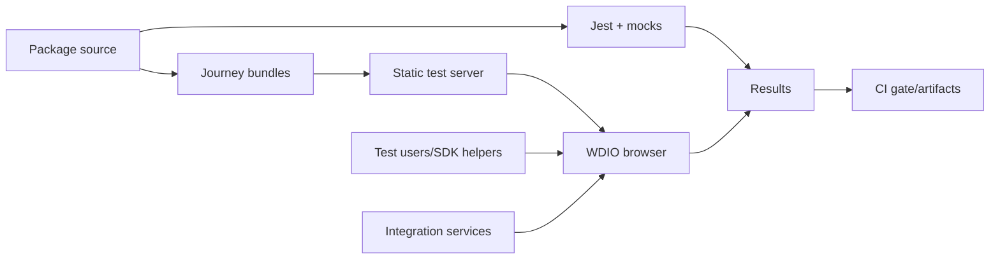
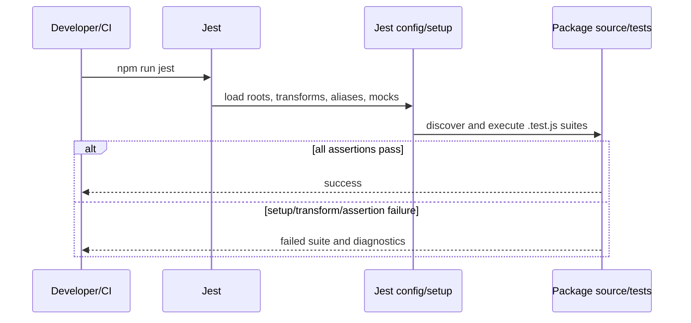
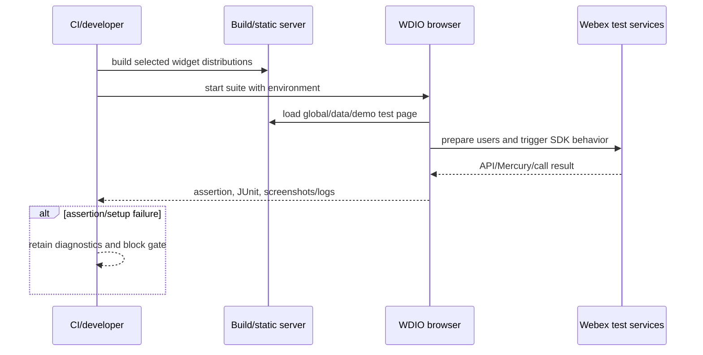
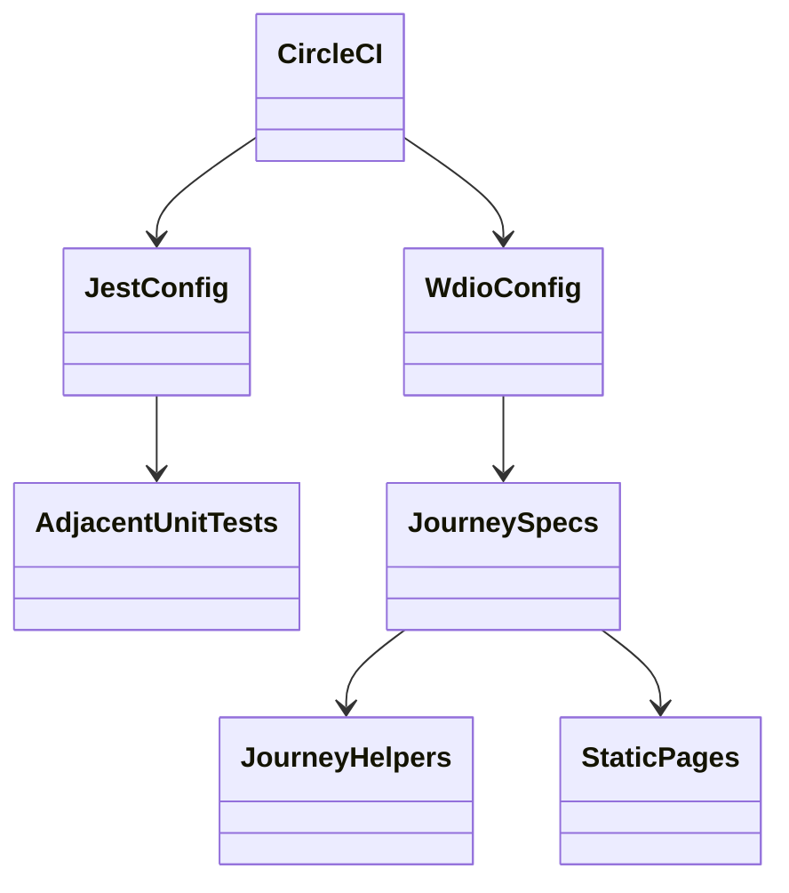

<!-- ───────────────────────────────
  Template:     Module Spec
  Template-ID:  module-spec
  Generates:    ai-docs/modules/test-automation-spec.md
  Description:  Per-module canonical spec — orientation plus requirements, design, invariants, flows, pitfalls, and tests.
  Library ver:  0.2.2
  Last updated: 2026-07-30
─────────────────────────────── -->

# Test Automation — SPEC

> Start with root [`AGENTS.md`](../../AGENTS.md), router [`SPEC_INDEX.md`](../SPEC_INDEX.md), and repository [`REVIEW_CHECKLIST.md`](../REVIEW_CHECKLIST.md).

## Metadata

| Field | Value |
|---|---|
| Module id | `test-automation` |
| Source path(s) | adjacent `*.test.js`, `test/journeys/`, `jest.config.json`, `wdio.conf.js`, `scripts/tests/` |
| Parent spec | — |
| Doc kind | Module spec |
| Coverage score | 96% assessed 2026-07-22; unit/journey topology, protected plan intent, suites, environment, fixtures, and CI use covered |
| Generated from | `module-spec` @ SDLC template library `0.2.2` |
| generated_by / approved_by / updated_at | `codex-desktop` / pending PR approval / 2026-08-07 |
| Validation status | not-run |

## Evidence Rules

Executable Jest/WDIO configuration and test code determine current coverage. The protected journey test plan preserves intended scenarios; where prose and executable suites diverge, this spec records the gap instead of claiming a pass.

## Source Material Register

| Source material | Scope | Decision | Detail location or disposition |
|---|---|---|---|
| Protected journey plan | journey intent | verified/reconciled | Suite inventory and scenario expectations are preserved below and mapped to executable specs. |
| Repository usage-guide test commands | developer workflow | verified | Public Surface and Use Cases. |
| Jest/WDIO/CircleCI configuration | execution | authoritative | Requirements, Design Overview, Error Handling. |
| adjacent tests and journey specs/helpers | behavior | authoritative | Test-Case Strategy. |

## Overview

The repository uses adjacent Jest suites for package-level units and WebdriverIO journeys for real browser/widget integration. Journeys cover smoke, Space, Recents, production TAP, data API, browser-global, multiple-widget, guest, startup-setting, event, media, and accessibility behavior. CircleCI runs lint/Jest and configured Chrome/Firefox integration jobs.

## Purpose / Responsibility

Detect regressions in independently published packages and embedded widget behavior, while keeping external-service requirements and evidence limits explicit.

## Stack

Jest 24, Babel setup, identity/file/sound mocks, react-test-renderer, redux-mock-store, WebdriverIO 7/Mocha/Chai, Sauce Labs or local Selenium, static server service, Webex test-user helpers, Axe, CircleCI, Chrome, and Firefox.

## Folder / Package Structure

```text
jest.config.json
packages/node_modules/@webex/**/src/*.test.js
scripts/tests/                 # setup, async/openh264, suite preparation
test/journeys/
├── specs/
│   ├── smoke/
│   ├── space/
│   ├── recents/
│   └── tap/
├── lib/                      # browser, users, events, helpers, waiters, axe
├── server/                   # local/global/data-api pages
└── testplan.md               # protected intent source
wdio.conf.js
```

## Key Files (source of truth)

| File | Holds |
|---|---|
| `jest.config.json` | unit roots, transforms, aliases, mocks, setup |
| `scripts/tests/jest-setup.js` | global test environment |
| `wdio.conf.js` | suites, browsers, Sauce/local services, timeouts, reporters |
| `test/journeys/specs/**/*.js` | executable integration assertions |
| `test/journeys/lib/test-helpers/` | widget actions/assertion helpers |
| `test/journeys/testplan.md` | protected human scenario inventory |
| `.circleci/config.yml` | CI test invocation and artifacts |

## Public Surface

| Contract ID | Type | Surface | Purpose | Compatibility / deprecation | Schema / detail link | Root index |
|---|---|---|---|---|---|---|
| `rw.cmd.static-analysis` | CLI | `npm run static-analysis`, `npm run eslint` | repository lint gate | CI/developer contract | `package.json` | `../CONTRACTS.md` |
| `rw.cmd.jest` | CLI | `npm run jest`, `npm test` | package units; combined lint/unit gate | CI/developer contract | `package.json`, `jest.config.json` | `../CONTRACTS.md` |
| `rw.cmd.journeys` | CLI | `npm run test:automation[:smoke|:space|:recents]` | local/remote browser suites | suite names stable for CI | `package.json`, `wdio.conf.js` | `../CONTRACTS.md` |
| `rw.cmd.tap` | CLI | `npm run test:tap`, `npm run test:integration` | production TAP or smoke integration | explicit environment/target required | `package.json`, `wdio.conf.js` | `../CONTRACTS.md` |

Compatibility notes:

WDIO accepts `BROWSER`, `VERSION`, `PLATFORM`, `SAUCE`, `TAP`, `INTEGRATION`, `JOURNEY_TEST_BASE_URL`, `STATIC_SERVER_PATH`, `BUILD_NUMBER`, test-user/service variables, and Sauce credentials.

## Requires (dependencies)

Installed npm dependencies and built widget distributions; Chrome/Firefox plus local Selenium or Sauce credentials; Webex test users and integration endpoints for remote journeys; fake media device settings; writable report/artifact locations.

## Requirements

| ID | WHAT | WHY | Source Evidence | Test / Example Evidence | Assumptions / Gaps | Confidence |
|---|---|---|---|---|---|---|
| `TEST-R-001` | Jest discovers adjacent `*.test.js` only under tracked package source and maps `@webex`/legacy aliases to source. | Unit tests must exercise repository code, not published builds. | `jest.config.json` | `packages/node_modules/@webex/widget-space/src/reducer.test.js`, `packages/node_modules/@webex/widget-recents/src/enhancers/setup.test.js` | TypeScript-named tests outside regex need explicit support. | PRESENT |
| `TEST-R-002` | Smoke verifies Space, Recents, multiple widgets, demo auth modes, core messaging/calling, events, and accessibility. | Every PR needs a bounded integration signal across primary embeddings. | `wdio.conf.js`, `test/journeys/specs/smoke/widget-space/index.js`, `test/journeys/specs/smoke/widget-recents/index.js`, `test/journeys/specs/smoke/multiple/index.js`, `test/journeys/specs/smoke/demo.js` | same executable smoke specs | Calling breadth is limited to composed Space behavior. | PRESENT |
| `TEST-R-003` | Space journeys cover global/data API, messaging/actions/files/markdown, roster, call lifecycle, guest access, startup settings, events, and accessibility. | Space is a primary embeddable product surface. | `test/journeys/specs/space/index.js`, `test/journeys/specs/space/guest.js`, `test/journeys/specs/space/startup-settings.js`, `test/journeys/specs/space/data-api.js` | same executable Space specs | External services/test users can cause non-product failures. | PRESENT |
| `TEST-R-004` | Recents journeys cover global/data API, group/one-to-one updates, unread/read/select/member events, filters, startup settings, incoming-call indicators, and accessibility. | Recents must react correctly to SDK-driven changes in both host APIs. | `test/journeys/specs/recents/dataApi/basic.js`, `test/journeys/specs/recents/global/basic.js`, `test/journeys/specs/recents/dataApi/space-list-filter.js`, `test/journeys/specs/recents/global/startup-settings.js` | same executable Recents specs | Some plan wording predates current filters/settings specs. | PRESENT |
| `TEST-R-005` | Browser runs use fake media/notification settings, bounded waits, prepared test users, and stored diagnostics/reports. | Realtime/media UI requires reproducible automation and debuggable failures. | `wdio.conf.js`, `scripts/tests/beforeSuite.js`, `test/journeys/lib/wait-for-mercury-event.js`, `test/journeys/lib/axe.js` | `.circleci/config.yml` | Network timing remains nondeterministic. | PRESENT |
| `TEST-R-006` | Contributors run focused full widget journeys before PR; CI runs configured smoke/integration plus lint/Jest. | Local ownership and CI gates divide expensive coverage responsibly. | `test/journeys/testplan.md`, `.circleci/config.yml` | `package.json` | CI workflow conditions require independent check. | PRESENT |

## Design Overview

Unit suites stay beside implementation and mock styles/assets/dependencies through Jest. Browser journeys drive static test pages and Webex APIs using reusable helpers, waiting for SDK/Mercury outcomes rather than only DOM timing. WDIO selects suite/environment and records JUnit/browser artifacts; CI builds distributions before journeys.

## Data Flow



## Sequence Diagram(s)

Sequence coverage:

| Operation group | Diagram | Failure / recovery coverage |
|---|---|---|
| deterministic package units | Jest source suite | transform/setup/assertion failure blocks the command |
| built browser journeys | WDIO integration suite | build/auth/setup/assertion failures retain diagnostics and block CI |





## Class / Component Relationships



## Use Cases

- Run all deterministic package suites with UTC timezone and repository source aliases.
- Run smoke locally against built distributions before opening a PR.
- Run the full Space or Recents suite for a changed primary widget.
- Exercise production assets through TAP without starting the local static server.
- Diagnose a failed remote browser run from JUnit, browser artifacts, build identity, and Sauce session.

Protected-plan scenario inventory:

- **Recents smoke:** group and one-to-one incoming messages, read/unread behavior, new one-to-one, call indicators, created/read/unread/selected/member events, and Axe.
- **Space smoke:** activity-menu open/close and Message/Meet/Files/Roster switches, roster count/list/close, send/receive, call/hangup, and Axe.
- **Multiple/demo smoke:** Space and Recents on one page; demo access-token and SDK-instance authentication; external activity control.
- **Space full:** header/menu/roster/search/add; send/receive/events; flag/unflag; self-delete/no other-delete; PNG/file tab; bold, italic, quote, lists, H1-H3, horizontal rule, link, inline code, and code block.
- **Space call/guest/settings/data API:** precall, hangup before answer, decline, hangup, call payload; guest messaging/calls; `userId`, disabled activities/error, initial Meet/Message, start-call; both data and global instantiation.
- **Recents full:** data/global group and one-to-one update/read/call-hover; new one-to-one; incoming-call progress; current events; filters/startup settings; Axe.

## Business Rules & Invariants

- A test claiming a current event uses a constant/runtime event still present in source.
- Integration tests prepare/clean isolated users/spaces and wait for observable Webex outcomes.
- Tests never commit credentials, access tokens, or Sauce secrets.
- Accessibility assertions are required in the existing smoke/full surfaces and are not replaced by snapshot tests.

## Concurrency & Reactive Flow

Mercury, SDK promises, call/media setup, browsers, and remote test-user services are asynchronous. Helpers use bounded waits and event synchronization; arbitrary sleeps are a last resort. Parallel sessions require unique build/tunnel/user context and must not share mutable conversations unintentionally.

## Error Handling & Failure Modes

| Condition | Signal (error/code/result) | Caller recovery |
|---|---|---|
| setup/build/auth failure | before-suite or WDIO setup failure | fix environment/asset/user preparation before interpreting product assertions |
| assertion/timeout | failed Jest/WDIO result with reports/artifacts | inspect event timing, browser artifacts, and build identity |
| local static assets missing | page/load failure | build journey/widget assets or configure a remote base URL |
| repeated environmental flake | reproducible intermittent failure | assign owner/expiry and fix synchronization; do not hide with retries |

## Pitfalls

- The protected plan describes intent, not proof that every scenario still executes.
- Jest `testRegex` is `.test.js$`; TypeScript test naming requires validation.
- Browser journeys depend on mutable external services and credentials.
- Smoke is not a substitute for the changed widget's full suite.

## Module Do's / Don'ts

- Do add the narrowest deterministic unit test and the relevant journey for public behavior.
- Do use event/wait helpers and preserve diagnostics.
- Don't weaken assertions to accommodate timing without proving the race.
- Don't run production TAP against unapproved targets or expose credentials in logs.

## Key Design Trade-off

Real Webex/browser journeys give high-confidence integration evidence but are expensive and environment-sensitive, so adjacent unit tests provide fast breadth while focused full suites and CI smoke provide layered assurance.

## Test-Case Strategy (module)

| Layer | Scope | Expected gate |
|---|---|---|
| Static analysis | all tracked JS/TS/config/docs according to ESLint ignores | `npm run static-analysis` passes |
| Jest | 107 adjacent `*.test.js` suites discovered under `packages/node_modules/@webex/` | `npm run jest` passes |
| Smoke integration | Space, Recents, multiple, demo | required CI integration signal |
| Focused Space | messaging/files/roster/calls/guest/settings/data API | run for Space-related changes |
| Focused Recents | global/data API/filter/settings/events | run for Recents-related changes |
| TAP | production-hosted selected widget flows | explicit production validation |
| Accessibility | Axe in protected smoke/full surfaces | zero blocking violations |

| Requirement | Existing test/config evidence | Focused gap |
|---|---|---|
| `TEST-R-001` Jest discovery | `jest.config.json`, `packages/node_modules/@webex/widget-space/src/reducer.test.js` | TypeScript test discovery |
| `TEST-R-002` smoke | `wdio.conf.js`, `test/journeys/specs/smoke/widget-space/index.js`, `test/journeys/specs/smoke/widget-recents/index.js` | dedicated calling widgets |
| `TEST-R-003` Space | `test/journeys/specs/space/index.js`, `test/journeys/specs/space/guest.js`, `test/journeys/specs/space/data-api.js` | remote-service failure isolation |
| `TEST-R-004` Recents | `test/journeys/specs/recents/global/basic.js`, `test/journeys/specs/recents/dataApi/basic.js` | stale-event negative assertions |
| `TEST-R-005` browser setup | `scripts/tests/beforeSuite.js`, `test/journeys/lib/wait-for-mercury-event.js` | bounded wait consistency |
| `TEST-R-006` contributor/CI gates | `test/journeys/testplan.md`, `.circleci/config.yml` | automated plan-to-suite drift check |

Coverage gaps to retain: dedicated calling-widget journeys are sparse; several TypeScript calling components have stories rather than unit suites; teardown/race/error paths need focused characterization.

## Traceability

- Quality gate commands: `../GETTING_STARTED.md`, `../REVIEW_CHECKLIST.md`.
- Capability requirement mappings: every file in `ai-docs/modules/`.
- Machine coverage/profile/contracts: `.sdd/manifest.json`.
