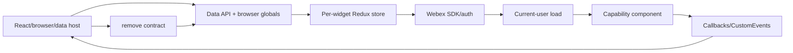
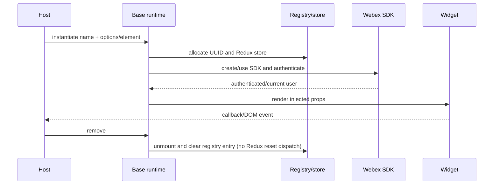
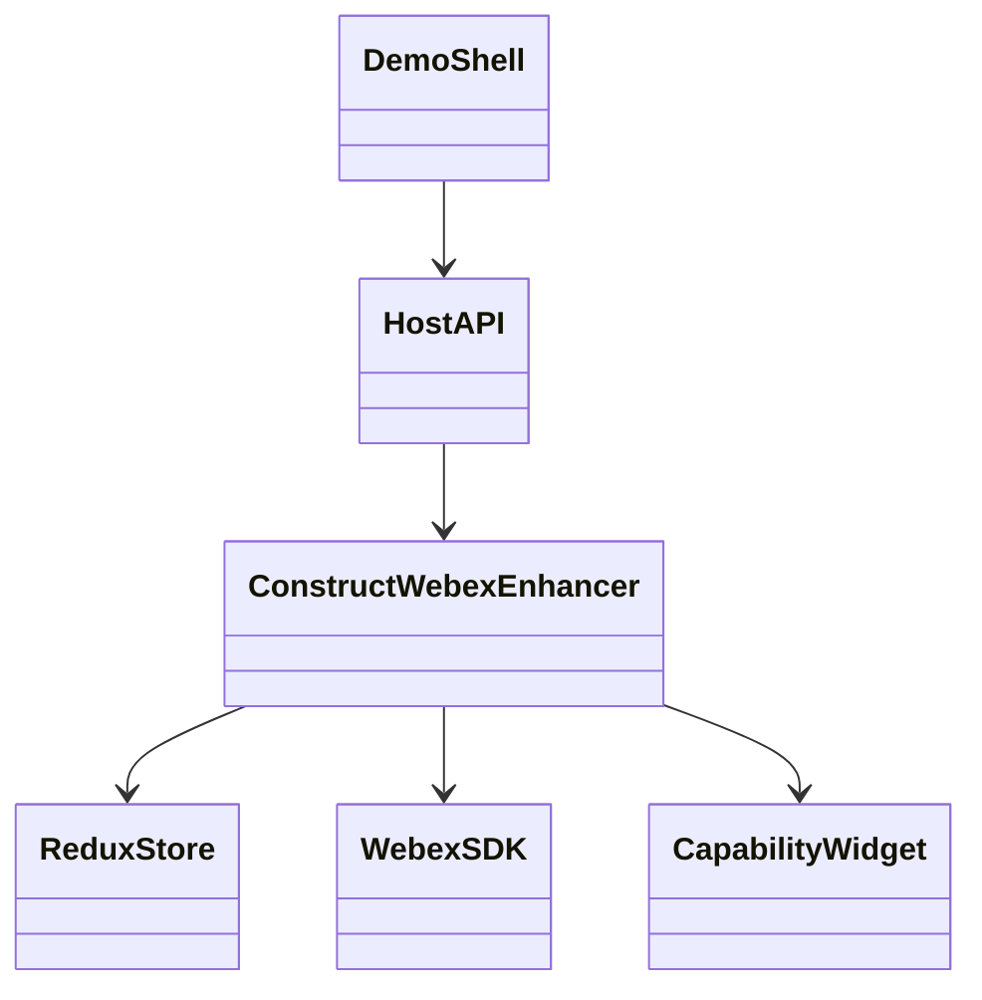
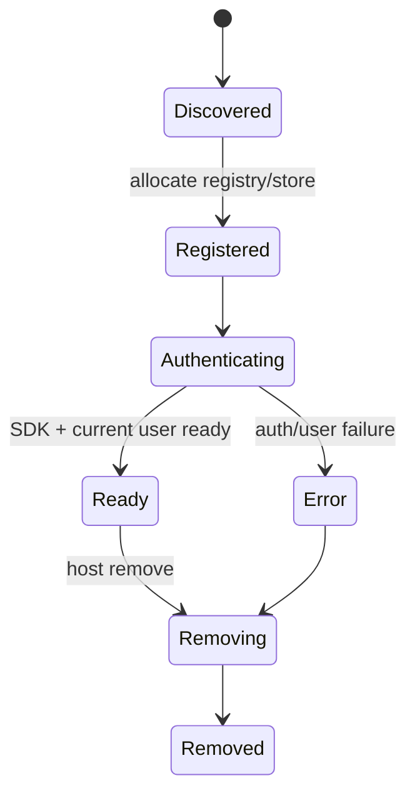

# Widget Runtime, Authentication, and Demos — SPEC

> Start with root [`AGENTS.md`](../../AGENTS.md), router [`SPEC_INDEX.md`](../SPEC_INDEX.md), and system [`ARCHITECTURE.md`](../ARCHITECTURE.md).

## Metadata

| Field | Value |
|---|---|
| Module id | `widget-runtime-auth` |
| Source path(s) | `packages/node_modules/@webex/webex-widget-base/`, `webex-sign-in-page/`, `widget-*-demo/`, `samples/` |
| Doc kind | Module spec |
| Coverage score | 93% assessed 2026-07-22; enhancer order, host APIs, auth, teardown, and demo boundaries covered |
| Generated from | `module-spec` @ SDLC template library `0.2.1` |
| generated_by / approved_by / updated_at | `codex-desktop` / repository owner / 2026-07-23 |
| Validation status | independent Cursor validation passed on 2026-07-23 with zero Blocking findings |

## Evidence Rules

Current enhancer signatures/order, package exports, host API implementation, tests, and demo wiring are authoritative. The protected widget-base README is reconciled: its two-argument default quick start conflicts with current implementation and is not promoted.

## Source Material Register

| Source material | Scope | Decision | Detail location or disposition |
|---|---|---|---|
| Protected base usage guidance | enhancer and host usage | corrected | Object-shaped `constructWebexEnhancer` is the supported source-backed construction path; conflict is in Pitfalls. |
| Protected demo guidance | demo startup | verified | Use Cases and Host Integration. |
| Repository usage guidance | browser/data API usage | verified/expanded | Current runtime surfaces are in Public Surface; its limited widget list remains unchanged. |
| legacy rename READMEs | namespace migration | verified | Export Stability. |

## Overview

`webex-widget-base` turns a React component into an embeddable widget by composing data API registration, browser globals, a Redux store, removal, SDK authentication, current-user loading, display name, and version metadata. The sign-in and demo/sample packages provide development/host entrypoints around this runtime.

## Purpose / Responsibility

Own widget instantiation, per-widget store/SDK/auth wiring, browser/data-attribute host APIs, localization hooks, removal, and developer demo shells. Capability widgets own domain behavior.

## Stack

React/ReactDOM, recompose, Redux/react-redux, Webex JS SDK, react-intl, ampersand-events, CustomEvent, Babel/Webpack development runtime, TypeScript for sign-in UI, and Jest/WebdriverIO.

## Folder / Package Structure

```text
packages/node_modules/@webex/
├── webex-widget-base/src/
│   └── enhancers/        # data API, browser globals, store, removal, intl, current user
├── webex-sign-in-page/src/
├── widget-demo/src/              # executable shared demo shell
├── widget-space-demo/src/        # index.html only; package src entry is absent
└── widget-recents-demo/src/      # index.html only; package src entry is absent
samples/                  # host examples served by tooling
```

## Key Files (source of truth)

| File | Holds |
|---|---|
| `packages/node_modules/@webex/webex-widget-base/src/index.js` | canonical enhancer composition/order and exports |
| `packages/node_modules/@webex/webex-widget-base/src/enhancers/withDataAPI.js` | data-attribute discovery/instantiation |
| `packages/node_modules/@webex/webex-widget-base/src/enhancers/withBrowserGlobals.js` | global registry, lookup, host events |
| `packages/node_modules/@webex/webex-widget-base/src/enhancers/withInitialState.js` | per-widget Redux store |
| `packages/node_modules/@webex/webex-widget-base/src/enhancers/withRemoveWidget.js` | injected `REMOVE_WIDGET` action; browser `remove()` does not dispatch it |
| `packages/node_modules/@webex/webex-widget-base/src/enhancers/withCurrentUser.js` | authenticated user loading |
| `packages/node_modules/@webex/webex-sign-in-page/src/index.ts` | sign-in page public barrel |
| `packages/node_modules/@webex/widget-demo/src/index.js` | development demo mount |

## Public Surface

| Contract ID | Type | Surface | Purpose | Compatibility / deprecation | Schema / detail link | Root index |
|---|---|---|---|---|---|---|
| `rw.runtime.base` | SDK/React | `constructWebexEnhancer({name, reducers, enhancers})`, default `WebexWidgetBase(name, BaseComponent)`, `withIntl`, `withInitialState`, `withBrowserGlobals` | common runtime composition | public semver; `enhancers` is accepted/documented by the entrypoint but ignored by `withInitialState`; the default helper has the signature mismatch below | `packages/node_modules/@webex/webex-widget-base/src/index.js`, `packages/node_modules/@webex/webex-widget-base/src/enhancers/withInitialState.js` | `../CONTRACTS.md` |
| `rw.host.widget.select` | browser API | `window.webex.widget(element)` | select/create a browser widget | stable global/alias and lookup behavior | `packages/node_modules/@webex/webex-widget-base/src/enhancers/withBrowserGlobals.js` | `../CONTRACTS.md` |
| `rw.host.widget.mount` | browser API | `widget.{name}Widget(options)` | mount a registered capability | names/options are public | `packages/node_modules/@webex/webex-widget-base/src/enhancers/withBrowserGlobals.js` | `../CONTRACTS.md` |
| `rw.host.widget.remove` | browser API | `widget.remove(callback?) -> Promise<boolean>` | unmount React and delete the UUID registry entry | callback/promise and registry semantics are public; no Redux reset is dispatched | `packages/node_modules/@webex/webex-widget-base/src/enhancers/withBrowserGlobals.js` | `../CONTRACTS.md` |
| `rw.host.data-api` | data API | `[data-toggle^="webex-{name}"]` + `data-*` | discover and mount widgets | names and kebab-to-camel mapping are public | `packages/node_modules/@webex/webex-widget-base/src/enhancers/withDataAPI.js` | `../CONTRACTS.md` |
| `rw.runtime.sign-in` | SDK/React | `webex-sign-in-page` typed barrel | reusable sign-in UI | public semver | `packages/node_modules/@webex/webex-sign-in-page/src/index.ts` | `../CONTRACTS.md` |

Compatibility notes:

Data API hosts instantiate supported widget elements/attributes after runtime discovery.

The default `WebexWidgetBase(name, BaseComponent)` export currently passes `name` to an object-destructuring function; consumers must not treat the protected README example as validated until that implementation conflict is resolved.

## Requires (dependencies)

React DOM, Redux reducer maps supplied by each widget, capability HOCs composed outside the base constructor, Webex SDK credentials or instance, browser globals/CustomEvent support for embedded APIs, locale/intl data, and bundler-injected `REACT_WEBEX_VERSION`.

## Requirements

| ID | WHAT | WHY | Source Evidence | Test / Example Evidence | Assumptions / Gaps | Confidence |
|---|---|---|---|---|---|---|
| `RUNTIME-R-001` | Enhancers execute in the declared compose order: data API, browser globals, initial state, removal, SDK, current user, display name, version. | Outer/inner ordering controls host discovery, store availability, auth, and teardown. | `packages/node_modules/@webex/webex-widget-base/src/index.js` | `test/journeys/specs/smoke/multiple/index.js` | No direct base composition test; reordering requires characterization. | PRESENT |
| `RUNTIME-R-002` | Every instantiated widget receives its own configured Redux store and SDK/auth context; the constructor's `enhancers` field has no effect because `withInitialState` ignores it. | Multiple widgets need separate state, and consumers must not rely on a documented-but-unused option. | `packages/node_modules/@webex/webex-widget-base/src/enhancers/withInitialState.js`, `packages/node_modules/@webex/webex-widget-base/src/index.js` | None found for store isolation. | The multiple-widget journey proves coexistence, not store-object isolation. | PRESENT |
| `RUNTIME-R-003` | Browser/data APIs discover, register, look up, emit from, and remove widgets using stable names/UUIDs. | Non-React hosts depend on embedding contracts. | `packages/node_modules/@webex/webex-widget-base/src/enhancers/withDataAPI.js`, `packages/node_modules/@webex/webex-widget-base/src/enhancers/withBrowserGlobals.js`, `packages/node_modules/@webex/webex-widget-base/src/enhancers/withRemoveWidget.js` | `test/journeys/specs/space/data-api.js`, `test/journeys/specs/smoke/multiple/index.js` | Exact DOM payloads require independent validation. | PRESENT |
| `RUNTIME-R-004` | SDK-dependent child setup waits for valid auth/registration/current-user state. | Prevent unauthenticated remote calls and incomplete identity UI. | `packages/node_modules/@webex/webex-widget-base/src/enhancers/withCurrentUser.js`, `packages/node_modules/@webex/react-redux-spark/src/index.js` | `packages/node_modules/@webex/react-redux-spark/src/sdk.test.js`, `packages/node_modules/@webex/widget-space/src/enhancers/setup.test.js` | Credentials are environment-owned. | PRESENT |
| `RUNTIME-R-005` | Browser `remove()` unmounts React, deletes the UUID registry entry, and returns through the established promise/callback contract; it does not dispatch `REMOVE_WIDGET` or explicitly reset Redux. | Embedded hosts need the exact implemented teardown boundary and must not assume a state-reset side effect. | `packages/node_modules/@webex/webex-widget-base/src/enhancers/withBrowserGlobals.js`, `packages/node_modules/@webex/webex-widget-base/src/enhancers/withRemoveWidget.js`, `packages/node_modules/@webex/webex-widget-base/src/enhancers/withInitialState.js` | None found for browser removal semantics. | Child unmount cleanup is distributed; repeated-remove and store-retention behavior need characterization. | PRESENT |
| `RUNTIME-R-006` | Demo/sample packages remain development shells and are not published as production capability contracts when marked private. | Avoid treating example configuration/token handling as supported API. | `packages/node_modules/@webex/widget-demo/package.json`, `packages/node_modules/@webex/widget-demo/src/index.js`, `scripts/start/commands/demo.js` | `test/journeys/specs/smoke/demo.js` | Some public sign-in UI is shared with demos. | PRESENT |

## Design Overview

The runtime is an enhancer pipeline around a capability component. Store and SDK concerns are injected below host-facing wrappers, allowing browser and data APIs to instantiate the same React export. Widgets provide reducer maps; capability-specific HOCs are composed around the base enhancer in their own entrypoints. Although the base constructor accepts an `enhancers` field, the current store initializer ignores it. Demos mount packaged widgets in development-only shells.

## Data Flow



## Sequence Diagram(s)

Sequence coverage:

| Operation group | Diagram | Failure / recovery coverage |
|---|---|---|
| discover, register, authenticate, render, emit, remove | Widget instance lifecycle | auth/lookup/removal failures and the setup/removal race are specified in Error Handling |



## Class / Component Relationships



## Use Cases

- Embed a packaged widget directly as React.
- Discover and instantiate a widget from supported DOM/data attributes.
- Look up a widget instance, listen for events, and remove it from a non-React host.
- Authenticate/use a Webex SDK instance and load the current user before capability setup.
- Run the local demo or sample server to exercise Space/Recents integrations.

## State Model

The runtime tracks a per-widget Redux store, SDK/auth state, current-user fetch state, widget UUID/registry entry, and removal lifecycle. Inputs are host properties/attributes, credentials/SDK instance, reducer maps, locale, and DOM mount points. Capability entrypoints compose additional HOCs outside the base constructor.

## Business Rules & Invariants

- `withDataAPI` remains outermost so host discovery wraps the completed widget.
- Store initialization precedes SDK/current-user consumers.
- Widget names and UUID registry keys are stable within an instance lifecycle.
- Removal is idempotent from a host perspective and must not leave a usable stale registry entry.

## Concurrency & Reactive Flow

DOM discovery, SDK authentication, current-user fetches, widget events, and removal are asynchronous. A removal racing setup must prevent late results from re-registering or updating an unmounted instance.

## State Machine



## UI Flow

Hosts see discovery/mount, authentication/loading or sign-in UI, the capability widget, and error/removal states. Demo UI supplies credentials/configuration and must not expose production secrets or redefine widget behavior.

## Error Handling & Failure Modes

| Condition | Signal (error/code/result) | Caller recovery |
|---|---|---|
| authentication/current-user failure | SDK/error state; capability remains unready | correct credentials or retry through owning host |
| invalid host element/name | discovery/lookup does not return a valid instance | correct mount markup/name and instantiate again |
| browser unmount returns `false` | callback receives or Promise resolves `false`; UUID entry is still deleted | inspect the host element and avoid assuming Redux reset occurred |
| remove races setup | late async result after removal | ignore/cancel result; do not re-register instance |

## Pitfalls

- Protected base documentation shows `WebexWidgetBase(name, Component)`, but current default implementation conflicts with `constructWebexEnhancer`'s object signature. Prefer the named object-shaped constructor pending a code/API decision.
- Global registries make tests order-sensitive unless reset.
- Demo token handling is development guidance, not a production authentication design.

## Module Do's / Don'ts

- Do preserve enhancer order and characterize it before edits.
- Do treat widget removal and listener cleanup as one lifecycle.
- Don't put capability reducers into the base package.
- Don't promote private demo/sample APIs as supported exports.

## Export Stability

`@webex/webex-widget-base` and `@webex/webex-sign-in-page` are public. Protected `@ciscospark` notices record namespace migration for legacy runtime packages. Browser/data API names, emitted event translation, and removal behavior are compatibility surfaces as well as JavaScript exports.

## Host Integration & Theming

Hosts may use React, browser globals, or data attributes. They provide DOM roots, credentials/SDK/options, locale, and event listeners; the runtime supplies base fonts/styles, Redux/provider context, and version metadata. Multiple widgets must coexist without ID/store collisions.

## Key Design Trade-off

One enhancer pipeline makes independently packaged widgets consistently embeddable, but ordering and global-registration behavior create implicit coupling. The canonical object-shaped constructor and lifecycle tests are the guardrails.

## Test-Case Strategy (module)

| Requirement | Current evidence | Focused gap |
|---|---|---|
| `RUNTIME-R-001` order | `packages/node_modules/@webex/webex-widget-base/src/index.js`; no direct unit test found | explicit composition-order characterization |
| `RUNTIME-R-002` isolation | None found | concurrent store/SDK identity assertions and unused-`enhancers` characterization |
| `RUNTIME-R-003` host APIs | `test/journeys/specs/space/data-api.js`, `test/journeys/specs/smoke/multiple/index.js` | invalid lookup and repeated remove |
| `RUNTIME-R-004` auth | `packages/node_modules/@webex/react-redux-spark/src/sdk.test.js`, `packages/node_modules/@webex/widget-space/src/enhancers/setup.test.js` | auth rejection/recovery |
| `RUNTIME-R-005` teardown | None found | direct unmount/registry assertions, explicit no-reset characterization, setup/remove race, and listener audit |
| `RUNTIME-R-006` demos | `test/journeys/specs/smoke/demo.js` | production-build exclusion |

## Traceability

- Runtime/contract overview: `../ARCHITECTURE.md`, `../CONTRACTS.md`.
- Composition pattern and cleanup rule: `../patterns/widget-enhancer-composition.md`, `../rules/clean-up-runtime-listeners.md`.
- Machine coverage/profile/contracts: `.sdd/manifest.json`.
